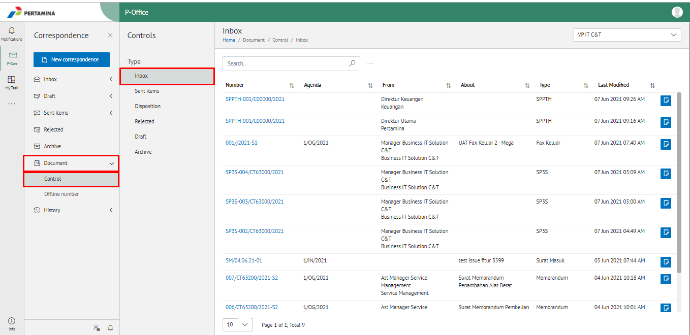
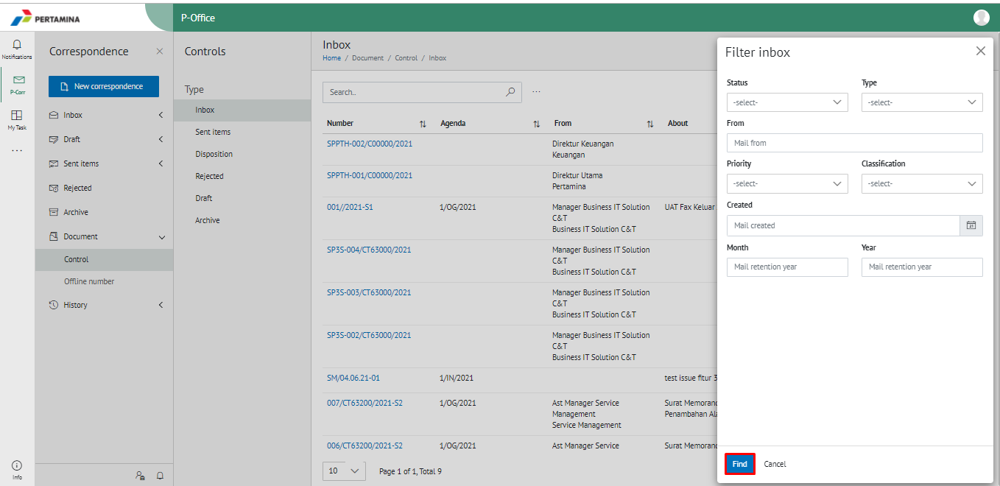
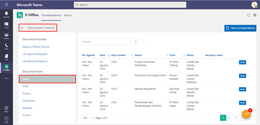
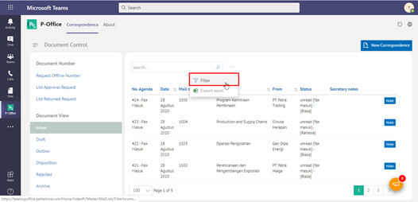
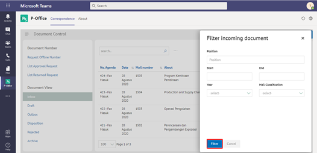
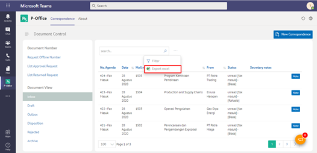

**Role yang sesuai**

- Sekretaris

Sekretaris dapat melakukan filter informasi yang akan tampil pada agenda kendali terhadap surat-surat pejabat atasan

## **P-Office Versi Web**

Langkah-langkah untuk filter data surat pada agenda kendali via Web adalah sebagai berikut:

1. Klik menu **Document** dan pilih **Control** kemudian pilih **Inbox/Sent Items/Disposition/Rejected/Draft/Archive**

2. Klik titik tiga kemudian pilih **Filter Inbox/Sent Items/Disposition/Rejected/Draft/Archive** untuk melakukan filter informasi data surat pada agenda kendali

3. Isikan informasi filter yang dibutuhkan kemudian klik button  **Find**

4. Data akan tampil berdasarkan filter yang sudah dipilih

## **P-Office Versi Teams**

Langkah-langkah untuk filter dokumen pada agenda kendala via Teams adalah sebagai berikut:

1. Klik menu **Document Control** dan pilih **Dokumen View** kemudian pilih **Inbox/Draft/Sent Item/Disposition/Rejected**

2. Klik button **Filter** kemudian sistem menampilkan form filter dokumen yang akan dicetak

3. Pilih filter yang akan dicetak kemudian klik **Filter**

4. Data akan tampil berdasarkan filter yang sudah dipilih kemudian klik tombol **Excel** untuk mencetak

  