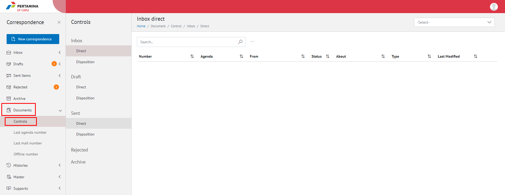
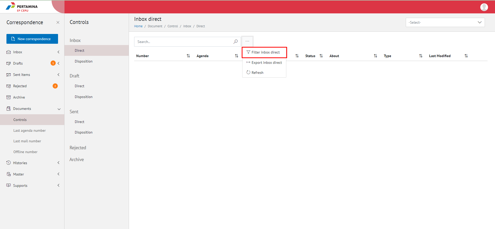
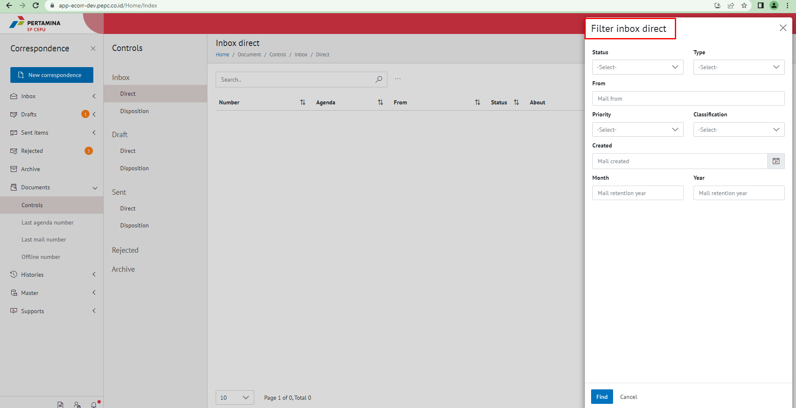

**Role yang sesuai**

- Sekretaris

Sekretaris dapat melakukan filter informasi yang akan tampil pada agenda kendali terhadap surat-surat pejabat atasan

## **E-Corr Versi Web**

Langkah-langkah untuk filter data surat pada agenda kendali via Web adalah sebagai berikut:

1. Klik menu **Document** dan pilih **Control** kemudian pilih **Inbox/Sent Items/Disposition/Rejected/Draft/Archive**

2. Klik titik tiga kemudian pilih **Filter Inbox/Sent Items/Disposition/Rejected/Draft/Archive** untuk melakukan filter informasi data surat pada agenda kendali

3. Isikan informasi filter yang dibutuhkan kemudian klik button  **Find**

4. Data akan tampil berdasarkan filter yang sudah dipilih .
 
