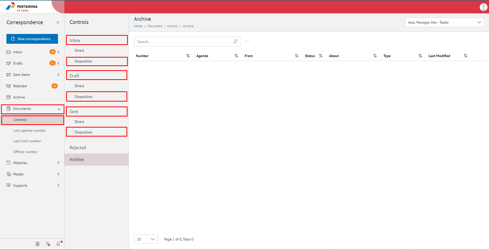

**Role yang sesuai**

- Sekretaris

Sekretaris dapat melihat daftar disposisi yang diterima oleh pejabat atasan

## **E-Corr Versi Web**

Langkah-langkah untuk melihat daftar disposisi via Web adalah sebagai berikut:

1. Klik menu **Document** dan pilih submenu **Control** **Inbox/Draft/Sent Items/** pilih sub menu **Disposition**

2. Sistem menampilkan dokumen disposisi yang informasinya meliputi number, Agenda, from, about, type, last Modified dan secretary note.
