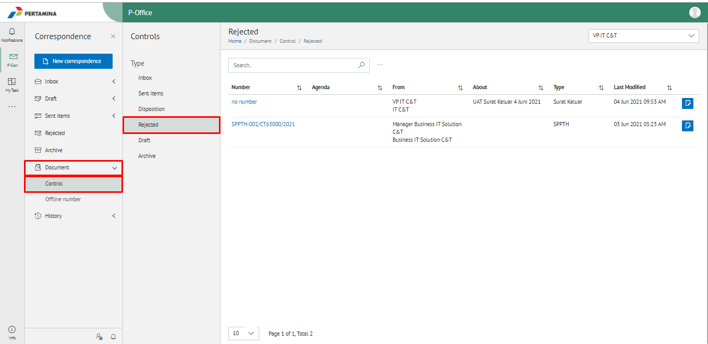
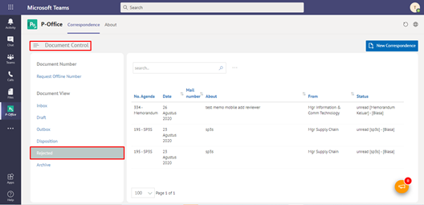

**Role yang sesuai**

- Sekretaris

Sekretaris dapat melihat daftar dokumen yang ditolak, dikembalikan atau dibatalkan di pejabat atasan

## **P-Office Versi Web**

Langkah-langkah untuk melihat daftar dokumen dokumen yang ditolak, dikembalikan atau dibatalkan via Web adalah sebagai berikut:

1. Klik menu **Document** dan pilih submenu **Control - Rejected**

2. Sistem menampilkan dokumen yang ditolak, dikembalikan atau dibatalkan yang meliputi number, Agenda, from, about, type, last Modified dan secretary note.

## **P-Office Versi Teams**

Langkah-langkah untuk melihat daftar dokumen ditolak, dikembalikan atau dibatalkan via Teams adalah sebagai berikut:

1. Klik menu **Document Control** dan pilih submenu **Document View - Rejected**

2. Sistem menampilkan dokumen disposis yang ditolak, dikembalikan dan dibatalkan yang meliputi no agenda, tanggal, nomor surat, perihal, dari/asal, status dan *secretary notes*