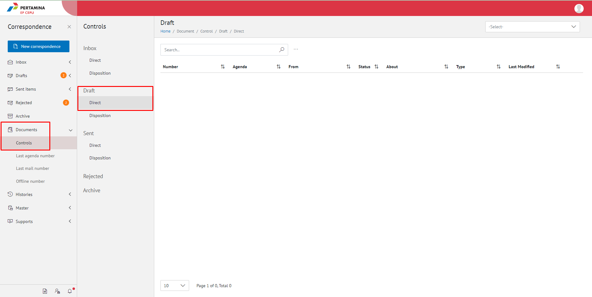

**Role yang sesuai**

- Sekretaris

Sekretaris dapat melihat daftar surat yang masih berada di draft pejabat atasan dan belum ditindak lanjuti

## **E-Corr Versi Web**

Langkah-langkah untuk melihat daftar dokumen draft via Web adalah sebagai berikut:

1. Klik menu **Document** dan pilih submenu **Control** **Inbox/Draft/Sent Items/Rejected/Archive** lalu pilih menu **Direct**

2. Sistem menampilkan dokumen draft yang meliputi number, Agenda, from, about, type, last Modified dan secretary note.

