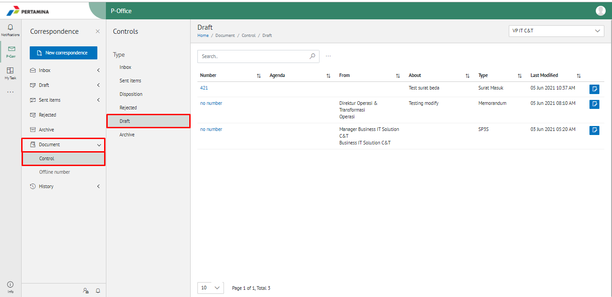
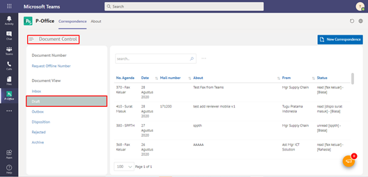

**Role yang sesuai**

- Sekretaris

Sekretaris dapat melihat daftar surat yang masih berada di draft pejabat atasan dan belum ditindak lanjuti

## **P-Office Versi Web**

Langkah-langkah untuk melihat daftar dokumen draft via Web adalah sebagai berikut:

1. Klik menu **Document** dan pilih submenu **Control - Draft**

2. Sistem menampilkan dokumen draft yang meliputi number, Agenda, from, about, type, last Modified dan secretary note.

## **P-Office Versi Teams**

Langkah-langkah untuk melihat daftar dokumen draft via Teams adalah sebagai berikut:

1. Klik menu **Document Control** dan pilih submenu **Document View - Draft**

2. Sistem menampilkan dokumen draft yang meliputi no agenda, tanggal, nomor surat, perihal, dari/asal, status dan *secretary notes*