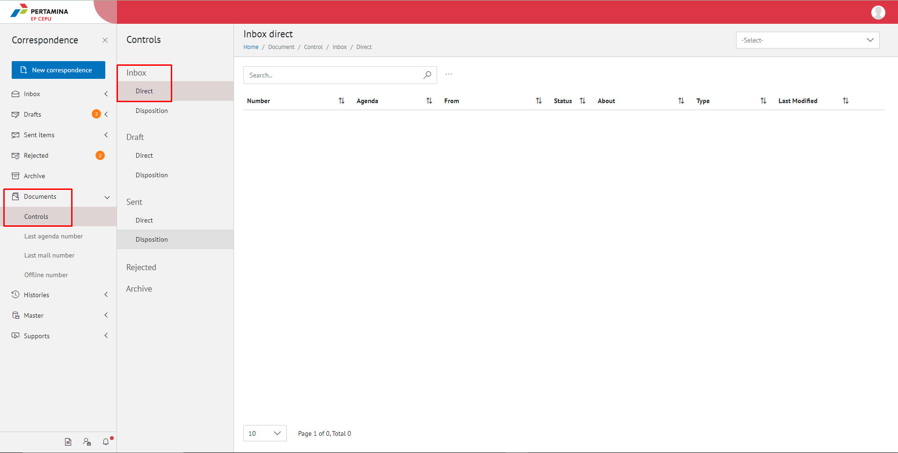

**Role yang sesuai**

- Sekretaris

Sekretaris dapat melihat daftar surat yang sudah ditindak lanjuti oleh pejabat atasan pada menu Sent Item.

## **E-Corr Versi Web**

Langkah-langkah untuk melihat daftar surat pada Sent Items pejabat atasan via Web adalah sebagai berikut

1. Klik menu **Document - Control** dan pilih submenu **Sent Items** - **Direct/Disposition**

2. Sistem menampilkan daftar surat pada Sent Item pejabat atasan yang meliputi number, Agenda, from, about, type, last Modified dan secretary note.