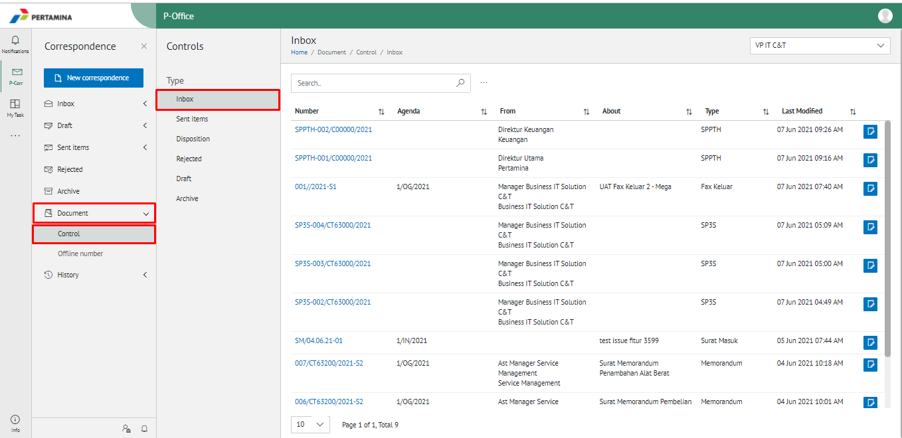
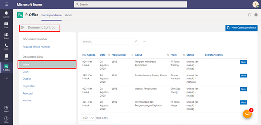

**Role yang sesuai**

- Sekretaris

Sekretaris dapat melihat daftar dokumen masuk (Inbox) yang mencatatkan seluruh dokumen yang masuk kepada jabatan atasan sekretaris. 

## **E-Corr Versi Web**

Berikut ini terdapat video yang menjelaskan langkah-langkah sebagai sekretaris untuk melihat dokumen milik atasan pejabatnya pada menu Document Control

 

1. Klik menu **Document** dan pilih submenu **Control - Inbox**

2. Sistem menampilkan dokumen masuk yang informasinya meliputi number, Agenda, from, about, type, last Modified dan secretary note.

## **E-Corr Versi Teams**

Langkah-langkah untuk melihat daftar dokumen masuk (Inbox) via Teams adalah sebagai berikut:

1. Klik menu **Document Control** dan pilih submenu **Document View - Inbox**

2. Sistem menampilkan dokumen masuk yang informasinya meliputi no agenda, tanggal, nomor surat, perihal, dari/asal, status dan *secretary notes*