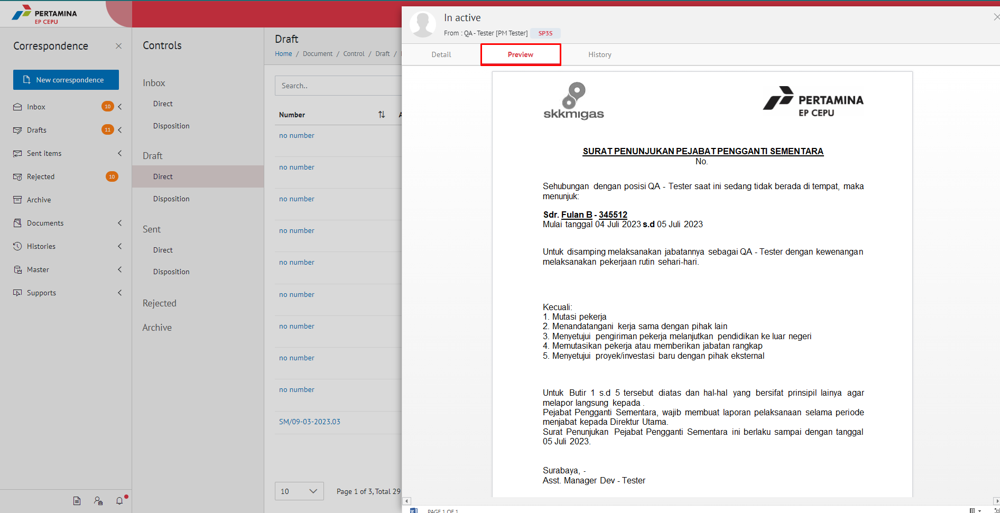
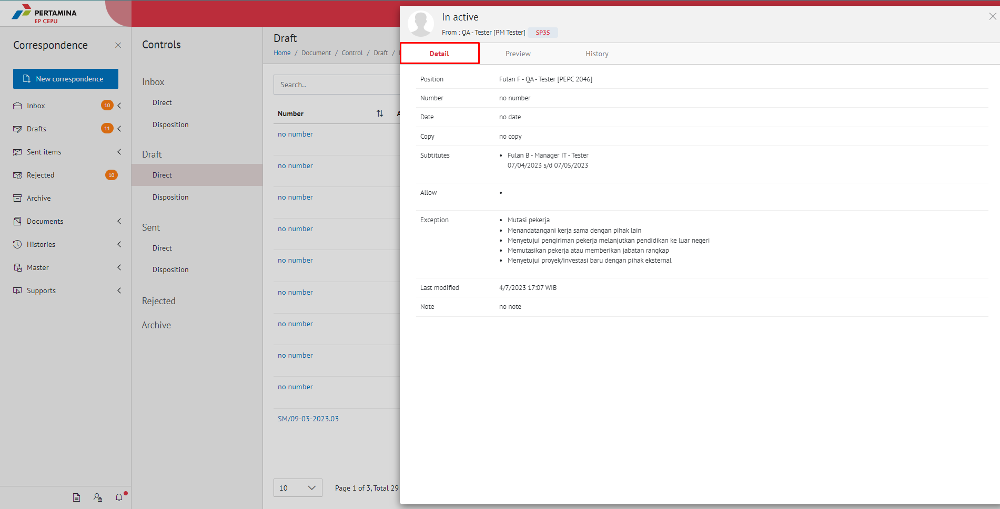
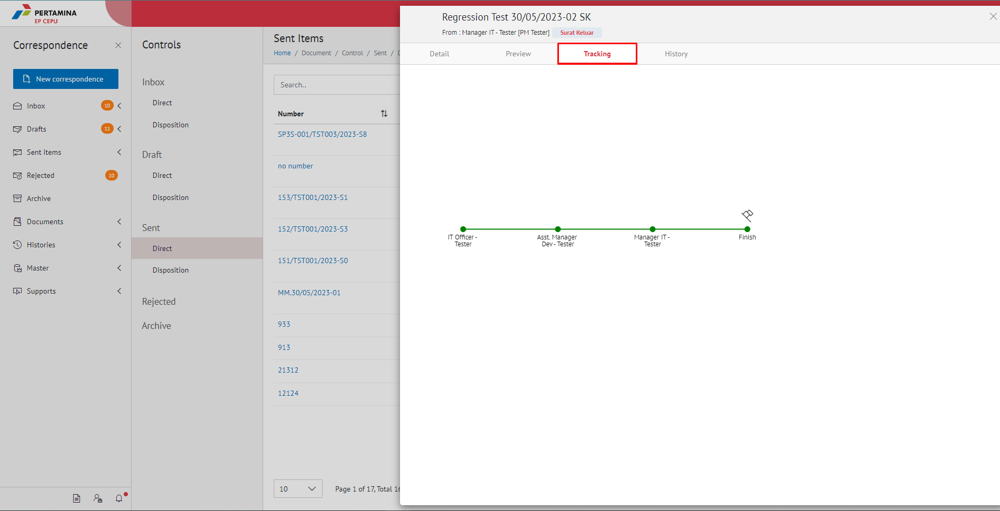
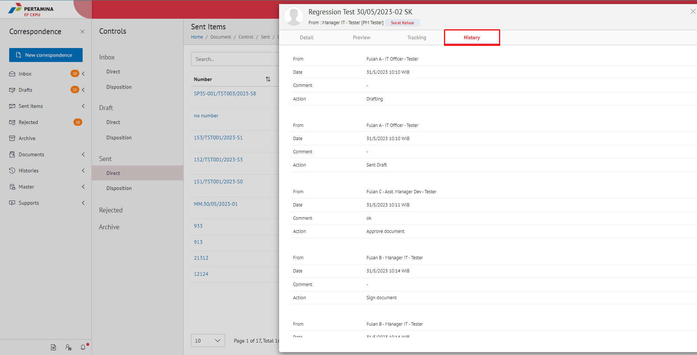

**Role yang sesuai**

- Sekretaris

Sekretaris dapat melihat detail surat baik surat yang berklasifikasi "Biasa", "Terbatas", "Rahasia" dan "Sangat Rahasia". Sedangkan sebagai *role* sekretaris hanya dapat melihat detail surat yang berklasifikasi "Biasa" dan "Terbatas". Informasi yang ditampikan detail surat antara lain yaitu

## **E-Corr Versi Web**

Langkah - langkah untuk melakukan melihat detail dokumen masuk, dokumen keluar dan dokumen disposisi via Web adalah sebagai berikut.

1. Klik menu **Document** dan pilih **Control**, Kemudian pilih **Dokumen Inbox/ Dokumen Draft/ Dokumen Sent items/** dari surat **Direct/Disposition**

<<<<<<< HEAD

2. Klik salah satu surat yang akan dilihat detailnya

=======

2. Klik salah satu surat yang akan dilihat detailnya

>>>>>>> 28ecc6a1b85ed82d96407dd1bff9845dd99bd4dd

#### **Preview Surat**
    
Pada tab **Preview**, ditampilkan _preview_ surat yang sudah dibuat. _Preview_ surat disesuaikan dengan template berdasarkan jenis surat

<<<<<<< HEAD

=======

>>>>>>> 28ecc6a1b85ed82d96407dd1bff9845dd99bd4dd

#### **Detail Surat**
    
Pada tab **Detail**, terdapat informasi asal surat, perihal, file lampiran, nomor surat, klasifikasi surat, tanggal surat, tujuan surat

<<<<<<< HEAD

=======

>>>>>>> 28ecc6a1b85ed82d96407dd1bff9845dd99bd4dd

#### **Tracking Surat**
   
Pada tab **Tracking**, ditampilkan informasi *tracking* memorandum dalam bentuk *chart*

<<<<<<< HEAD

=======

>>>>>>> 28ecc6a1b85ed82d96407dd1bff9845dd99bd4dd

#### **History Surat**
    
Pada tab **History**, ditampilkan riwayat memorandum yang terdapat informasi jabatan, tanggal, tindakan dan komentar

<<<<<<< HEAD

=======

>>>>>>> 28ecc6a1b85ed82d96407dd1bff9845dd99bd4dd

