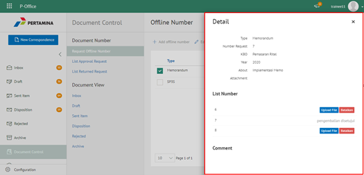
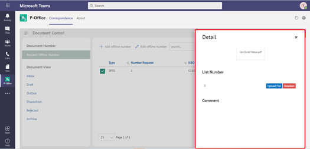
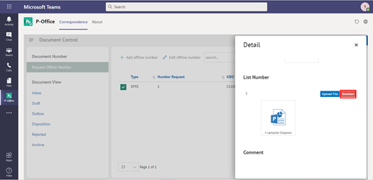
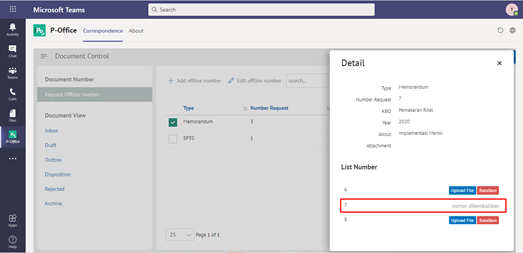

**Role yang sesuai**

 - Sekretaris

**Ditujukan untuk**

- Admin Approver Offline Number

Sekretaris dapat mengembalikan nomor offline yang sudah di-*request*.

## **P-Office Versi Web**

Langkah - langkah untuk mengembalikan nomor offline via Web adalah sebagai berikut

1. Klik menu **Document Control** dan pilih tab **Request Nomor Offline**

2. Pilih nomor offline yang akan dikembalikan dengan klik tombol **Detail**

3. Sistem menampilkan detail nomor offline dan daftar nomor berapa saja yang di-*request*.

4. Pilih tombol **Batalkan**

5. Nomor yang dikembalikan akan berubah status menjadi **Nomor Dikembalikan** dan pengembalian nomor akan tersimpan di menu "**Document Control - List Returned Request**" pada role admin P-Office.

## **P-Office Versi Teams**

Langkah - langkah untuk mengembalikan nomor via Teams adalah sebagai berikut:

1. Klik menu **Document Control** dan pilih tab **Request Nomor Offline**

2. Pilih nomor offline yang akan dikembalikan dengan klik tombol **Detail**

3. Sistem menampilkan detail nomor offline dan daftar nomor berapa saja yang di-*request*.

4. Pilih tombol **Batalkan**

5. Nomor yang dikembalikan akan berubah status menjadi **Nomor Dikembalikan** dan pengembalian nomor akan tersimpan di menu "**Document Control - List Returned Request**" pada role admin P-Office.

