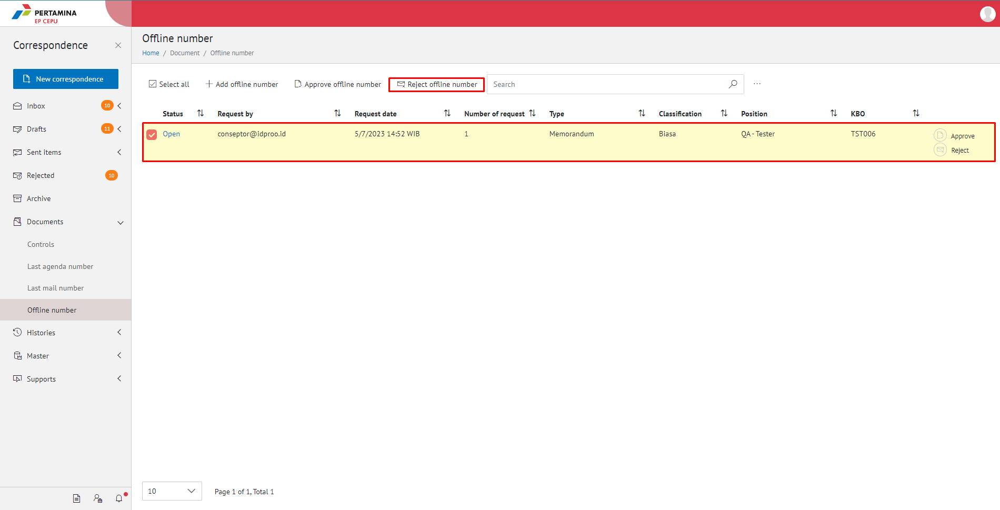
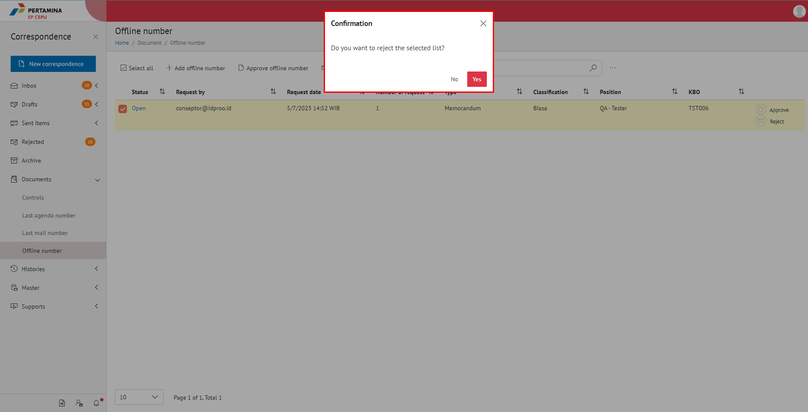
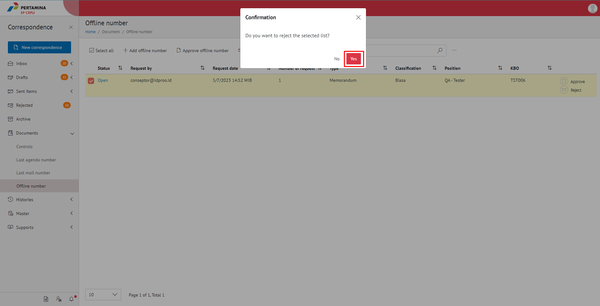
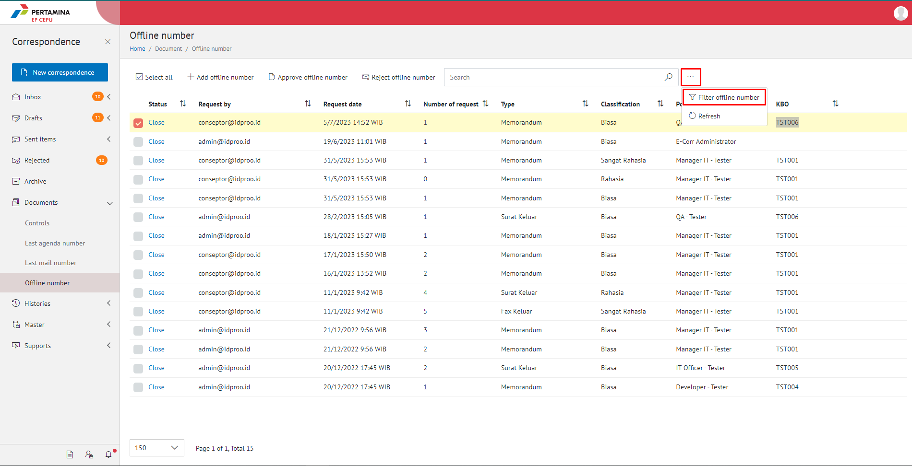
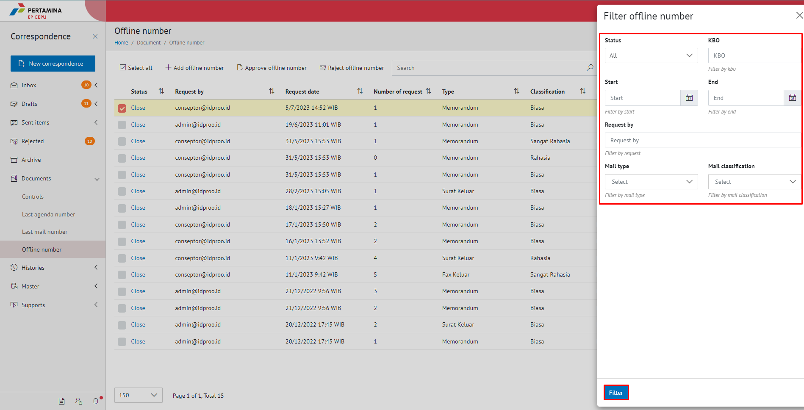
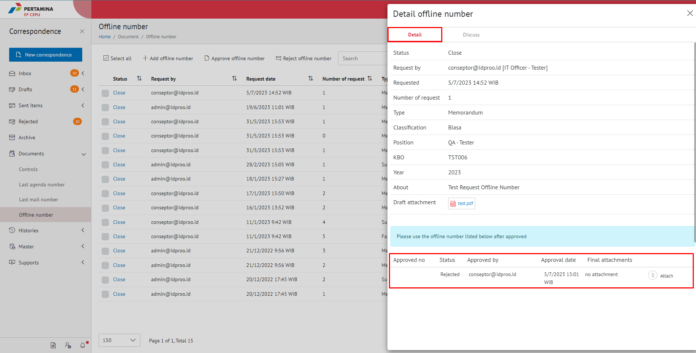

**Role yang sesuai**

 - Sekretaris

**Ditujukan untuk**

- Admin Approver Offline Number

Sekretaris dapat mengembalikan nomor offline yang sudah di-*request*.

## **E-Corr Versi Web**

Langkah - langkah untuk mengembalikan nomor offline via Web adalah sebagai berikut

1. Klik menu **Document** dan pilih tab **Offline Number**

2. Pilih dan Centang nomor offline yang akan dikembalikan dengan klik tombol **Reject**

3. Sistem menampilkan Pop up notifikasi pemberitahuan nomor offline yang ingin di **Yes** kemudian pilih **No**

4. Pilih tombol **Yes**

5. Nomor yang dikembalikan akan berubah status menjadi **Rejected** dan pengembalian nomor akan tersimpan di menu "**Document - Control**

6. Klik **...** lalu pilih opsi **Filter offline number** 

7. Sistem akan menamoilkan pop up form **Filter offline number** lalu isikan field yang dibutuhkan, selanjutnya klik **Filter**

8. Sistem akan menampilkan list data offline number, pilih salah satu daftar offline number dan klik tab **Detail** selanjutnya sistem akan menampilkan Detail offline number beserta dengan statusnya.

