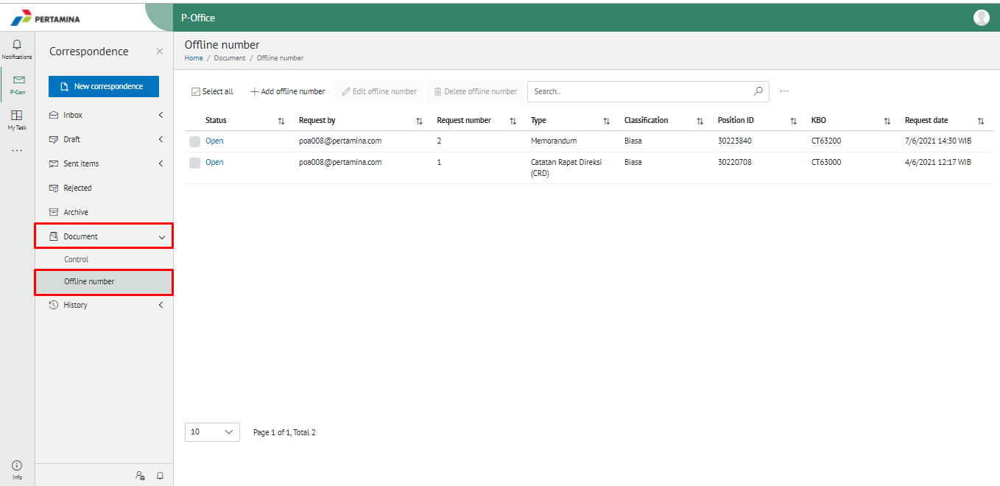
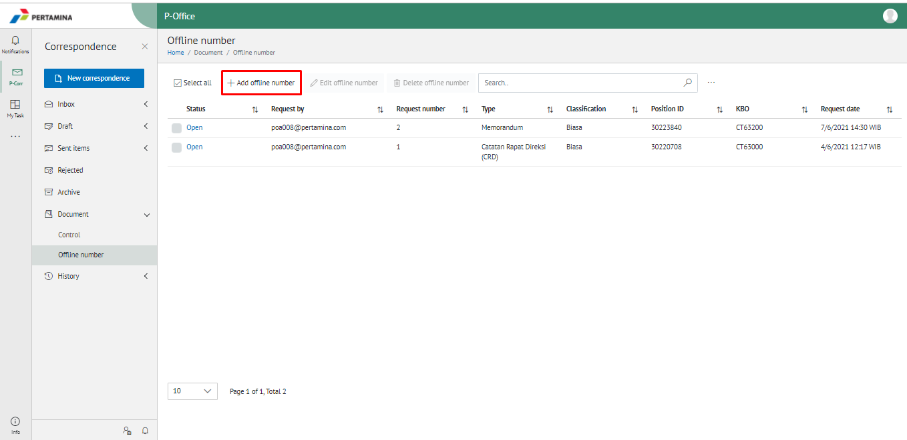
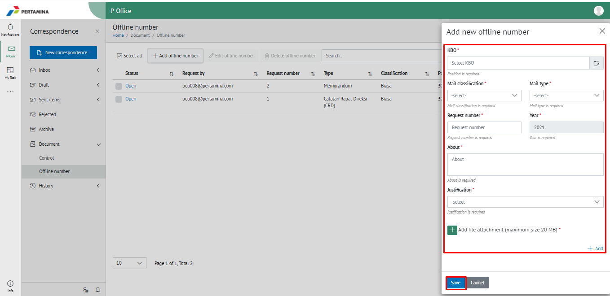
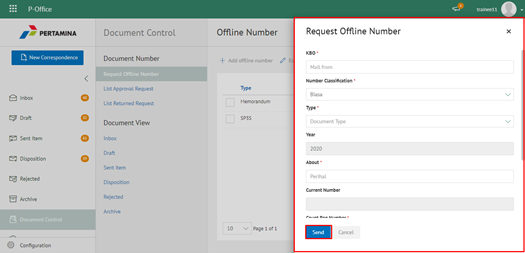
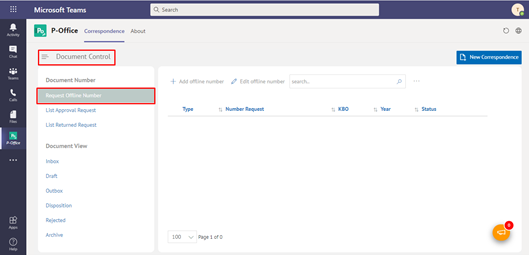
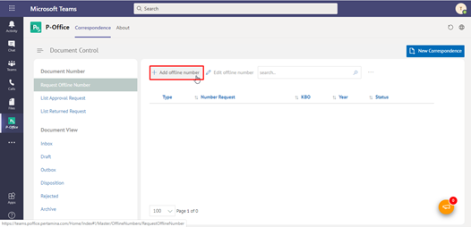
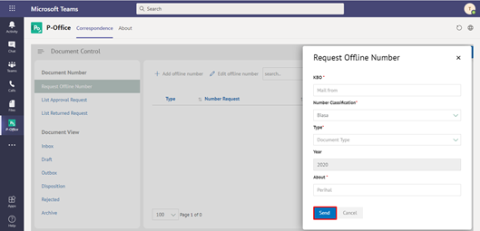
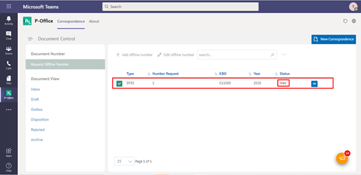

**Role yang sesuai**

- Sekretaris

Pengajuan nomor offline digunakan untuk *request* pemrosesan nomor dokumen secara offline. Sekretaris yang mengajukan nomor offline akan disetujui oleh admin approval nomor offline. 

## **E-Corr Versi Web**

Berikut ini terdapat video yang menjelaskan langkah - langkah sebagai sekretaris untuk mengajukan nomor offline yang kemudian akan di approve oleh admin approval offline number 

 

1. Klik menu **Document** dan pilih **Offline Number** 

2. Klik button "+ Add Offline Number" untuk melakukan *request* nomor offline

3. Sistem menampilkan form **Request Nomor Offline.** Isi form dan klik **Send**

4. Sistem berhasil menyimpan perubahan dan nomor offline yang sudah di *request* akan tampil di halaman daftar **Request Nomor Offline** dengan status **Waiting**

## **E-Corr Versi Teams**

Langkah - langkah untuk request nomor offline via Teams adalah sebagai berikut:

1. Klik menu **Document Control** dan pilih tab **Request Offline Number**

2. Klik button "+ Add Offline Number" untuk melakukan *request* nomor offline

3. Sistem menampilkan form **Request Nomor Offline.** Isi form dan klik **Send**

4. Sistem berhasil menyimpan perubahan dan nomor offline yang sudah di *request* akan tampil di halaman daftar **Request Nomor Offline** dengan status **Waiting**

