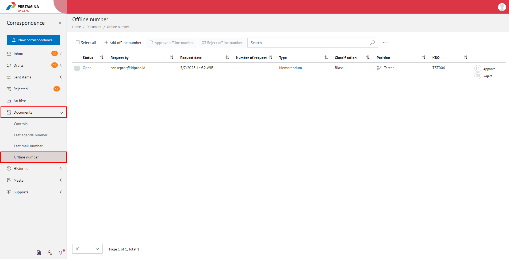
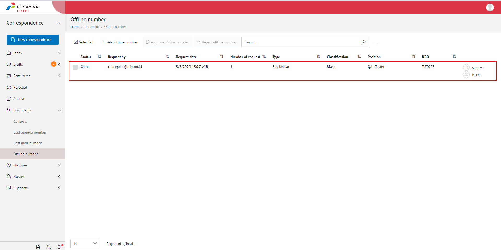
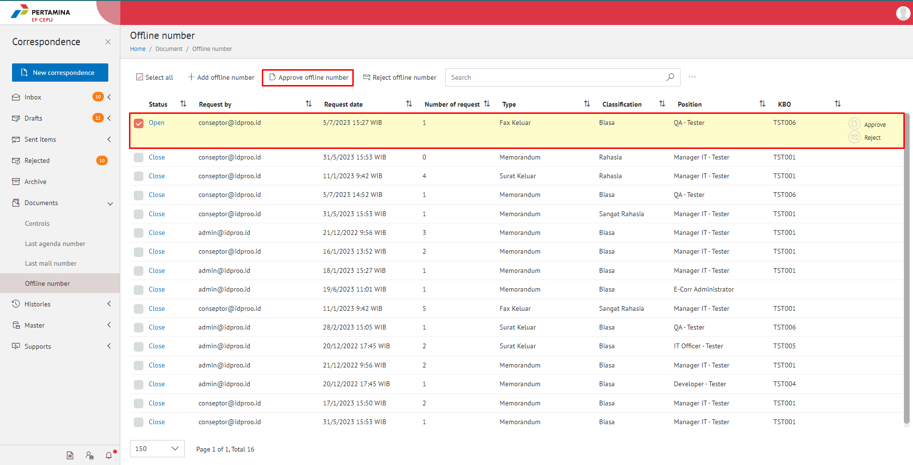
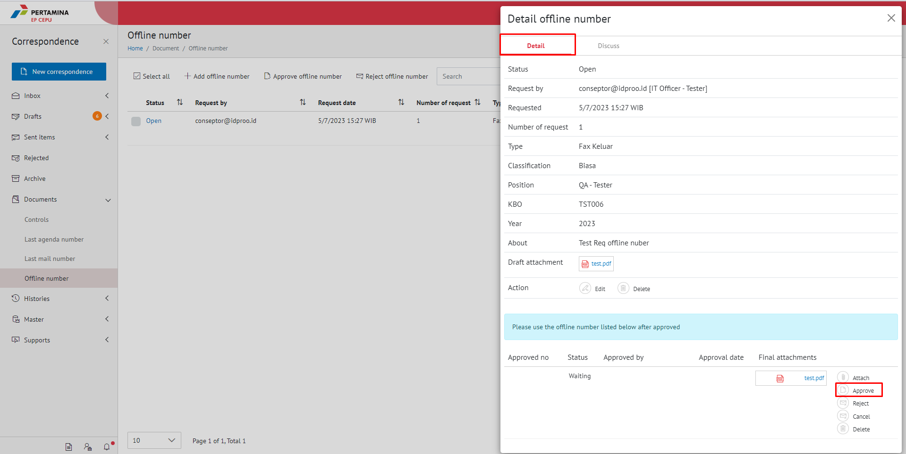
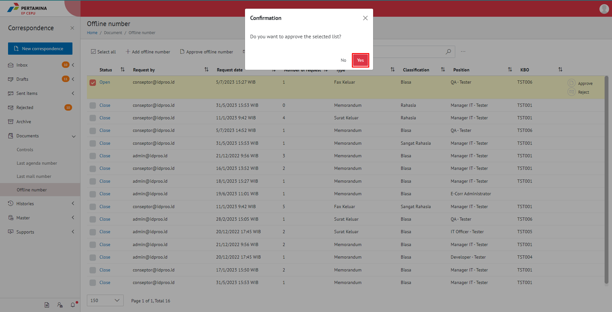

**Role yang sesuai**

- Admin Approver Offline Number

Admin Approver Offline Number dapat melakukan tindak lanjut terhadap pengajuan nomor offline dengan menyetujui pengajuan yang diajukan oleh sekretaris. 

## **E-Corr Versi Web**

Langkah - langkah untuk menyetujui pengajuan nomor via Web adalah sebagai berikut

1. Klik menu **Document** dan pilih **Offline Number**, kemudian Pilih salah satu nomor offline yang akan disetujui dan klik **Open**

<<<<<<< HEAD

=======

>>>>>>> 28ecc6a1b85ed82d96407dd1bff9845dd99bd4dd

2. Pilih/Checklist salah satu daftar offline number yang akan di approve, lalu klik **Approve offline number**

<<<<<<< HEAD

=======

>>>>>>> 28ecc6a1b85ed82d96407dd1bff9845dd99bd4dd

3. Setelah di approve maka akan muncul pemberitahuan bahwa **Request number** sudah di approve

<<<<<<< HEAD

4. Sistem berhasil menyimpan perubahan dan nomor offline yang disetujui akan tampil di menu "**Document - Control**" dengan status **Close** dan  pada role admin E-Corr. Sedangkan untuk role sekretaris tersimpan di menu "**Document - Control**"  dengan status **Close**
=======

4. Sistem berhasil menyimpan perubahan dan nomor offline yang disetujui akan tampil di menu "**Document - Control**" dengan status **Close** dan  pada role admin E-Corr. Sedangkan untuk role sekretaris tersimpan di menu "**Document - Control**"  dengan status **Close**

>>>>>>> 28ecc6a1b85ed82d96407dd1bff9845dd99bd4dd
