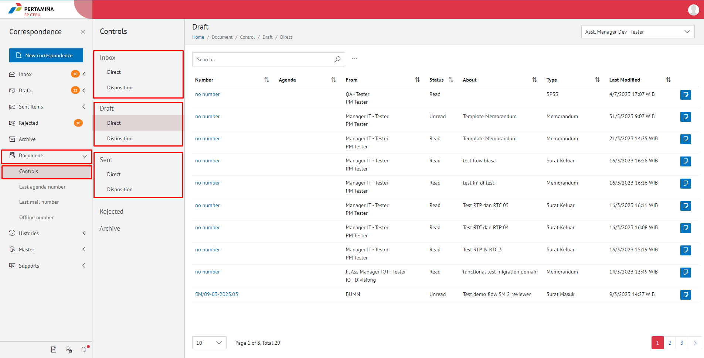
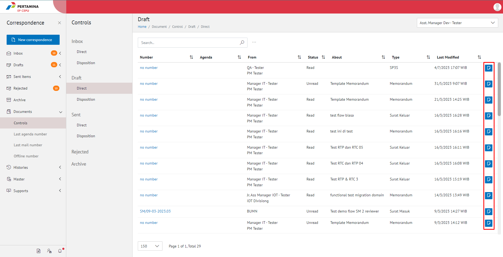
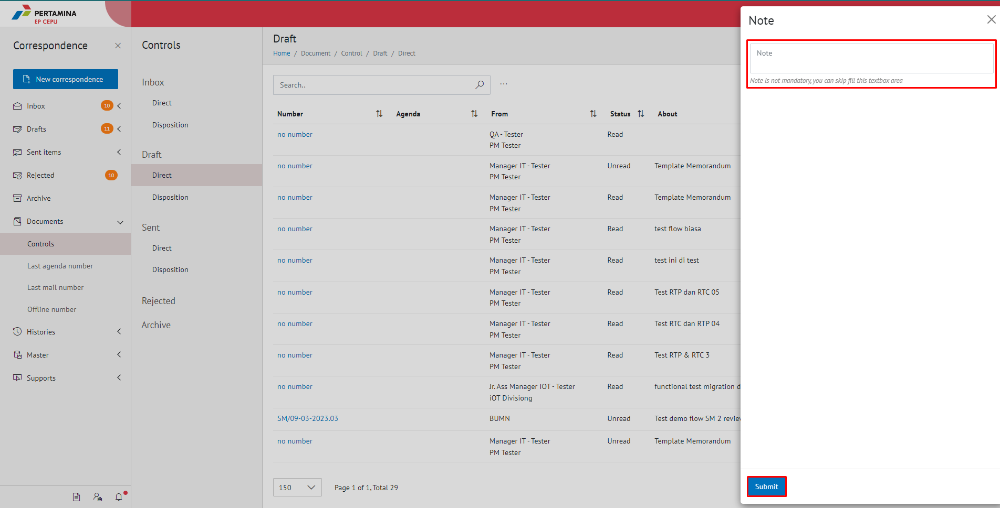

**Role yang sesuai**

- Sekretaris

Sekretaris dapat menambahkan *notes*/catatan terkait dokumen yang di-*review*. 

## **E-Corr Versi Web**

Langkah - langkah untuk menambah catatan dokumen via Web adalah sebagai berikut

1. Klik menu **Document** dan pilih **Control**, Kemudian pilih **Dokumen Inbox/ Dokumen Draft/ Dokumen Sent items**

2. Pilih dokumen/surat yang akan ditambahkan catatan dengan klik button **Notes**.

3. Sistem akan menapilkan _pop up_ **Note** Isikan catatan dan klik tombol **Submit**

4. Sistem berhasil menyimpan perubahan catatan dokumen
