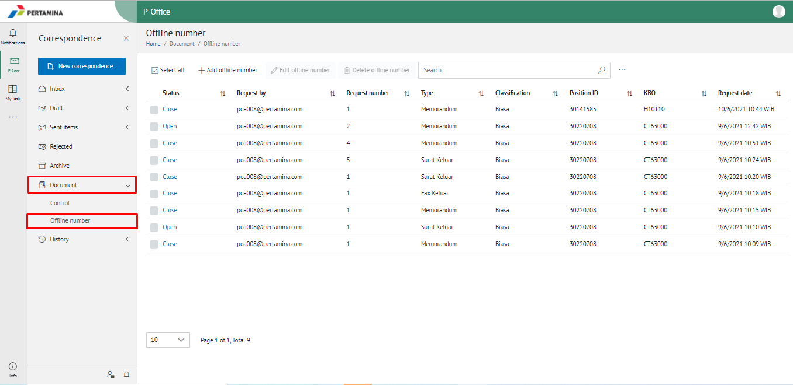
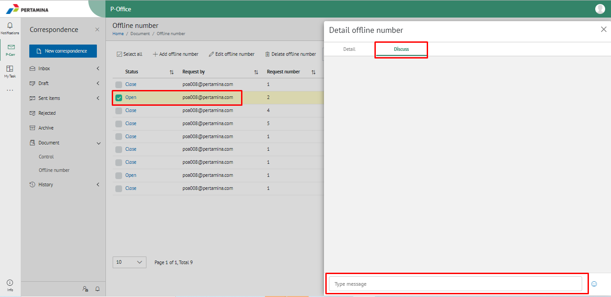
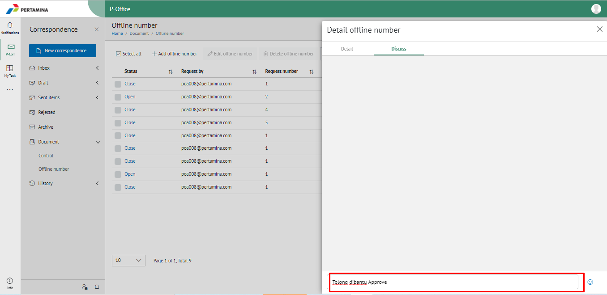
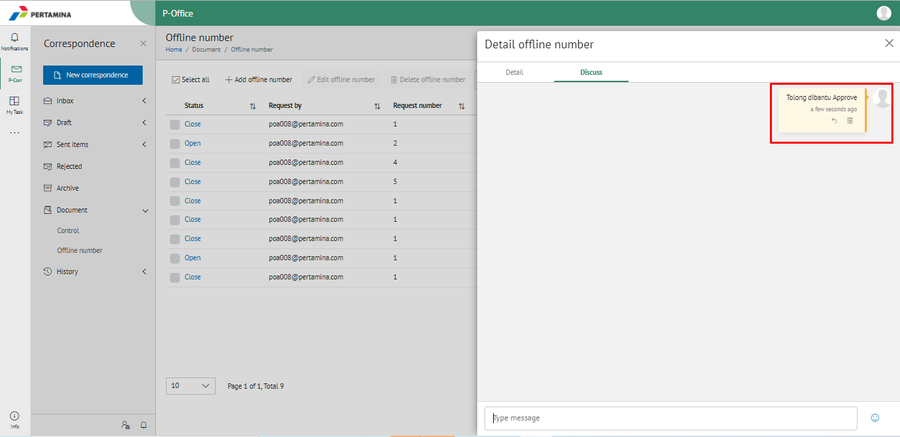
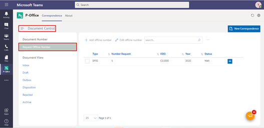
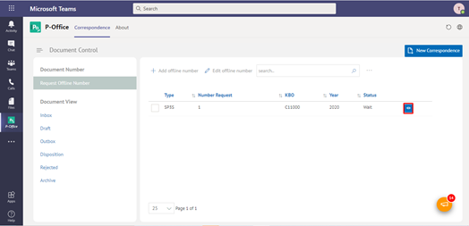

**Role yang sesuai**

- Sekretaris
- Admin Approver Offline Number

*User* dapat menambahkan komentar pada field komentar yang disediakan pada detail pengajuan nomor offline. 

## **P-Office Versi Web**

Langkah - langkah untuk menambahkan komentar via Web adalah sebagai berikut

1. Klik menu **Document** dan pilih **Control**

2. Pilih nomor offline yang akan ditambahkan komentar, Pilih Tab **Discuss**

3. Isikan komentar kemudian klik **Enter**

4. Sistem menyimpan perubahan dan *user* dapat saling berkomentar pada detail nomor offline

## **P-Office Versi Teams**

Langkah - langkah untuk menambahkan nomor offline via Teams adalah sebagai berikut:

1. Klik menu **Document Control** dan pilih tab **Request Nomor Offline**

2. Pilih nomor offline yang akan ditambahkan komentar dan halaman detail nomor offline akan muncul

3. Isikan komentar kemudian klik tombol **Send**

4. Sistem menyimpan perubahan dan *user* dapat saling berkomentar pada detail nomor offline