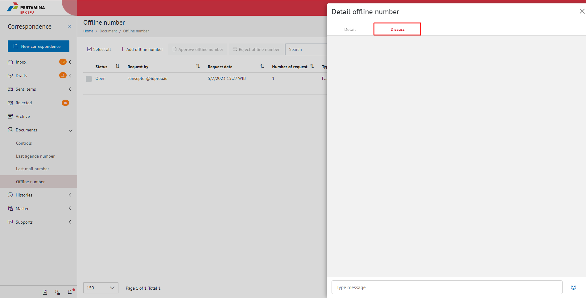
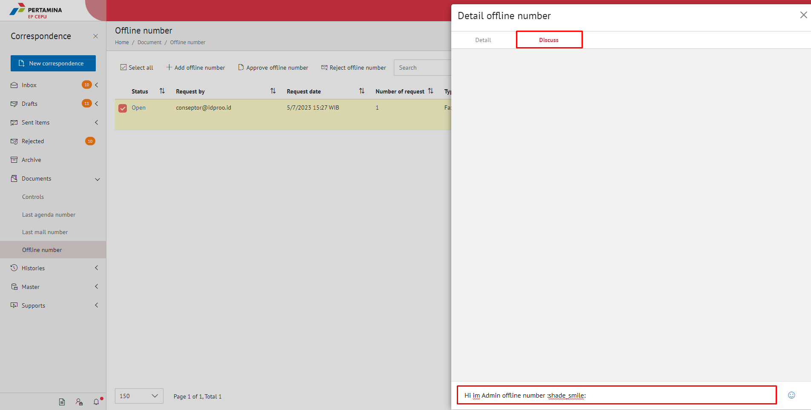
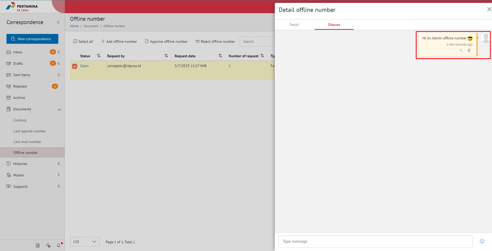

**Role yang sesuai**

- Sekretaris
- Admin Approver Offline Number

*User* dapat menambahkan komentar pada field komentar yang disediakan pada detail pengajuan nomor offline. 

## **E-Corr Versi Web**

Langkah - langkah untuk menambahkan komentar via Web adalah sebagai berikut

1. Klik menu **Document** dan pilih **Offline number**

2. Pilih nomor offline yang akan ditambahkan komentar, Pilih Tab **Discuss**

3. Isikan komentar kemudian klik **Enter**

4. Sistem menyimpan perubahan dan *user* dapat saling berkomentar pada detail nomor offline