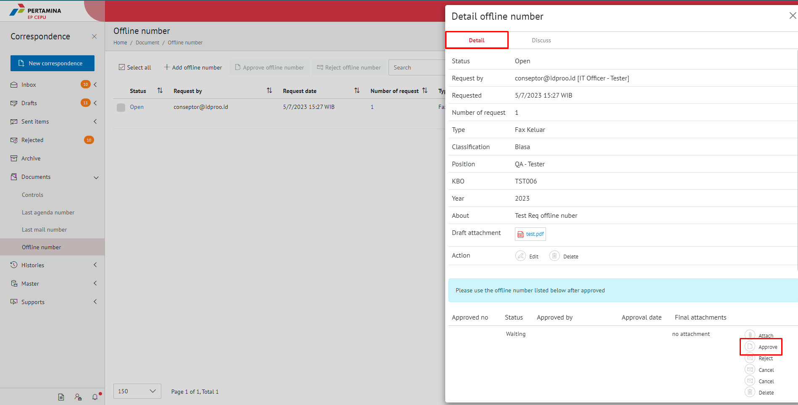

**Role yang sesuai**

- Admin Approver Offline Number

Admin Approver Offline Number dapat melakukan tindak lanjut terhadap pengajuan nomor offline dengan menolak / *reject* pengajuan  yang diajukan oleh sekretaris. 

## **E-Corr Versi Web**

Langkah - langkah untuk menolak pengajuan nomor via Web adalah sebagai berikut :

1. Klik menu **Document** dan pilih **Offline number**

2. Pilih nomor offline yang akan ditolak, Klik tombol **Open**, ke Tab **Detail** dan Pilih **Reject**

3. Sistem berhasil menyimpan perubahan dan nomor offline yang ditolak akan tampil di menu "**Document - Control**" dengan status **Rejected** pada role admin E-Corr. Sedangkan untuk role sekretaris tersimpan di menu "**Document - Control**" dengan status **Rejected**

