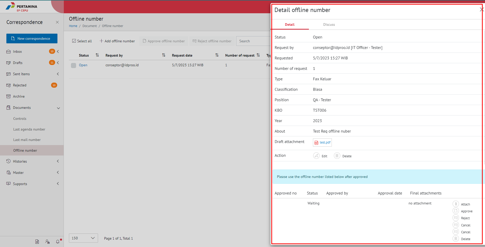
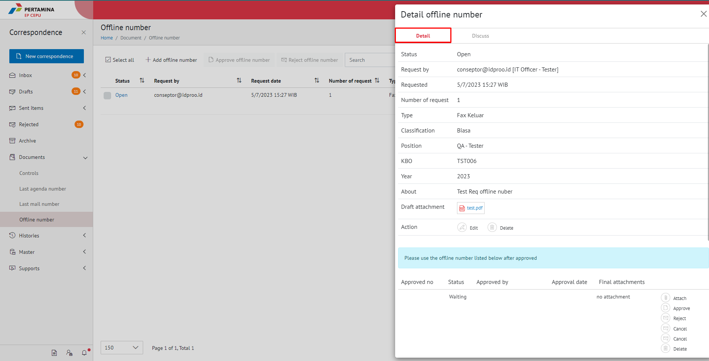
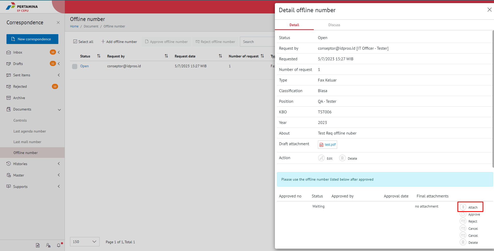
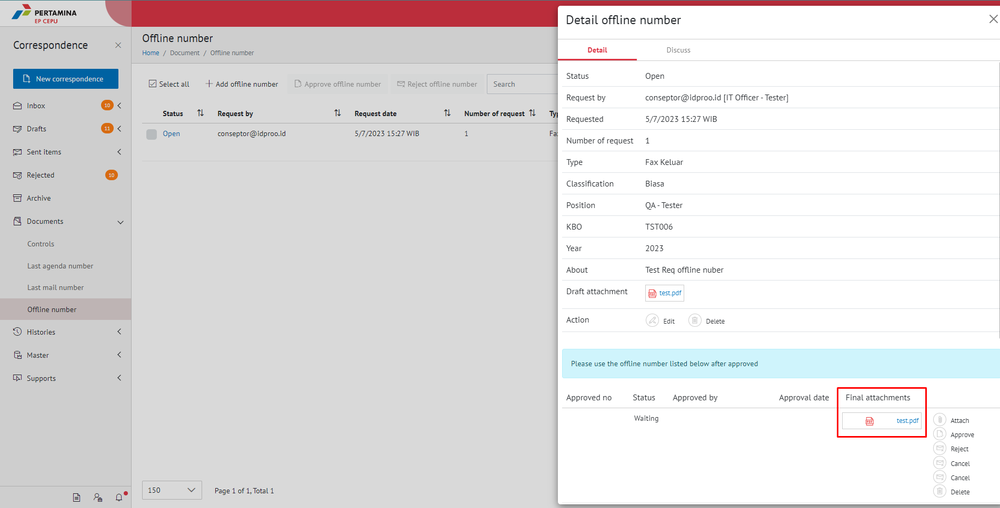

**Role yang sesuai**

- Sekretaris

Sekretaris dapat mengunggah dokumen permasing-masing nomor offline yang sudah di-*request*. Sekretaris yang sudah mengunggah dokumen nomor offline dapat melakukan pengajuan nomor kembali maksimal 5 kali _request_. 

## **E-Corr Versi Web**

Langkah-langkah untuk mengunggah dokumen nomor offline via Web adalah sebagai berikut

1. Klik menu **Document** dan pilih tab **Offline number**

2. Pilih nomor offline yang akan diunggah dokumennya dengan klik tombol **Open** 

3. Pada Tab **Detail** Sistem menampilkan detail nomor offline dan daftar nomor berapa saja yang di-*request*.

4. Pilih tombol **attach** dan pilih **upload** file yang akan diunggah dan klik **Save**

5. Sistem berhasil menunggah dokumen/file nomor offline. File yang sudah diunggah muncul di halaman detail nomor offline dan hasil unggahan dapat di unduh oleh *user*

