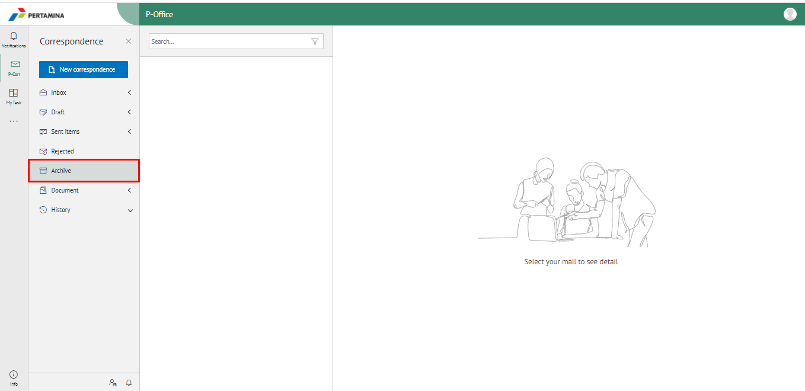
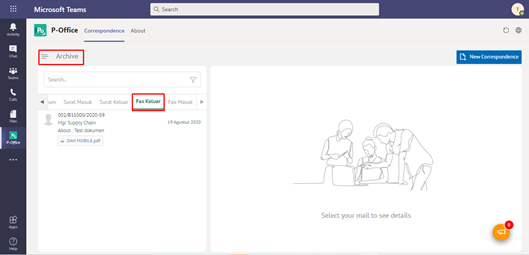

**Role yang sesuai**

- *Approver User*
- *Reviewer User*
- *Member User*
- Sekretaris

*User* dapat melihat dokumen fax keluar pada menu Archive.

## **P-Office Versi Web**

Langkah - langkah untuk melihat daftar dokumem Fax keluar via Web adalah sebagai berikut :

1. Klik menu **Archive** dan pilih Surat berlabel **Fax keluar**

 2. Sistem menampilkan dokumen fax masuk yang tersimpan di menu Archive

## **P-Office Versi Teams**

Langkah - langkah untuk melihat daftar dokumem Fax keluar via Teams adalah sebagai berikut :

1.  Klik menu **Archive** dan pilih submenu **Fax Keluar**

2.  Sistem menampilkan dokumen fax keluar yang tersimpan di menu Archive

## **P-Office Versi Android dan iOS**

Langkah - langkah untuk melihat daftar dokumem Fax keluar via Android dan iOS adalah sebagai berikut :

1. Klik menu **Archive** pilih submenu **Fax Keluar**
   
 

2. Sistem menampilkan dokumen surat masuk yang tersimpan di menu Archive
