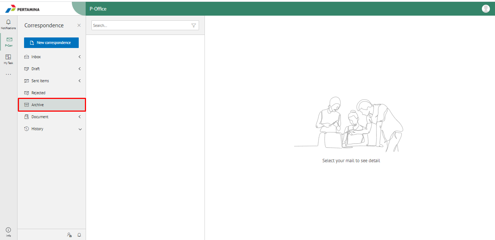
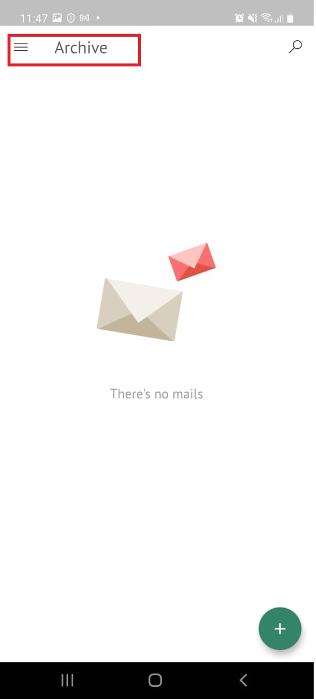

**Role yang sesuai**

- *Approver User*
- *Reviewer User*
- *Member User*
- Sekretaris

*User* dapat melihat dokumen fax masuk pada menu Archive.

## **E-Corr Versi Web**

Langkah - langkah untuk melihat dokumen fax masuk via Web adalah sebagai berikut:

1. Klik menu **Archive** dan pilih Surat berlabel **Fax Masuk**

2. Sistem menampilkan dokumen fax keluar yang tersimpan di menu Archive

## **E-Corr Versi Android dan iOS**

Langkah - langkah untuk melihat daftar dokumem Fax Masuk via Android dan iOS adalah sebagai berikut :

1. Klik menu **Archive** pilih submenu **Fax Masuk**
   
 

2. Sistem menampilkan dokumen Fax Masuk yang tersimpan di menu Archive

