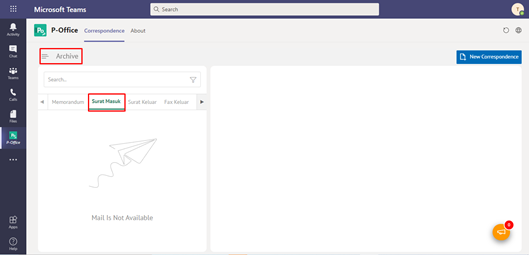

**Role yang sesuai**

- *Approver User*
- *Reviewer User*
- *Member User*
- Sekretaris

*User* dapat melihat dokumen surat masuk pada menu Archive. 

## **P-Office Versi Web**

Langkah - langkah untuk melihat dokumen surat masuk via Web adalah sebagai berikut :

1. lik menu **Archive** dan pilih Surat berlabel **Surat Masuk**

2. Sistem menampilkan dokumen surat masuk yang tersimpan di menu Archive

## **P-Office Versi Teams**

Langkah - langkah untuk melihat daftar dokumem Surat Masuk via Teams adalah sebagai berikut :

1. Klik menu **Archive** dan pilih submenu Surat Masuk

2.  Sistem menampilkan dokumen surat masuk yang tersimpan di menu _Archive_

## **P-Office Versi Android dan iOS**

Langkah - langkah untuk melihat daftar dokumem Surat Masuk via Android dan iOS adalah sebagai berikut :

1. Klik menu **Archive** pilih Berlabel **Surat Masuk**
   
 

2. Sistem menampilkan dokumen surat masuk yang tersimpan di menu Archive

