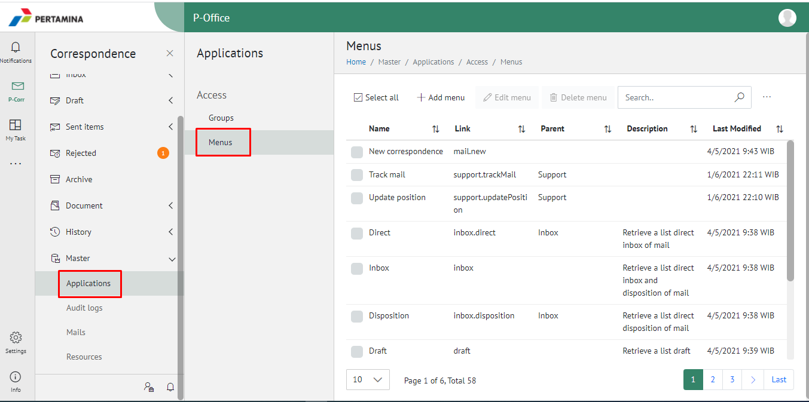
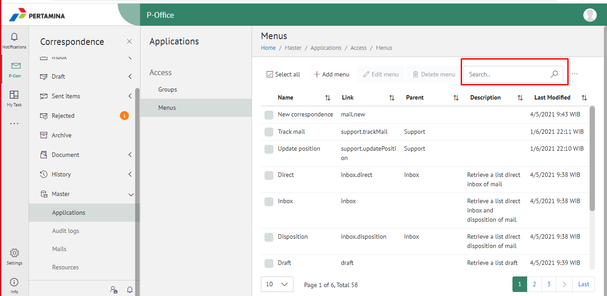
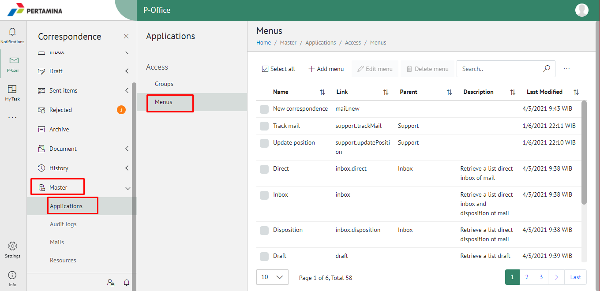
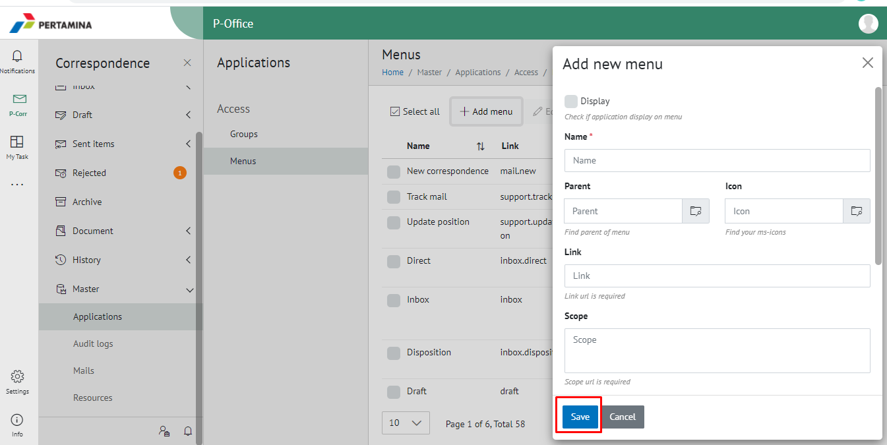
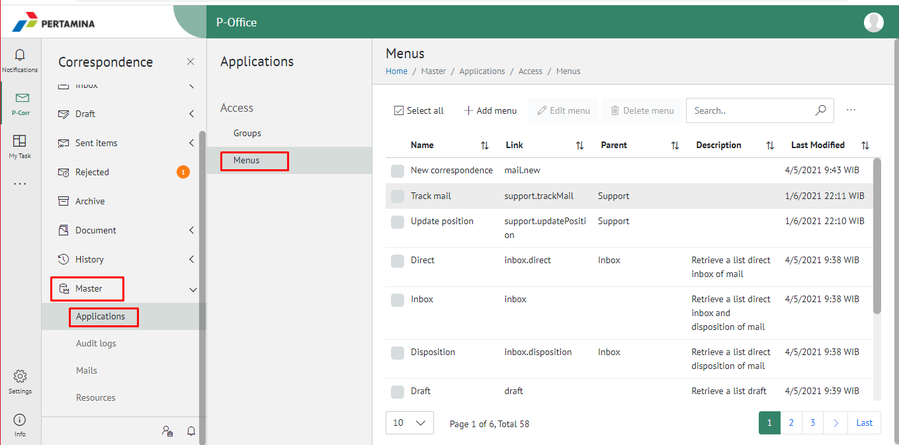

**Role yang sesuai**

- Admin E-Corr

Admin E-Corr dapat mengelola akses menu yang digunakan dalam dalam pemberian hak akses pada setiap role-nya. Pengelolaan akses menu yang dilakukan admin E-Corr antara lain yaitu

- Mencari akses menu

- Menambah akses menu

- Mengubah akses menu

- Menghapus akses menu

## **E-Corr Versi Web**

Langkah - langkah untuk melakukan pengelolaan akses menu via Web adalah sebagai berikut :

#### **Mencari Menu Akses**

1.    Pilih menu **Master** dan pilih submenu **Access Menus**

2.    Pilih tombol **Search** dan masukkan pencarian berdasarkan kata kunci, kemudian klik **Enter**

#### **Menambah Menu Akses**

1.    Pilih menu **Master** dan pilih submenu **Access Menus**

2.    Pilih tombol **+ Add Menu** untuk menambah menu akses

3.    Isikan informasi menu akses meliputi nama dan link akses menu kemudian klik tombol **Submit.**

4.    Sistem menyimpan perubahan dan data akan muncul di halaman daftar menu akses

#### **Mengubah Menu Akses**

1.    Pilih menu **Master** dan pilih submenu **Access Menus**

2.    Klik checklist pada akses menu yang akan diubah kemudian klik tombol **Edit Menu**