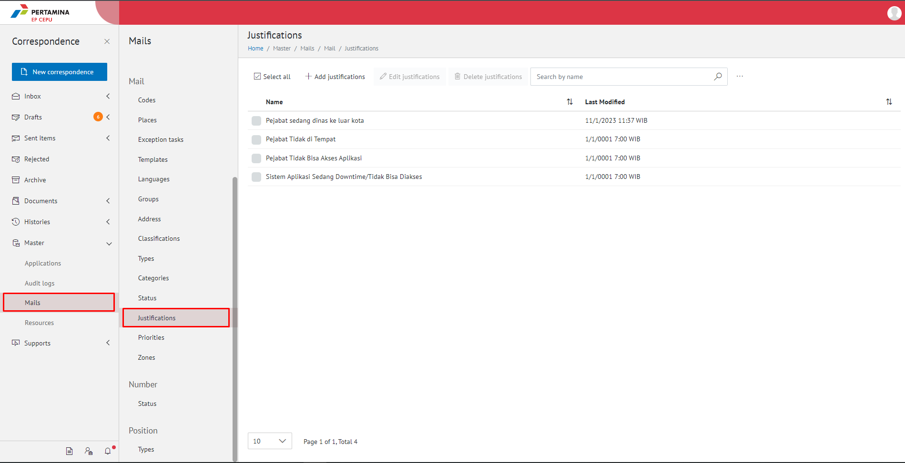
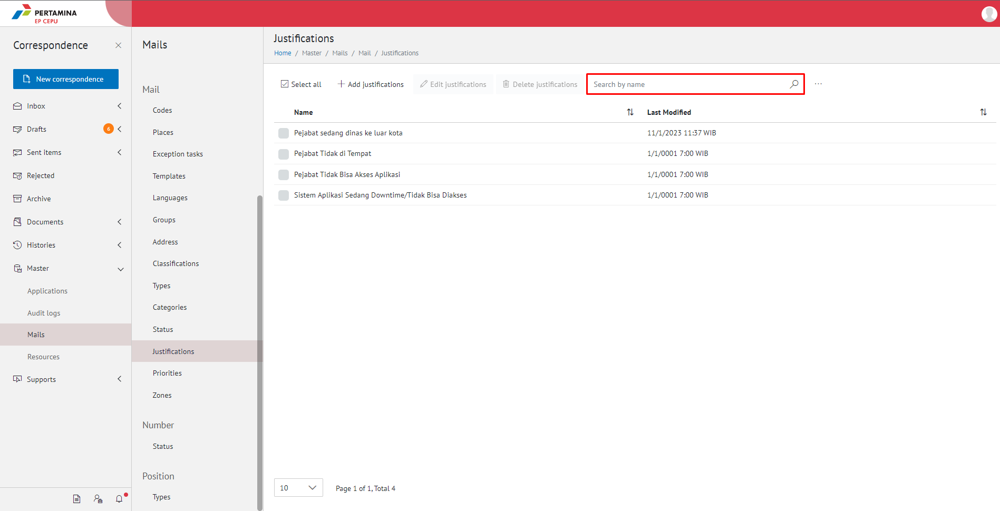
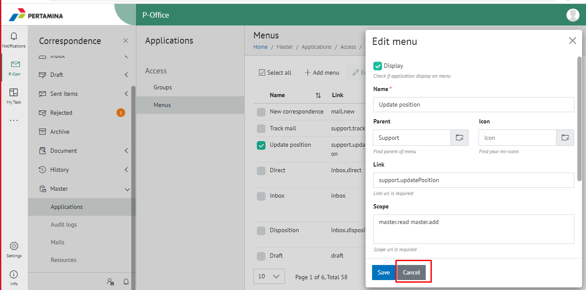
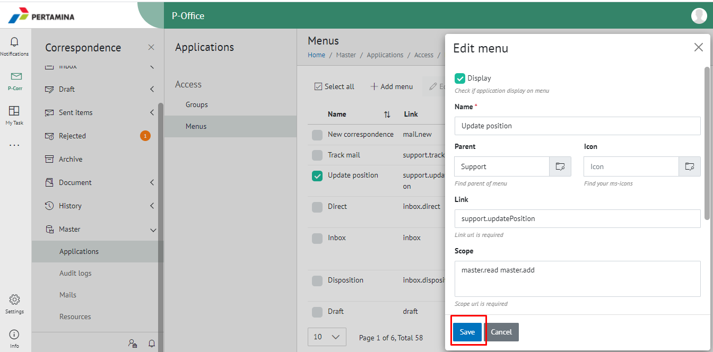
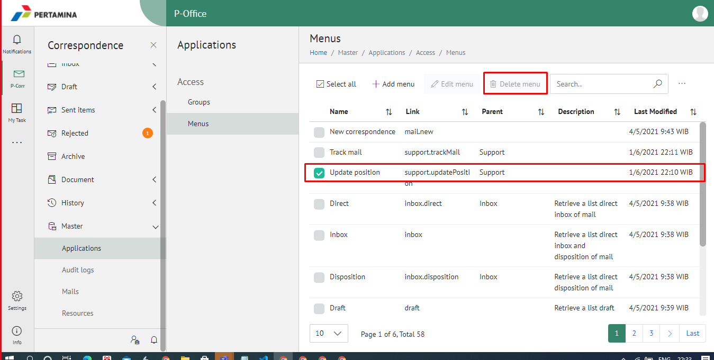
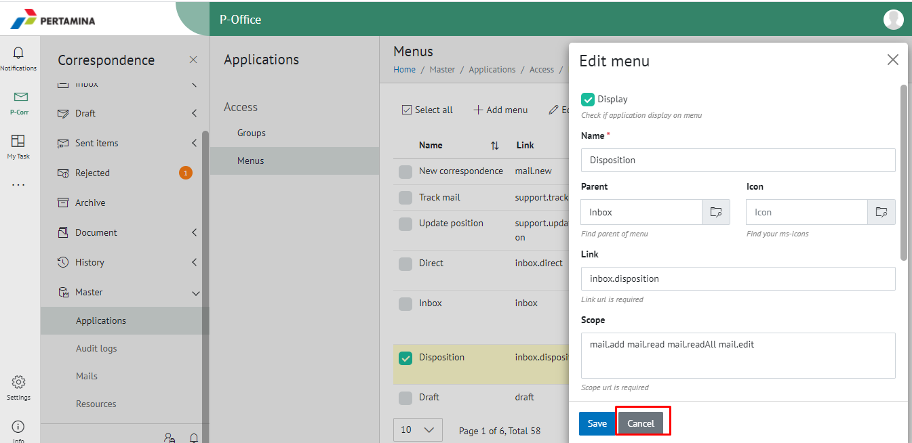
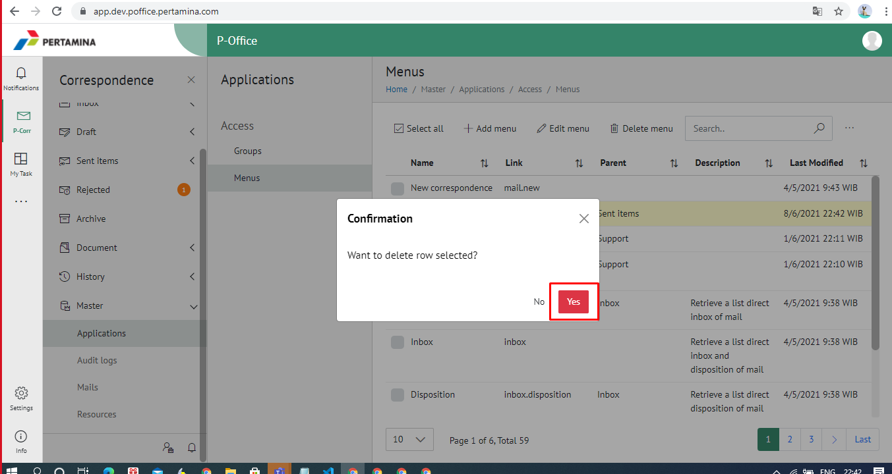

**Role yang sesuai**

## Menu Aplikasi

Admin E-Corr dapat mengelola aplikasi yang digunakan dalam pemberian hak akses pada setiap role-nya. Pengelolaan Aplikasi menu yang dilakukan admin E-Corr antara lain yaitu :

## **Mencari Akses** 

## 1.  Group
- Mencari Grup Akses
## 2   Menu
- Mencari akses menu
- Menambah akses menu
- Mengubah akses menu
- Menghapus akses menu

## **E-Corr Versi Web**

Langkah - langkah untuk melakukan pengelolaan grup akses via Web adalah sebagai berikut :

## **Group**
#### **Mencari Grup Akses**

1.    Pilih menu **Master** dan pilih submenu **Group Access**

2.    Pilih tombol **Search** dan masukkan pencarian berdasarkan kata kunci, kemudian klik **Enter**

## **E-Corr Versi Web**

Langkah - langkah untuk melakukan pengelolaan akses menu via Web adalah sebagai berikut :

## **Menu**

#### **Mencari Menu Akses**

1.    Pilih menu **Master** dan pilih submenu **Aplication** Lalu klik **Menu**

2.    Pilih tombol **Search** dan masukkan pencarian berdasarkan kata kunci, kemudian klik **Enter**

#### **Menambah Menu Akses**

1.    Pilih menu **Master** dan pilih submenu **Aplication** dan **Menu**

2.    Pilih tombol **+ Add Menu** untuk menambah menu akses

3.    Isikan informasi menu akses meliputi nama dan link akses menu kemudian klik tombol **Save.**

4.    Sistem menyimpan perubahan dan data akan muncul di halaman daftar menu akses

#### **Mengubah Menu Akses**

1.    Pilih menu **Master** dan pilih submenu **Aplication** Lalu klik **Menu**

2.    Klik checklist pada akses menu yang akan diubah kemudian klik tombol **Edit Menu**

3.    Lakukan perubahan pada kategori surat, pilih **Cancel** untuk membatalkan proses

4.    Lakukan perubahan pada kategori surat kemudian klik tombol **Save**

5.    Sistem menyimpan perubahan dan data akan muncul di halaman daftar kategori surat

#### **Menghapus Menu**

1.    Pilih menu **Master** dan pilih submenu **Aplication** Lalu klik **Menu**

2.    Klik checklist pada kategori surat yang akan dihapus kemudian klik tombol **Delete**

3.    Klik tombol **Cancel** untuk membatalkan proses

4.	  Klik tombol **Ya** untuk menghapus menu akses. Sistem menyimpan perubahan dan data akan terhapus

