**Role yang sesuai**

- Admin E-Corr

Admin E-Corr dapat mengelola akses menu yang digunakan dalam dalam pemberian hak akses pada setiap role-nya. Pengelolaan akses menu yang dilakukan admin E-Corr antara lain yaitu

- Mencari akses menu
- Menambah akses menu
- Mengubah akses menu
- Menghapus akses menu

## **E-Corr Versi Web**

Langkah - langkah untuk melakukan pengelolaan akses menu via Web adalah sebagai berikut :

#### **Mencari Menu Akses**

<<<<<<< HEAD:DM_Applicaton.md
1.    Pilih menu **Master** dan pilih submenu **Application**

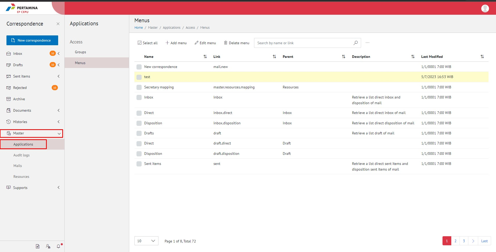
=======
1.    Pilih menu **Master**, pilih submenu **Applications** dan selanjutnya pilih **Access - Menu**

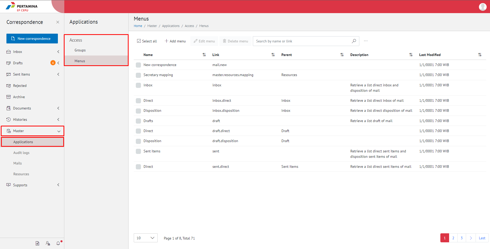
>>>>>>> 805215203ab428a6aeadb0e1f20e96e213117efd:DM_Access_Menu.md

2.    Pilih tombol **Menu* untuk melihat daftar menu akses

<<<<<<< HEAD:DM_Applicaton.md
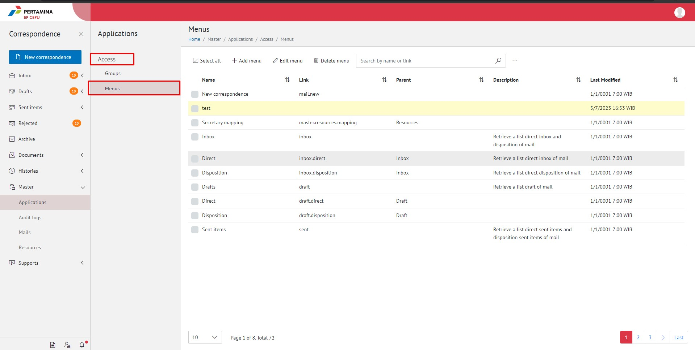

#### **Menambah Menu Akses**

1.   Pilih menu **Master** dan pilih submenu **Application**

2.    Pilih tombol **Add Menu** untuk menambah menu akses

!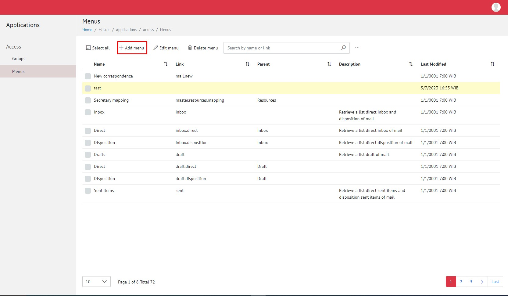
=======
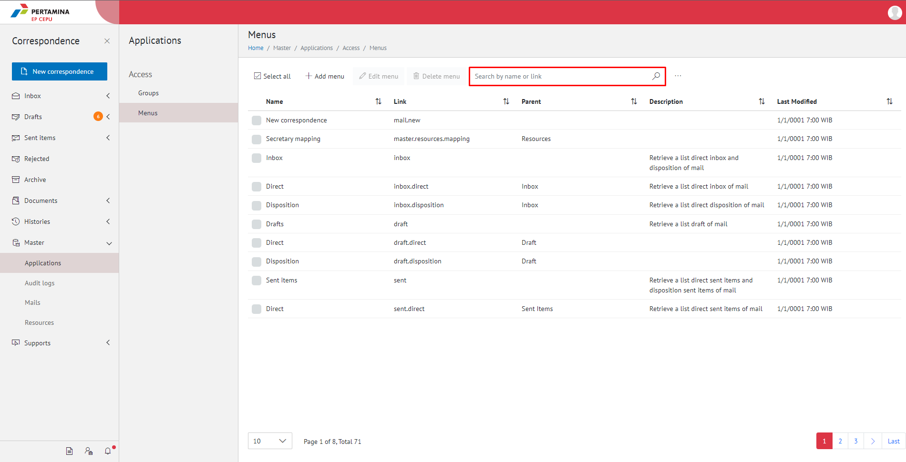

#### **Menambah Menu Akses**

1.    Pilih menu **Master** pilih submenu **Applications** dan selanjutnya pilih **Access - Menu**

2.    Pilih tombol **Add Menu** untuk menambah menu akses

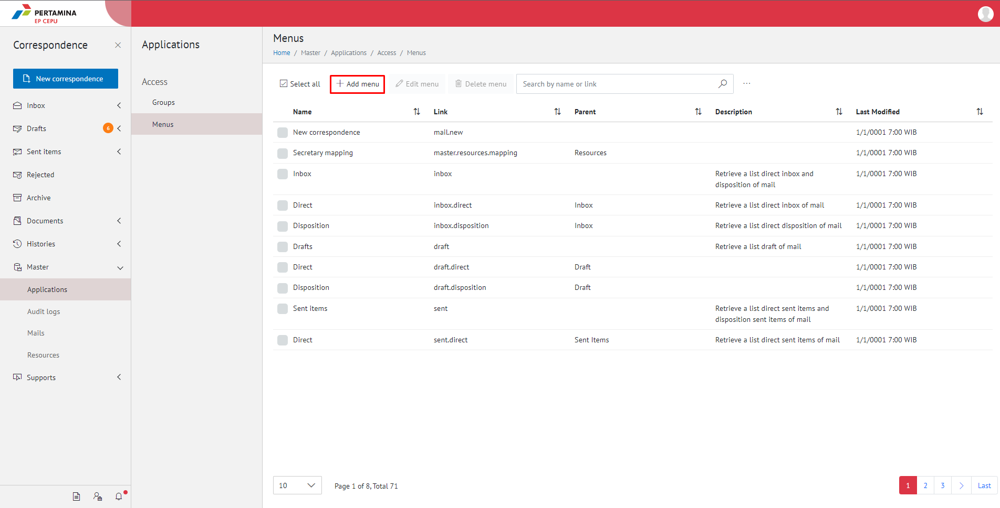
>>>>>>> 805215203ab428a6aeadb0e1f20e96e213117efd:DM_Access_Menu.md

3.    Isikan informasi menu akses meliputi nama dan link akses menu kemudian klik tombol **Save.**

<<<<<<< HEAD:DM_Applicaton.md
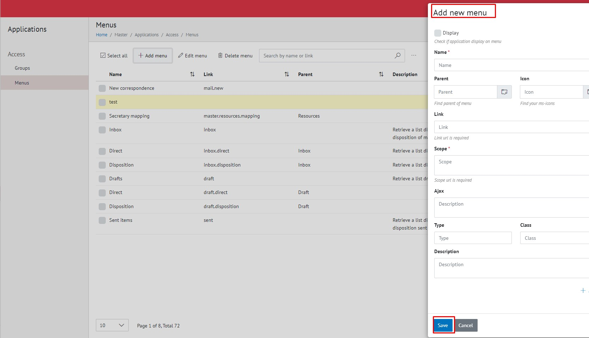
=======
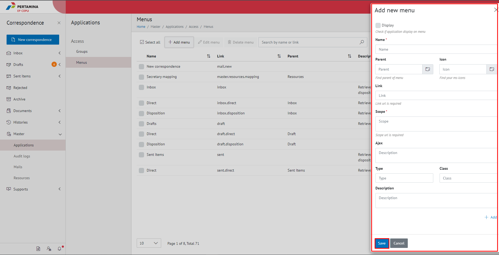
>>>>>>> 805215203ab428a6aeadb0e1f20e96e213117efd:DM_Access_Menu.md

4.    Sistem menyimpan perubahan dan data akan muncul di halaman daftar menu akses

#### **Mengubah Menu Akses**

<<<<<<< HEAD:DM_Applicaton.md
1.   Pilih menu **Master** dan pilih submenu **Application**

2.    Klik checklist pada akses menu yang akan diubah kemudian klik tombol **Edit Menu**

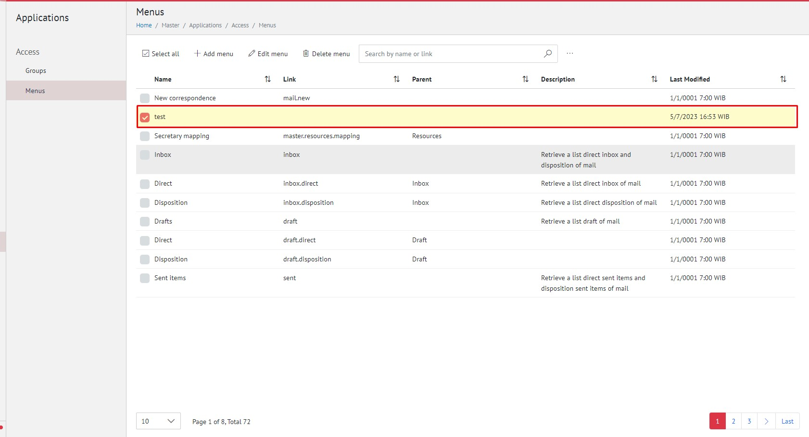
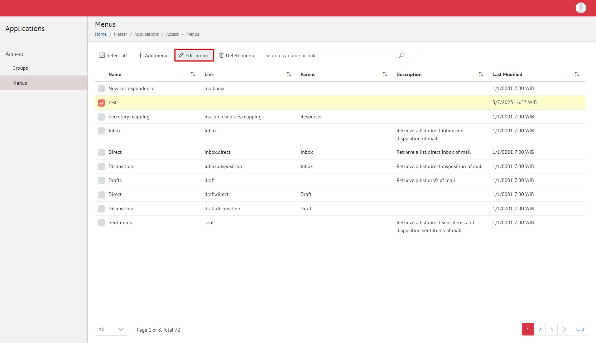
=======
1.    pilih submenu **Applications** dan selanjutnya pilih **Access - Menu**

2.    Klik checklist pada akses menu yang akan diubah kemudian klik tombol **Edit Menu**

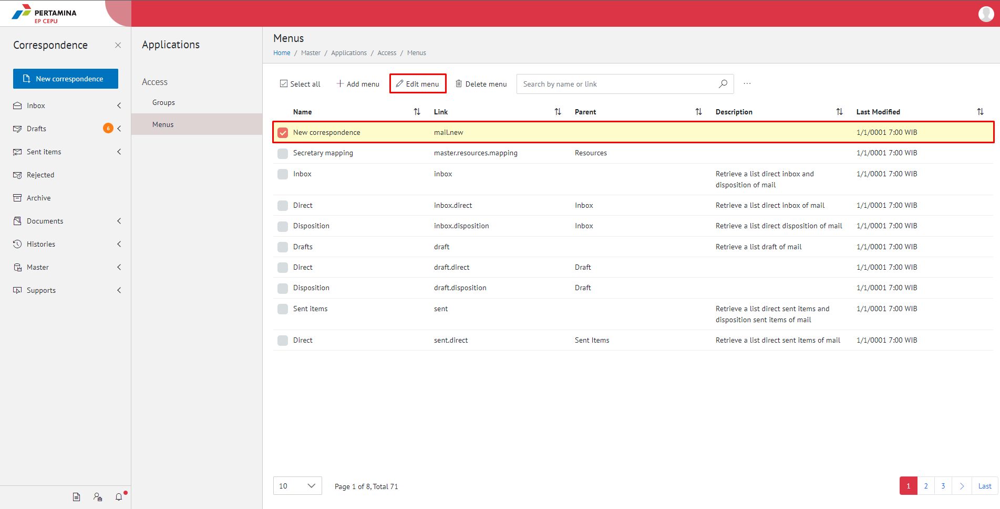
>>>>>>> 805215203ab428a6aeadb0e1f20e96e213117efd:DM_Access_Menu.md

3.    Lakukan perubahan pada kategori surat, pilih **No** untuk membatalkan proses

<<<<<<< HEAD:DM_Applicaton.md
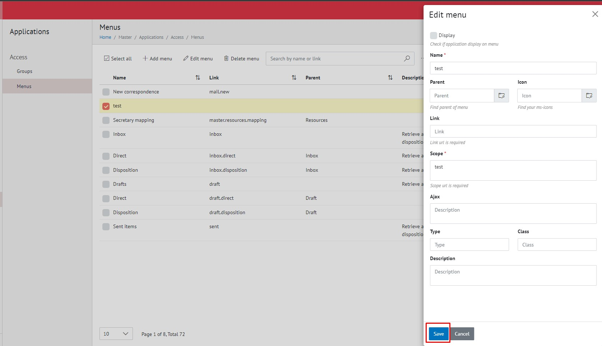

4.    Lakukan perubahan pada kategori surat kemudian klik tombol **Save**

=======
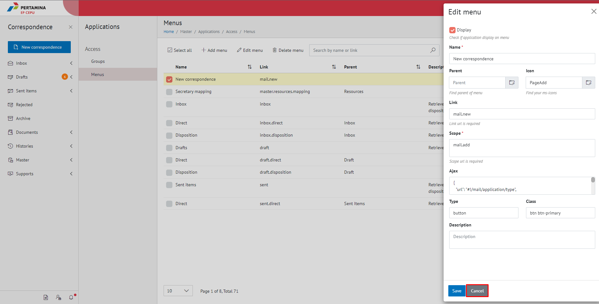

4.    Lakukan perubahan pada Edit menu kemudian klik tombol **Save**

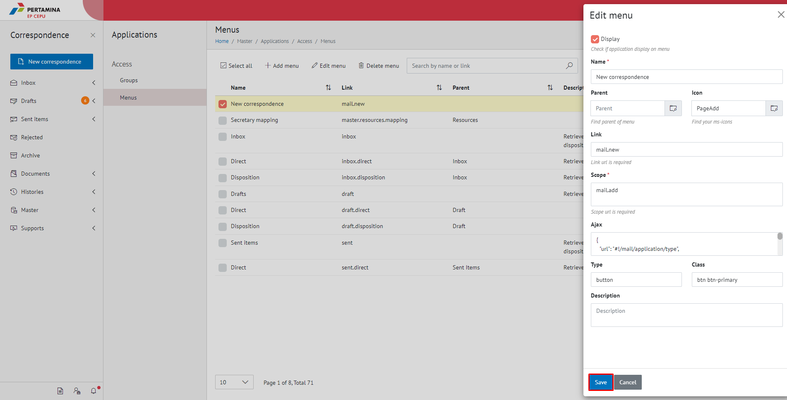
>>>>>>> 805215203ab428a6aeadb0e1f20e96e213117efd:DM_Access_Menu.md

5.    Sistem menyimpan perubahan dan data akan muncul di halaman daftar kategori surat

#### **Menghapus Menu Akses**

<<<<<<< HEAD:DM_Applicaton.md
   Pilih menu **Master** dan pilih submenu **Application**

2.    Klik checklist pada kategori surat yang akan dihapus kemudian klik tombol **Delete**

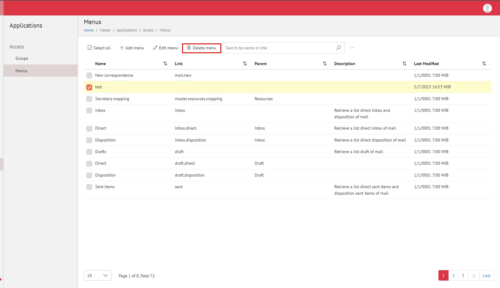
=======
1.    pilih submenu **Applications** dan selanjutnya pilih **Access - Menu**

2.    Klik checklist pada kategori surat yang akan dihapus kemudian klik tombol **Delete**

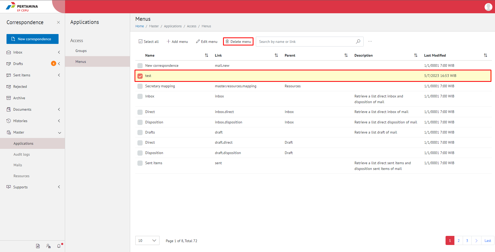
>>>>>>> 805215203ab428a6aeadb0e1f20e96e213117efd:DM_Access_Menu.md

3.    Klik tombol **No** untuk membatalkan proses

<<<<<<< HEAD:DM_Applicaton.md
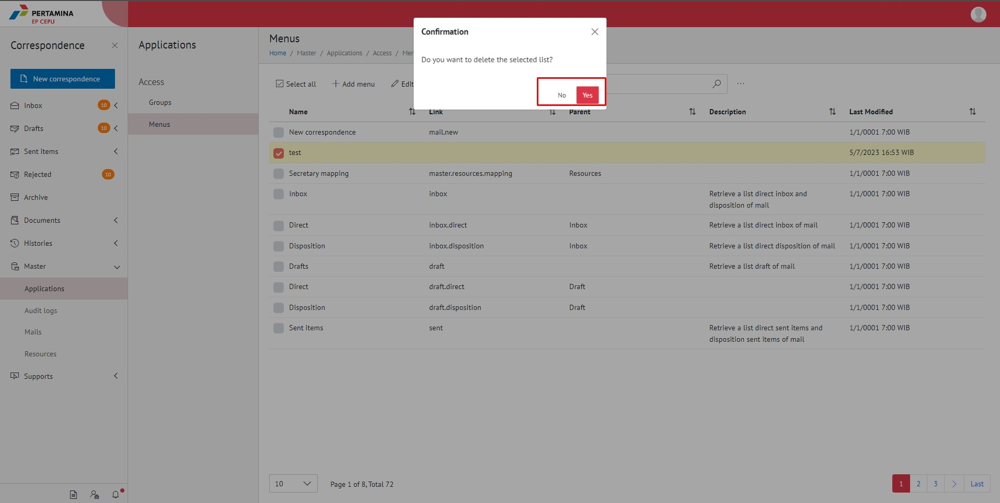
=======
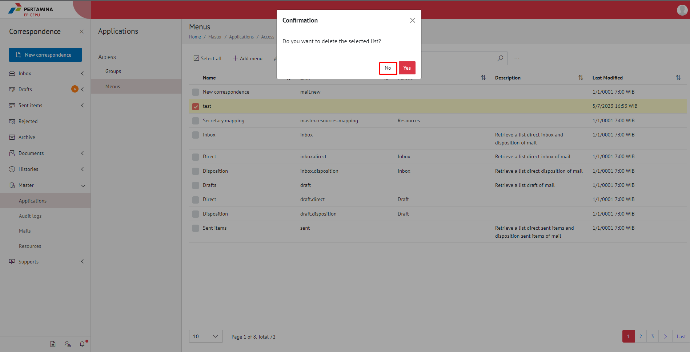
>>>>>>> 805215203ab428a6aeadb0e1f20e96e213117efd:DM_Access_Menu.md

4.	  Klik tombol **Yes** untuk menghapus menu akses. Sistem menyimpan perubahan dan data akan terhapus

<<<<<<< HEAD:DM_Applicaton.md

=======
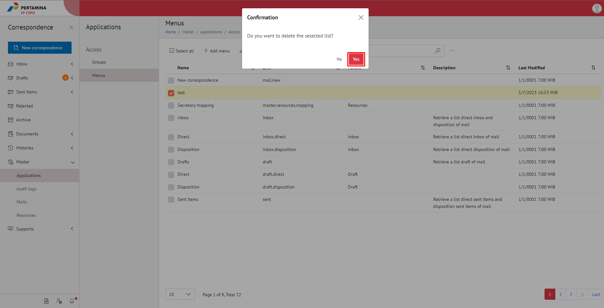
>>>>>>> 805215203ab428a6aeadb0e1f20e96e213117efd:DM_Access_Menu.md

