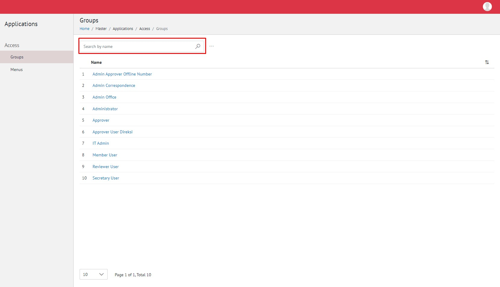

**Role yang sesuai**

- Admin E-Corr

Admin E-Corr dapat mengelola grup akses untuk pemberian kewenangan pada setiap role-nya. Akses menu ditambahkan kemudian admin E-Corr akan melakukan _grouping_ untuk setiap grup akses. Pengelolaan grup akses yang dilakukan admin E-Corr antara lain yaitu

- Mencari grup akses
- Menambah grup akses untuk setiap role

## **E-Corr Versi Web**

Langkah - langkah untuk melakukan pengelolaan grup akses via Web adalah sebagai berikut :

#### **Mencari Menu Akses**

1.    Pilih menu **Master**, **Applications** dan pilih submenu **Group - Access**

2.    Pilih tombol **Search** dan masukkan pencarian berdasarkan kata kunci, kemudian klik **Enter**

#### **Menambah Grup Akses untuk Setiap Role**

1.    Pilih menu **Master**, **Applications** dan pilih submenu **Group - Access**

2.    Pilih role yang akan ditambahkan grup akses kemudian checklist grup menu yang akan diberikan akses dan klik **Save**

