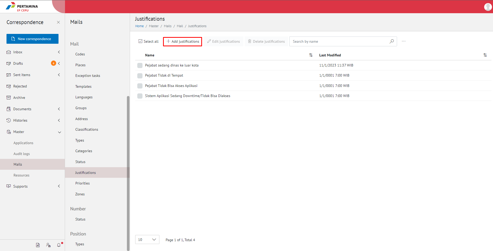
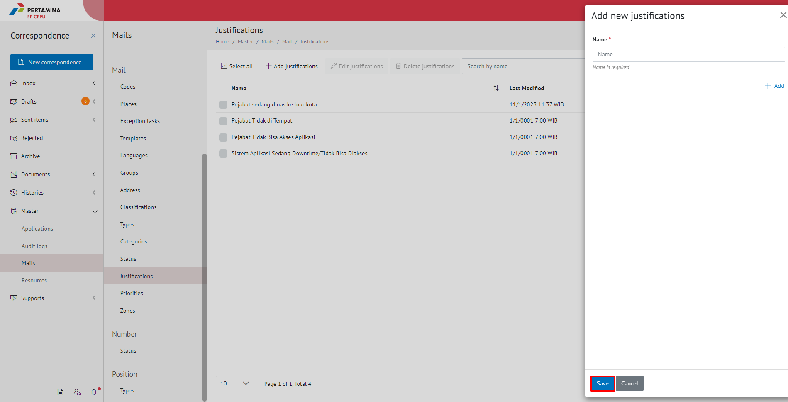
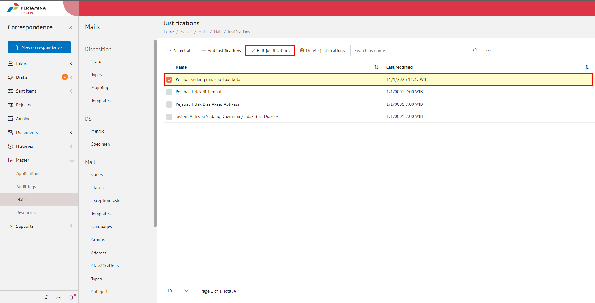
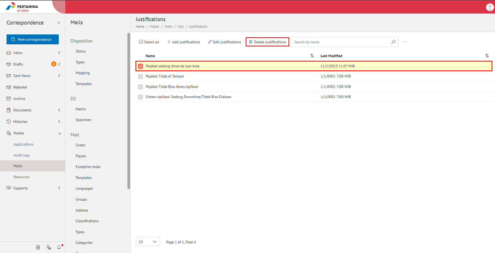
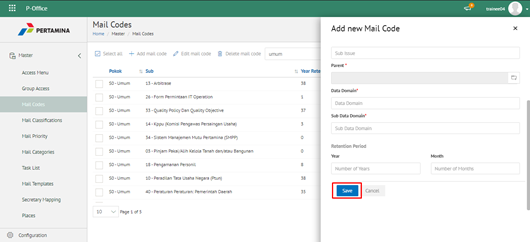
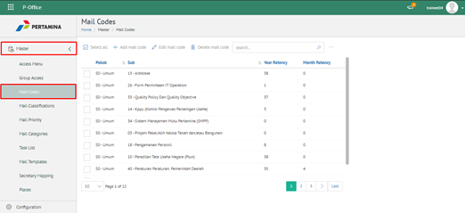

**Role yang sesuai**

- Admin E-Corr

Admin E-Corr dapat mengelola data master untuk penginputan justifikasi pada form pengajuan nomor offline. Pengelolaan data master justifikasi yang dilakukan admin E-Corr antara lain yaitu

- Mencari data master justifikasi
- Menambah data master justifikasi
- Mengubah data master justifikasi
- Menghapus data master justifikasi

## **E-Corr Versi Web**

Langkah - langkah untuk melakukan pengelolaan justifikasi via Web adalah sebagai berikut:

#### **Mencari Justifikasi**

<<<<<<< HEAD
1.    Pilih menu **Master** Kemudian **Mails** dan pilih submenu **Justifications**

2.    Pilih tombol **Search** dan masukkan pencarian berdasarkan kata kunci, kemudian klik **Enter**

#### **Menambah Justifikasi**

1.    Pilih menu **Master** Kemudian **Mails** dan pilih submenu **Justifications**

=======
1.    Pilih menu **Master - Mails** dan pilih submenu **Justifications**

2.    Pilih tombol **Search** dan masukkan pencarian berdasarkan kata kunci, kemudian klik **Enter**

#### **Menambah Justifikasi**

1.    Pilih menu **Master - Mails** dan pilih submenu **Justifications**

>>>>>>> 805215203ab428a6aeadb0e1f20e96e213117efd

2.    Pilih tombol **Add Justifications** untuk justifikasi

<<<<<<< HEAD

=======

>>>>>>> 805215203ab428a6aeadb0e1f20e96e213117efd

3.    Isikan informasi justifikasi meliputi nama kemudian klik tombol **Save.**

<<<<<<< HEAD

=======

>>>>>>> 805215203ab428a6aeadb0e1f20e96e213117efd

4.    Sistem menyimpan perubahan dan data akan muncul di halaman daftar tempat

#### **Mengubah Justifikasi**

<<<<<<< HEAD
1.    Pilih menu **Master** Kemudian **Mails** dan pilih submenu **Justifications**

2.    Klik checklist pada justifikasi yang akan diubah kemudian klik icon **Edit Justifications**

3.    Lakukan perubahan pada justifikasi, pilih **Cancel** untuk membatalkan proses

=======
1.    Pilih menu **Master - Mails** dan pilih submenu **Justifications**

2.    Klik checklist pada justifikasi yang akan diubah kemudian klik icon **Edit Justifications**

3.    Lakukan perubahan pada justifikasi, pilih **Cancel** untuk membatalkan proses

>>>>>>> 805215203ab428a6aeadb0e1f20e96e213117efd

4.    Lakukan perubahan pada justifikasi kemudian klik tombol **Save.**

<<<<<<< HEAD

=======

>>>>>>> 805215203ab428a6aeadb0e1f20e96e213117efd

5.    Sistem menyimpan perubahan dan data akan muncul di halaman daftar tempat

#### **Menghapus Justifikasi**

<<<<<<< HEAD

1.    Pilih menu **Master** Kemudian **Mails** dan pilih submenu **Justifications**

2.    Klik checklist pada justifikasi yang akan dihapus kemudian klik tombol **Delete Justifications**

=======
1.    Pilih menu **Master - Mails** dan pilih submenu **Justifications**

2.    Klik checklist pada justifikasi yang akan dihapus kemudian klik tombol **Delete Justifications**

>>>>>>> 805215203ab428a6aeadb0e1f20e96e213117efd

3.    Klik tombol **No** untuk membatalkan proses

<<<<<<< HEAD

=======

>>>>>>> 805215203ab428a6aeadb0e1f20e96e213117efd

4.    Klik tombol **Yes** untuk menghapus tempat. Sistem menyimpan perubahan dan data akan terhapus dari daftar tempat

<<<<<<< HEAD

=======

>>>>>>> 805215203ab428a6aeadb0e1f20e96e213117efd
