**Role yang sesuai**

- Admin P-Office

Admin P-Office dapat mengelola data master untuk penginputan justifikasi pada form pengajuan nomor offline. Pengelolaan data master justifikasi yang dilakukan admin P-Office antara lain yaitu

- Mencari data master justifikasi
- Menambah data master justifikasi
- Mengubah data master justifikasi
- Menghapus data master justifikasi

## **P-Office Versi Web**

Langkah - langkah untuk melakukan pengelolaan justifikasi via Web adalah sebagai berikut:

#### **Mencari Justifikasi**

1.    Pilih menu **Master** dan pilih submenu **Justifications**

2.    Pilih tombol **Search** dan masukkan pencarian berdasarkan kata kunci, kemudian klik **Enter**

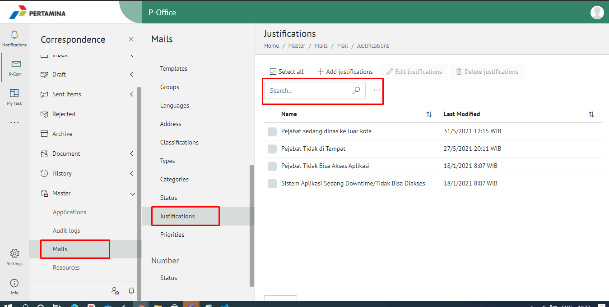

#### **Menambah Justifikasi**

1.    Pilih menu **Master** dan pilih submenu **Justifications**

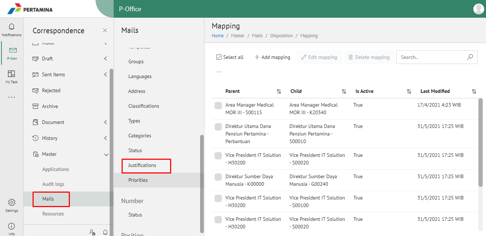

2.    Pilih tombol **+ Add Justifications** untuk justifikasi

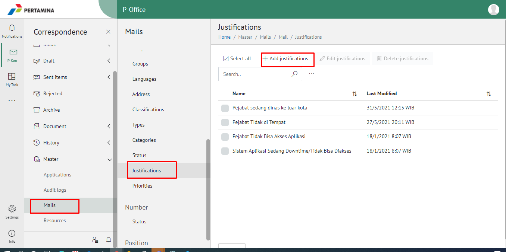

3.    Isikan informasi justifikasi meliputi nama kemudian klik tombol **Submit.**

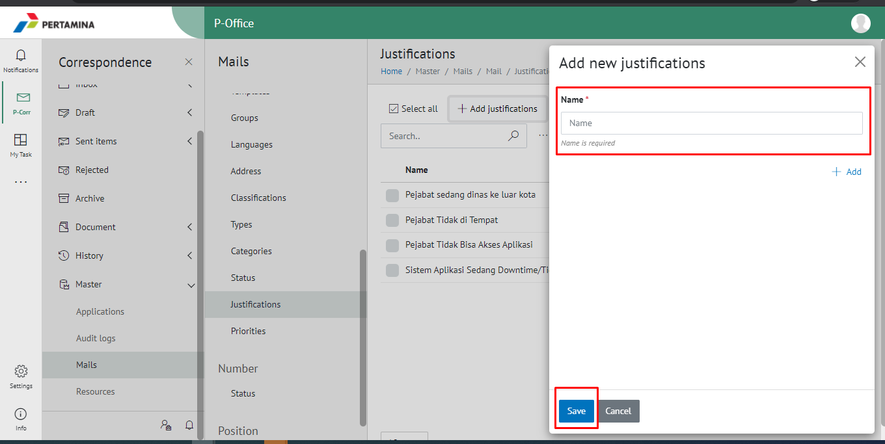

4.    Sistem menyimpan perubahan dan data akan muncul di halaman daftar tempat

#### **Mengubah Justifikasi**

1.    Pilih menu **Master** dan pilih submenu **Justifications**

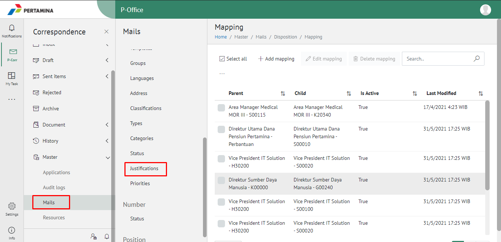

2.    Klik checklist pada justifikasi yang akan diubah kemudian klik icon **Edit Justifications**

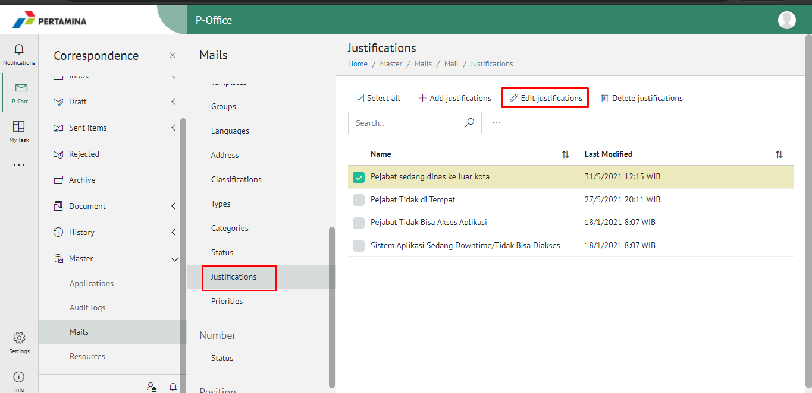

3.    Lakukan perubahan pada justifikasi, pilih **Cancel** untuk membatalkan proses

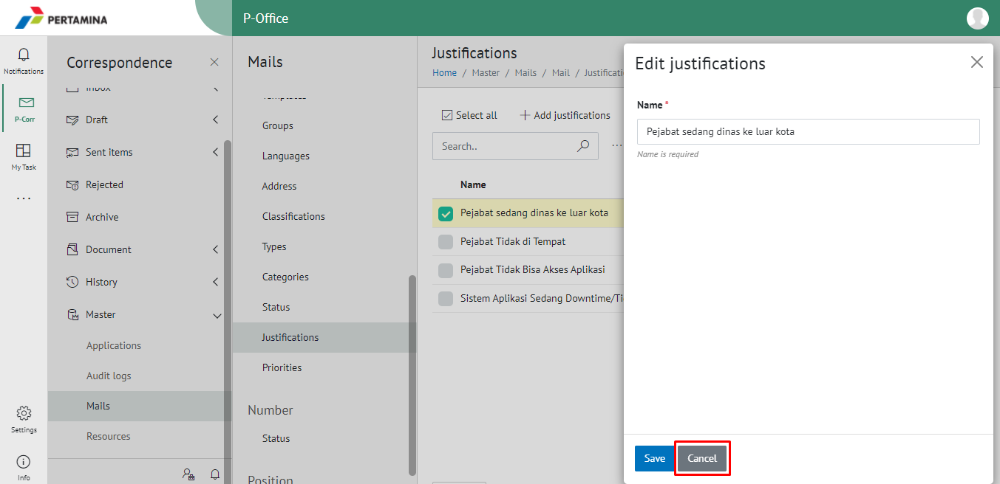

4.    Lakukan perubahan pada justifikasi kemudian klik tombol **Submit.**

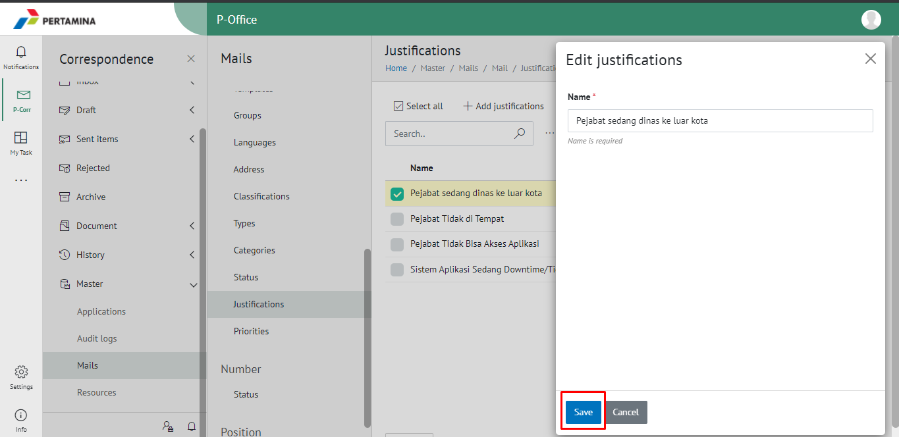

5.    Sistem menyimpan perubahan dan data akan muncul di halaman daftar tempat

#### **Menghapus Justifikasi**

1.    Pilih menu **Master** dan pilih submenu **Justifications**

2.    Klik checklist pada justifikasi yang akan dihapus kemudian klik tombol **Delete Justifications**

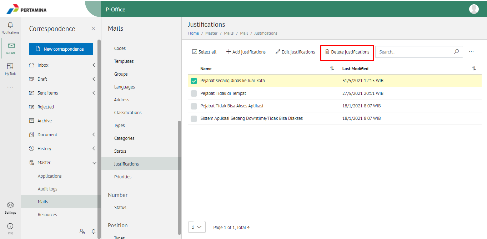

3.    Klik tombol **Cancel** untuk membatalkan proses

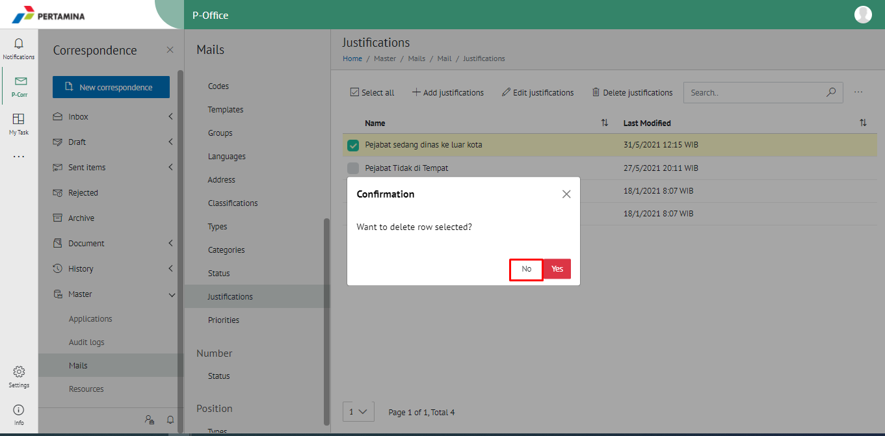

4.    Klik tombol **Ya** untuk menghapus tempat. Sistem menyimpan perubahan dan data akan terhapus dari daftar tempat

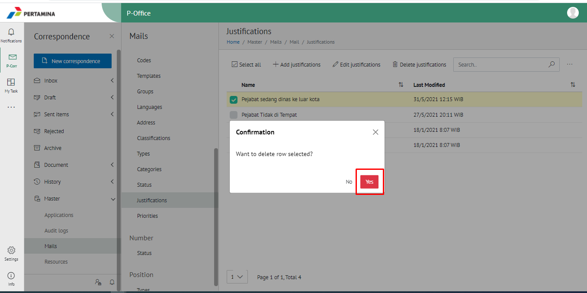