**Role yang sesuai**

- Admin P-Office

Admin P-Office dapat mengelola kategori surat yang digunakan dalam penginputan form surat masuk dan fax masuk. Pengelolaan kategori surat yang dilakukan admin P-Office antara lain yaitu

- Mencari kategori surat
- Menambah kategori surat
- Mengubah kategori surat
- Menghapus kategori surat

## **P-Office Versi Web**

Langkah - langkah untuk pengelolaan kategori surat via Web adalah sebagai berikut:

#### **Mencari Kategori Surat**

1.    Pilih menu **Master** dan pilih submenu **Mail Categories**

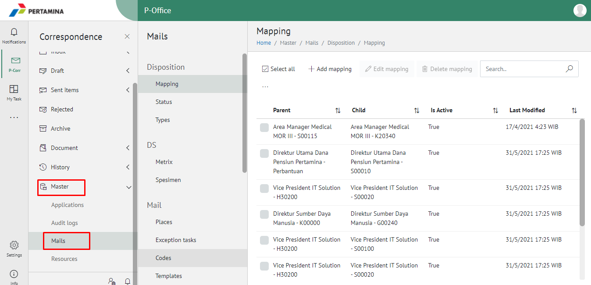

2.    Pilih tombol **Search** dan masukkan pencarian berdasarkan kata kunci, kemudian klik **Enter**

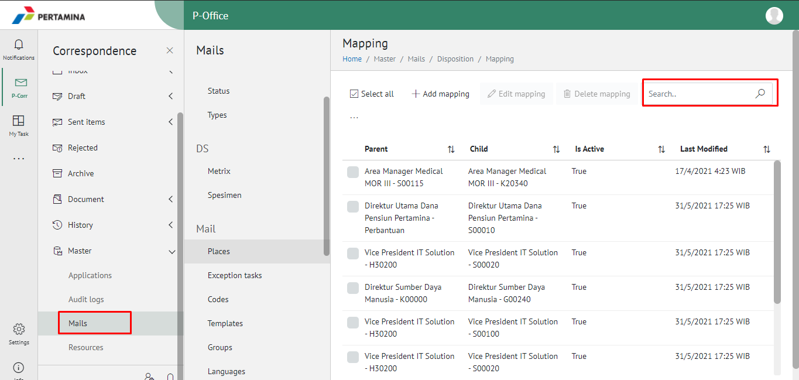

#### **Menambah Kategori Surat**

1.    Pilih menu **Master** dan pilih submenu **Mail Categories**

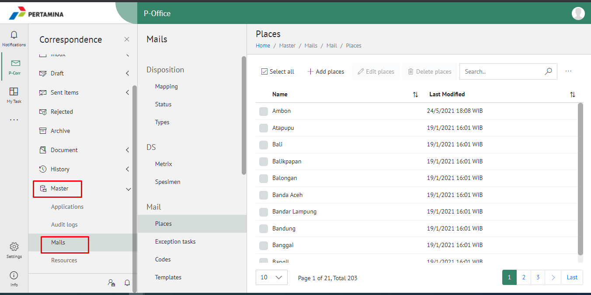

2.    Pilih tombol **+ Add Mail Categories** untuk menambah kategori surat

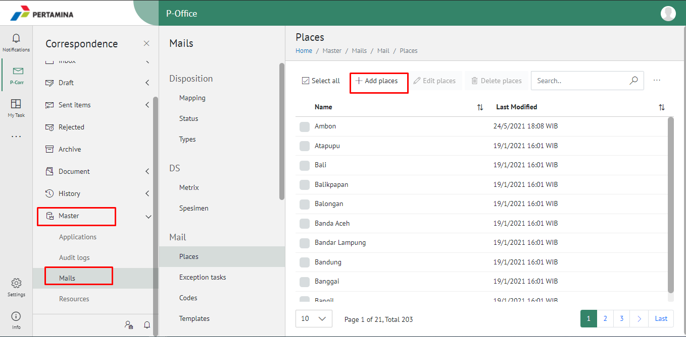

3.    Isikan informasi kategori surat meliputi nama kemudian klik tombol **Submit.**

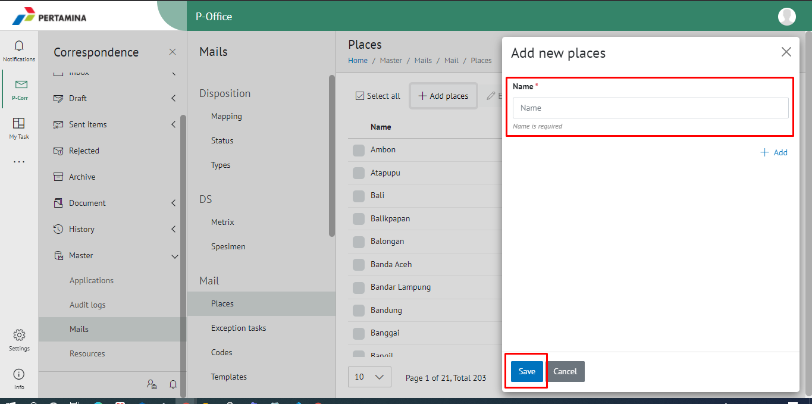

4.    Sistem menyimpan perubahan dan data akan muncul di halaman daftar kategori surat

#### **Mengubah Kategori Surat**

1.    Pilih menu **Master** dan pilih submenu **Mail Categories**

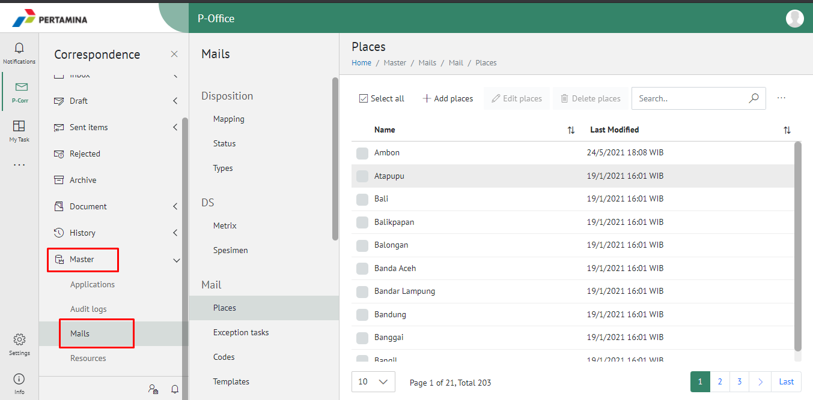

2.    Klik checklist pada kategori surat yang akan diubah kemudian klik tombol **Edit Mail Categories**

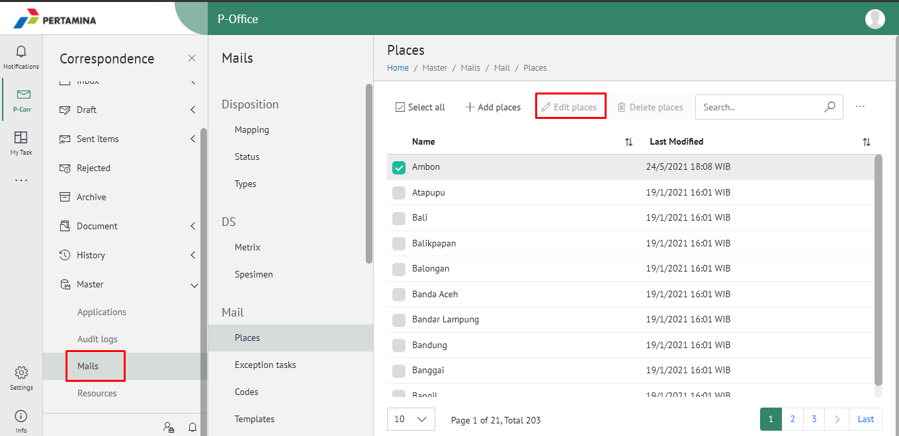

3.    Lakukan perubahan pada kategori surat, pilih **Cancel** untuk membatalkan proses

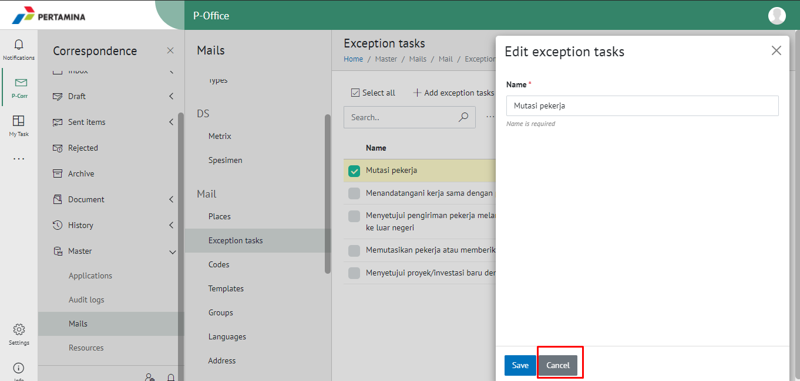

4.    Lakukan perubahan pada kategori surat kemudian klik tombol **Submit**

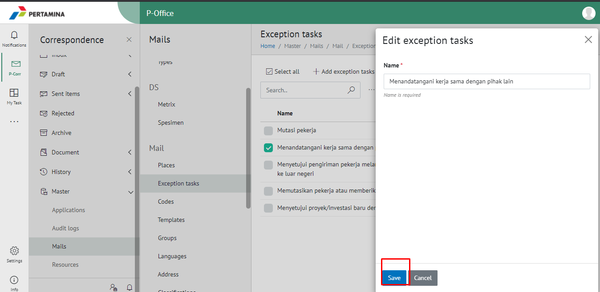

5.    Sistem menyimpan perubahan dan data akan muncul di halaman daftar kategori surat

#### **Menghapus Kategori Surat**

1.    Pilih menu **Master** dan pilih submenu **Mail Categories**

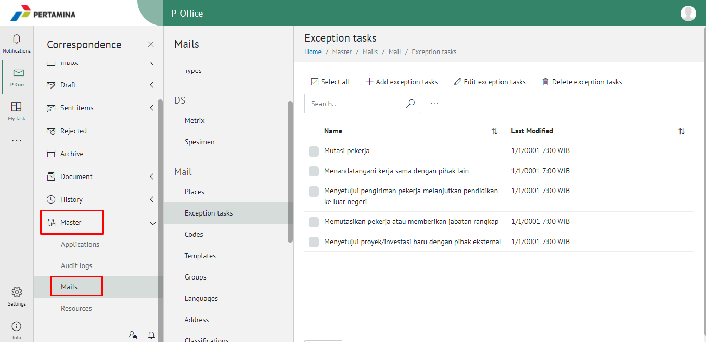

2.    Klik checklist pada kategori surat yang akan dihapus kemudian klik tombol **Delete Mail Categories**

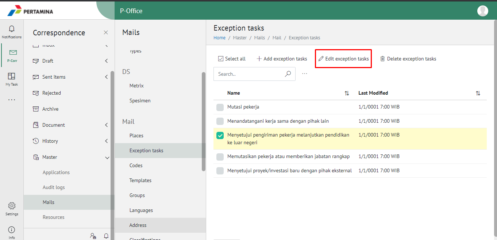

3.    Klik tombol **Cancel** untuk membatalkan proses

4.    Klik tombol **Ya** untuk menghapus kategori surat. Sistem menyimpan perubahan dan data akan terhapus dari daftar kategori surat

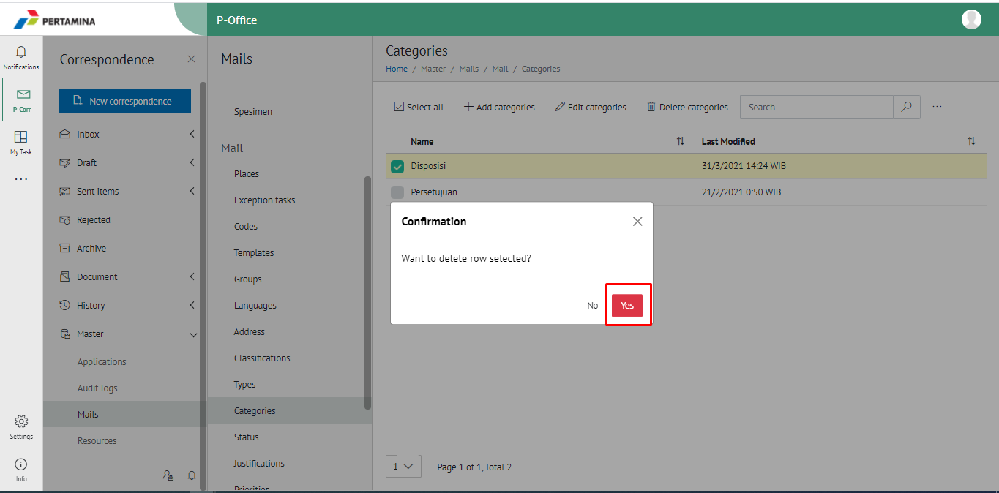

