**Role yang sesuai**

- Admin E-Corr

Admin E-Corr dapat mengelola klasifikasi surat yang digunakan dalam penginputan form surat. Pengelolaan klasifikasi surat yang dilakukan admin E-Corr antara lain yaitu

- Mencari klasifikasi surat
- Menambah klasifikasi surat
- Mengubah klasifikasi surat
- Menghapus klasifikasi surat

## **E-Corr Versi Web**

Langkah - langkah untuk pengelolaan klasifikasi surat via Web adalah sebagai berikut:

#### **Mencari Klasifikasi surat**

<<<<<<< HEAD
1.    Pilih menu **Master** Kemudian pilih **Mails** dan pilih submenu **Mail Classification**

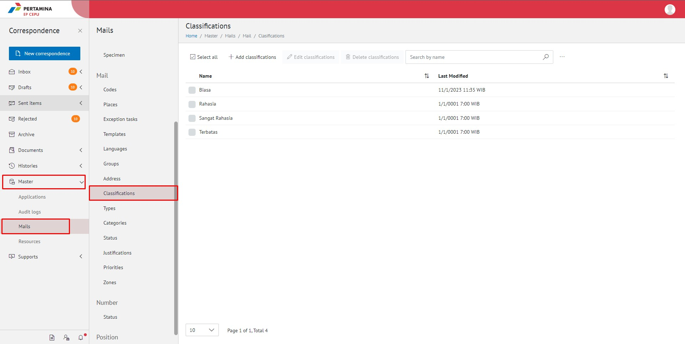

2.    Pilih tombol **Search** dan masukkan pencarian berdasarkan kata kunci, kemudian klik **Enter**

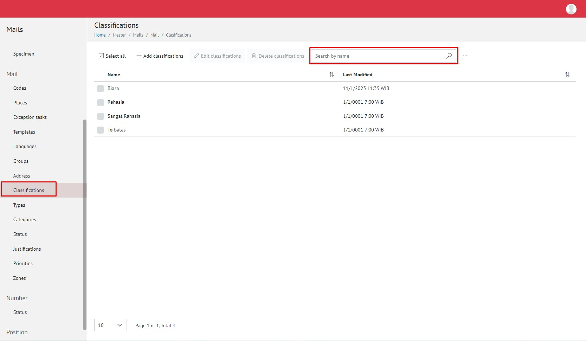
=======
1.    Pilih menu **Master** dan pilih submenu **Mails - Classifications**

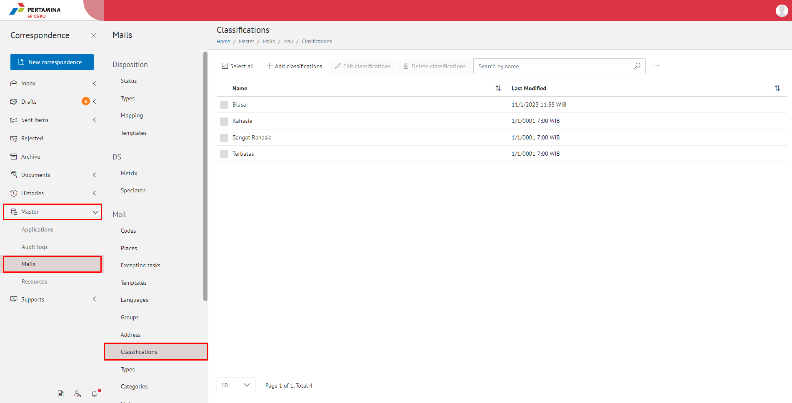

2.    Pilih tombol **Search** dan masukkan pencarian berdasarkan kata kunci, kemudian klik **Enter**

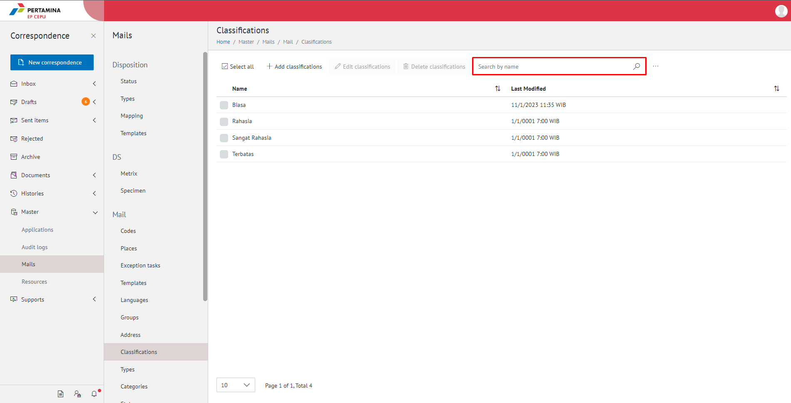
>>>>>>> 805215203ab428a6aeadb0e1f20e96e213117efd

#### **Menambah Klasifikasi Surat**

1.    Pilih menu **Master** dan pilih submenu **Mails - Classifications**

2.    Pilih tombol **+ Add Mail Classification** untuk menambah klasifikasi surat

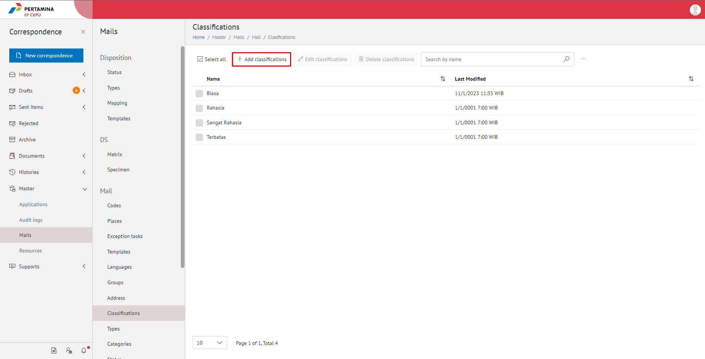

3.    Isikan informasi klasifikasi surat meliputi nama kemudian klik tombol **Save**

4.    Sistem menyimpan perubahan dan data akan muncul di halaman daftar klasifikasi surat

#### **Mengubah Klasifikasi Surat**

1.    Pilih menu **Master** dan pilih submenu **Mails - Classifications**

2.    Klik checklist pada klasifikasi surat yang akan diubah kemudian klik tombol **Edit Mail Classification**

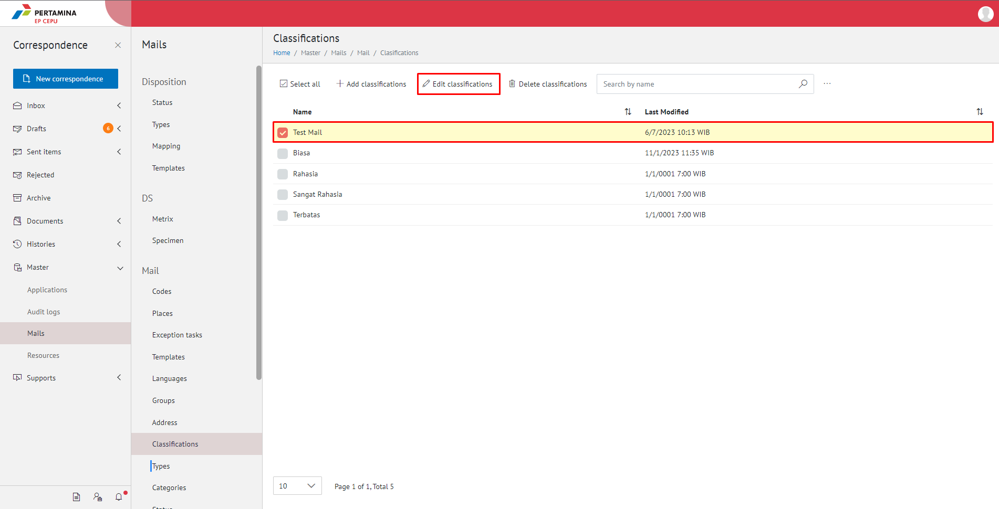

3.    Lakukan perubahan pada klasifikasi surat, pilih **Cancel** untuk membatalkan proses

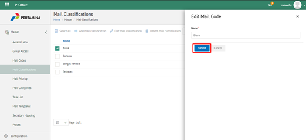

4.    Lakukan perubahan pada klasifikasi surat kemudian klik tombol **Save**

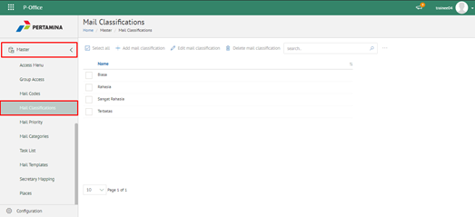

5.    Sistem menyimpan perubahan dan data akan muncul di halaman daftar klasifikasi surat
 

#### **Menghapus Klasifikasi Surat**

1.    Pilih menu **Master** dan pilih submenu **Mails - Classifications**

2.    Klik checklist pada klasifikasi surat yang akan dihapus kemudian klik icon **Delete Classification**

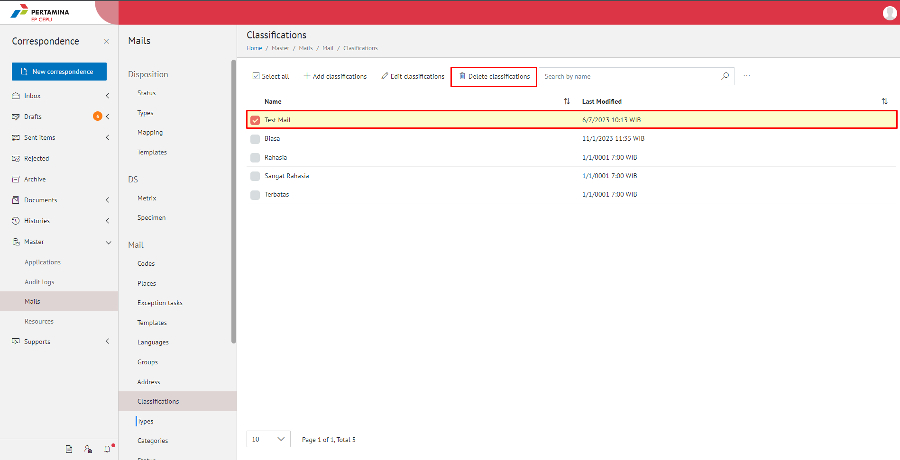

3.    Klik tombol **No** untuk membatalkan proses

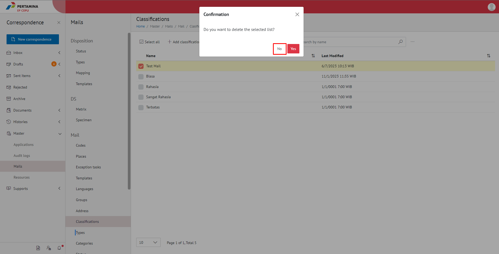

4.    Klik tombol **Yes** untuk menghapus klasifikasi surat. Sistem menyimpan perubahan dan data akan terhapus dari daftar klasifikasi surat

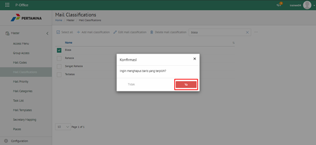
