- Admin P-Office

Admin P-Office dapat mengelola tempat/lokasi yang digunakan dalam penginputan form surat. Pengelolaan data master lokasi yang dilakukan admin P-Office antara lain adalah sebagai berikut :

- Mencari data master tempat
- Menambah data master tempat
- Mengubah data master tempat
- Menghapus data master tempat

## **P-Office Versi Web**

Langkah-langkah untuk pengelolaan tempat/lokasi surat via Web adalah sebagai berikut:

#### Mencari Tempat

1. Pilih menu **Master** dan pilih submenu **Places**

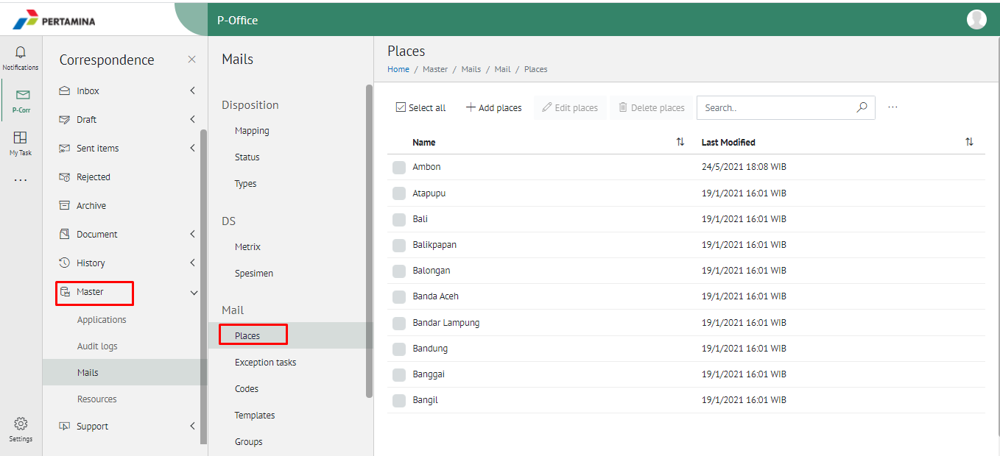

2. Pilih tombol **Search** dan masukkan pencarian berdasarkan kata kunci, kemudian klik **Enter**

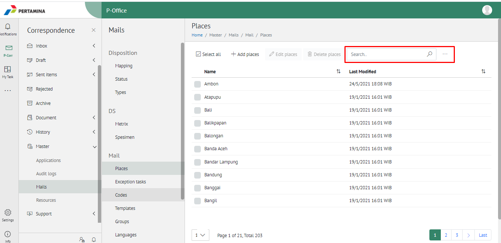

#### Menambah Tempat

1. Pilih menu **Master** dan pilih submenu **Places**

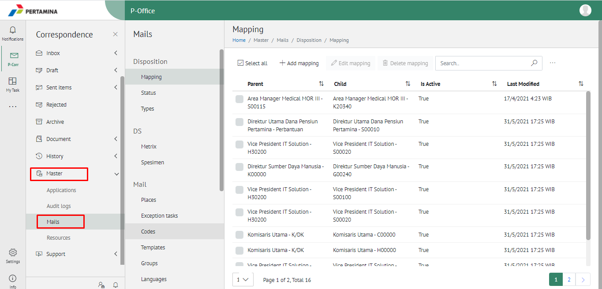

2. Pilih tombol &quot;+&quot; untuk menambah tempat

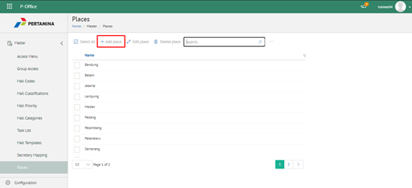

3. Isikan informasi tempat meliputi nama kemudian klik tombol **Submit**

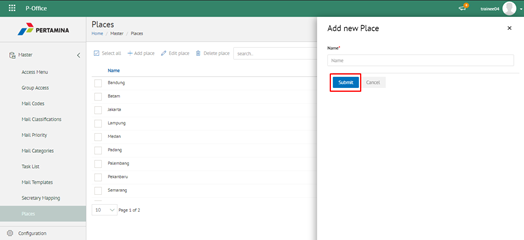

4. Sistem menyimpan perubahan dan data akan muncul di halaman daftar tempat

#### Mengubah Tempat

1. Pilih menu **Master** dan pilih submenu **Places**

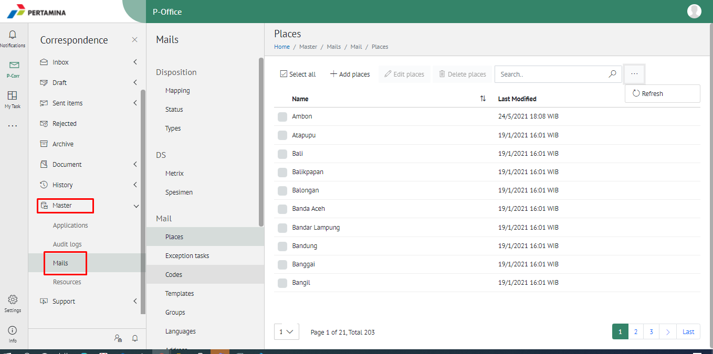

2. Klik checklist pada tempat yang akan diubah kemudian klik icon **Ubah**

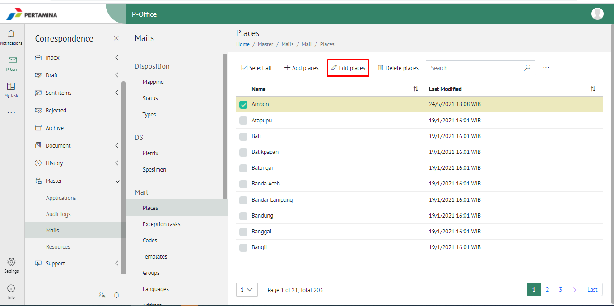

3. Lakukan perubahan pada tempat, pilih **Cancel** untuk membatalkan proses

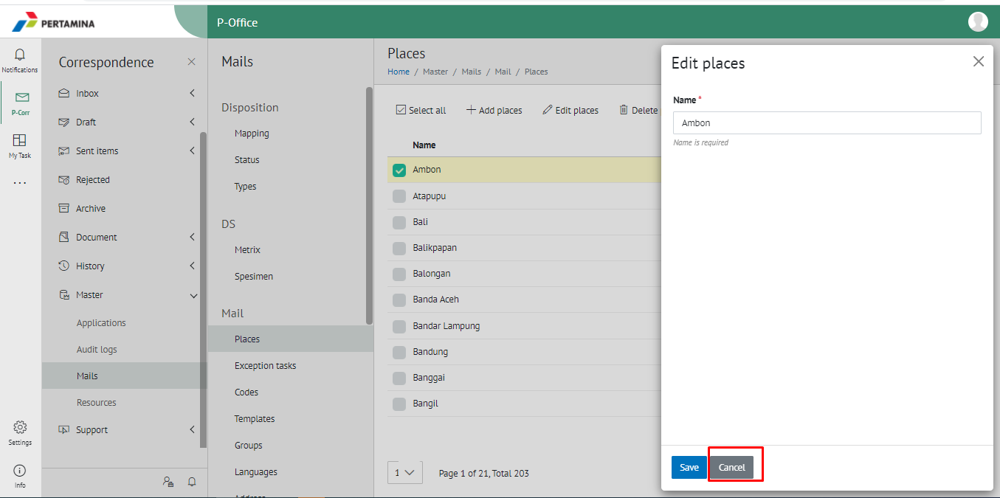

4. Lakukan perubahan pada tempat kemudian klik tombol **Submit**

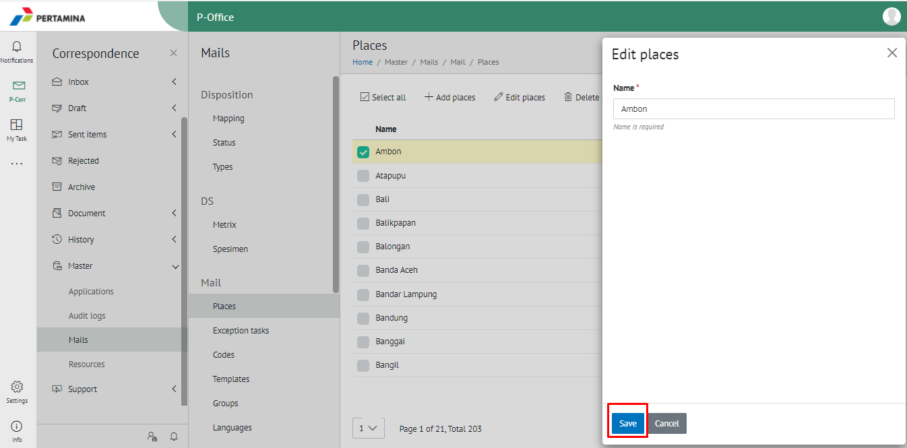

5. Sistem menyimpan perubahan dan data akan muncul di halaman daftar tempat

#### Menghapus Kategori Surat

1. Pilih menu **Master** dan pilih submenu **Mail Categories**

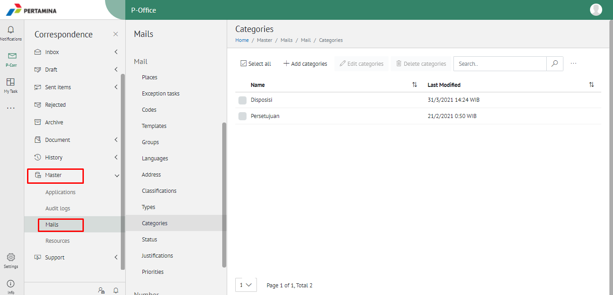

2. Klik checklist pada tempat yang akan dihapus kemudian klik icon **Delete**

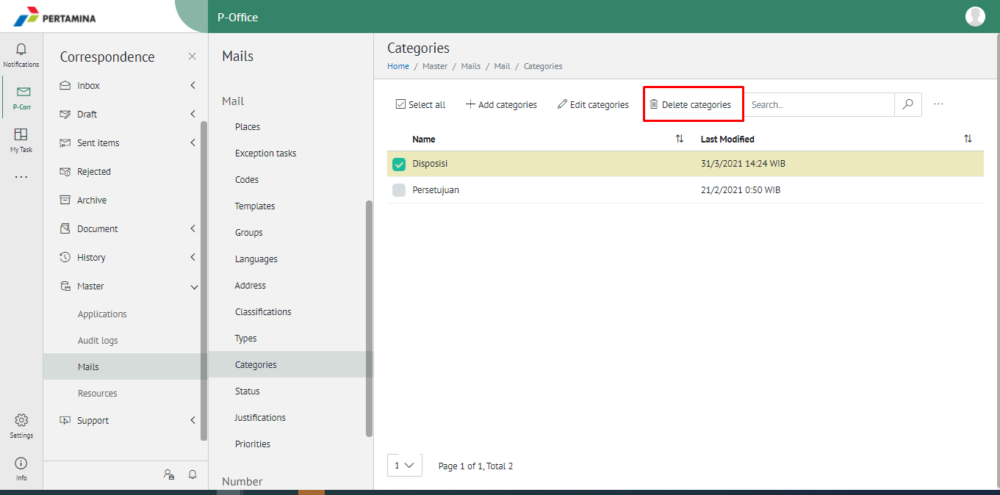

3. Klik tombol **No** untuk membatalkan proses

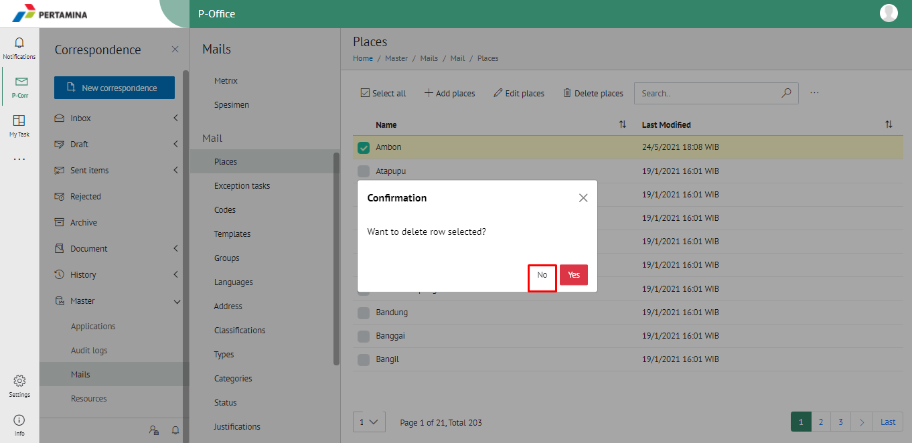

4. Klik tombol **Ya** untuk menghapus tempat

5. Sistem menyimpan perubahan dan data akan terhapus dari daftar tempat