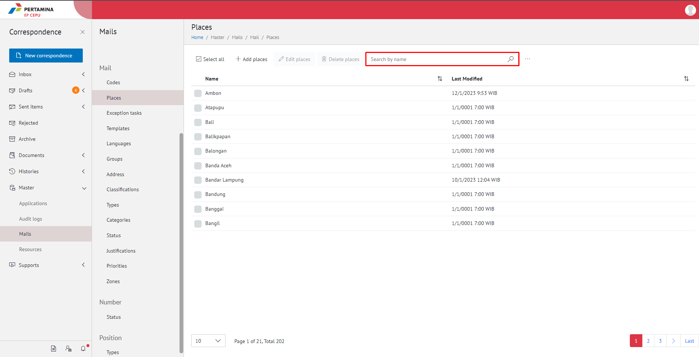
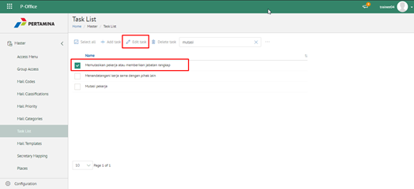
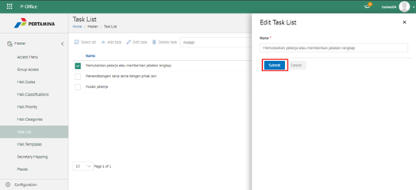
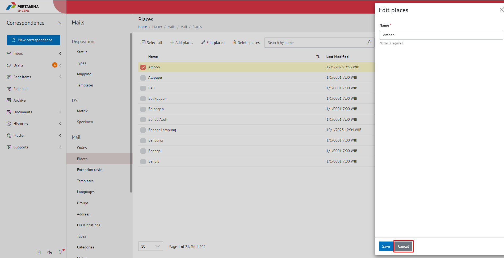
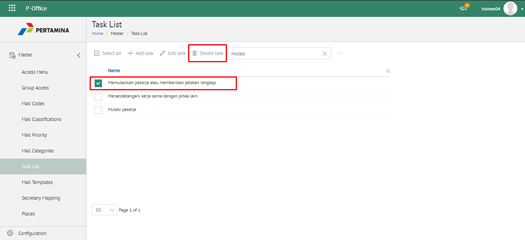
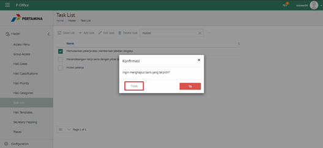
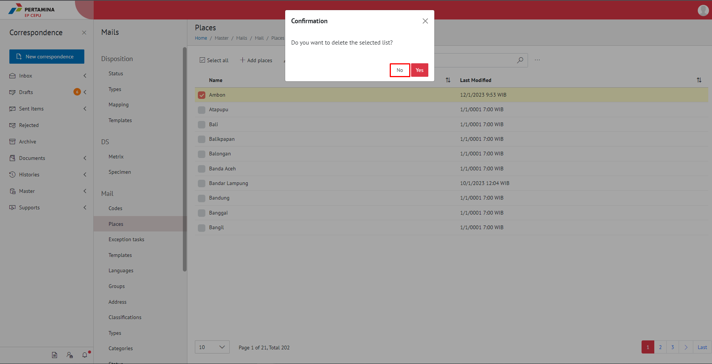

- Admin E-Corr

Admin E-Corr dapat mengelola tempat/lokasi yang digunakan dalam penginputan form surat. Pengelolaan data master lokasi yang dilakukan admin E-Corr antara lain adalah sebagai berikut :

- Mencari data master tempat
- Menambah data master tempat
- Mengubah data master tempat
- Menghapus data master tempat

## **E-Corr Versi Web**

Langkah-langkah untuk pengelolaan tempat/lokasi surat via Web adalah sebagai berikut:

#### Mencari Tempat

1. Pilih menu **Master** dan pilih submenu **Mails - Places**

2. Pilih tombol **Search** dan masukkan pencarian berdasarkan kata kunci, kemudian klik **Enter**

#### Menambah Tempat

1. Pilih menu **Master** dan pilih submenu **Mails - Places**

2. Pilih tombol ***+ Add places** untuk menambah tempat

3. Isikan informasi tempat meliputi nama kemudian klik tombol **Save**

4. Sistem menyimpan perubahan dan data akan muncul di halaman daftar tempat

#### Mengubah Tempat

1. Pilih menu **Master** dan pilih submenu **Mails - Places**

2. Klik checklist pada tempat yang akan diubah kemudian klik icon **Edit places**

3. Lakukan perubahan pada tempat, pilih **Cancel** untuk membatalkan proses

4. Lakukan perubahan pada tempat kemudian klik tombol **Save**

5. Sistem menyimpan perubahan dan data akan muncul di halaman daftar tempat

#### Menghapus Kategori Surat

1. Pilih menu **Master** dan pilih submenu **Mails - Places**

2. Klik checklist pada tempat yang akan dihapus kemudian klik icon **Delete**

3. Klik tombol **No** untuk membatalkan proses

4. Klik tombol **Yes** untuk menghapus tempat

5. Sistem menyimpan perubahan dan data akan terhapus dari daftar tempat