**Role yang sesuai**

- Admin E-Corr

Admin E-Corr dapat mengelola pemetaan sekretaris kepada pejabat pemilik KBO berdasarkan tanggal mulai dan tanggal selesai. Sekretaris dapat ditugaskan / di _assign_ oleh lebih dari satu pemilik. Pengelolaan _secretary mapping_ yang dilakukan admin E-Corr antara lain yaitu

- Mencari daftar sekretaris
- Menambah _mapping_ sekretaris
- Mengubah _mapping_ sekretaris
- Menghapus _mapping_ sekretaris

## **E-Corr Versi Web**

Langkah - langkah untuk pengelolaan _mapping_ sekretaris via Web adalah sebagai berikut:

#### Mencari Daftar Sekretaris

1. Pilih menu **Master** dan pilih submenu **Mapping Secretary**

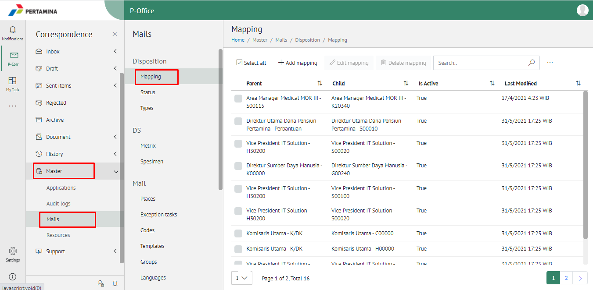

2. Pilih tombol **Search** dan masukkan pencarian berdasarkan kata kunci, kemudian klik **Enter**

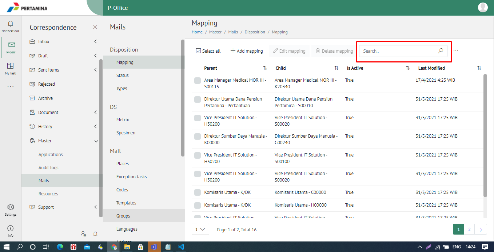

#### Menambah Secretary Mapping

1. Pilih menu **Master** dan pilih submenu **Secretary Mapping**

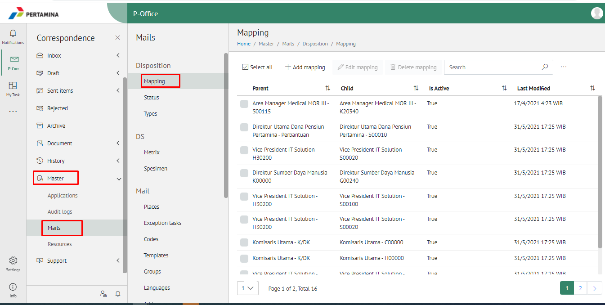

2. Pilih tombol **+ Add Mapping** untuk menambah _secretary mapping_

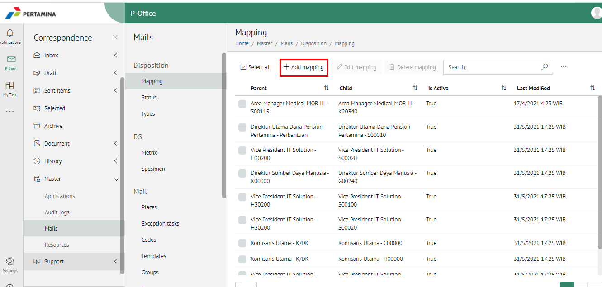

3. Isikan informasi _secretary mapping_ meliputi nama sekretaris, jabatan (pemilik KBO), tanggal mulai dan tanggal selesai kemudian klik tombol **Submit.**

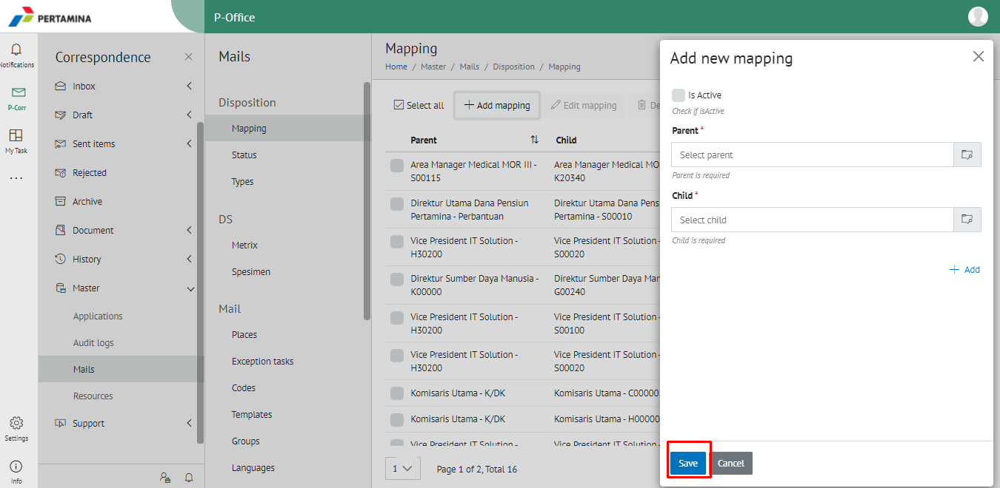

4. Sistem menyimpan perubahan dan data akan muncul di halaman daftar kode simpan

#### Mengubah Secretary Mapping

1. Pilih menu **Master** dan pilih submenu **Secretary Mapping**

2. Klik checklist pada _secretary mapping_ yang akan diubah kemudian klik tombol **Edit Mapping**

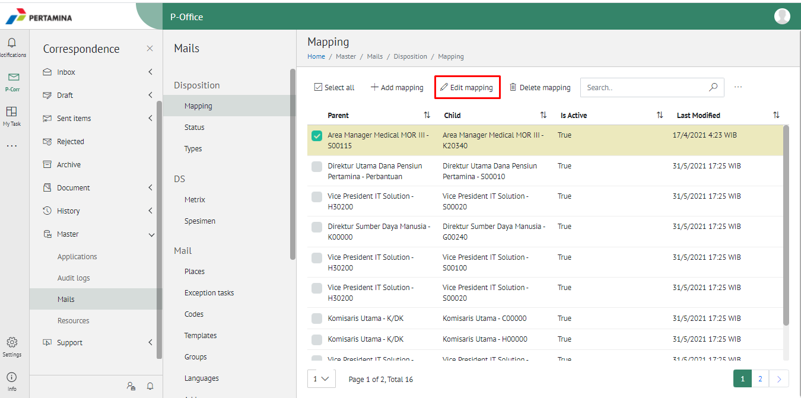

3. Lakukan perubahan pada _secretary mapping_, pilih **Cancel** untuk membatalkan proses

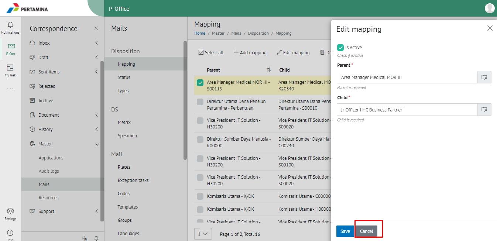

4. Lakukan perubahan pada _secretary mapping_ kemudian klik tombol **Submit** untuk menyimpan perubahan

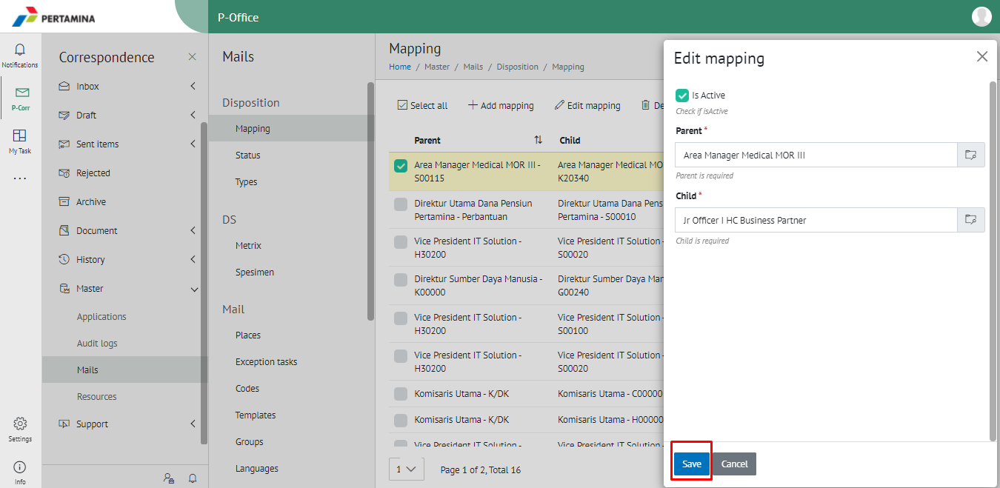

5. Sistem menyimpan perubahan dan data akan muncul di halaman daftar _secretary mapping_

#### Menghapus Secretary Mapping

1. Pilih menu **Master** dan pilih submenu **Secretary Mapping**

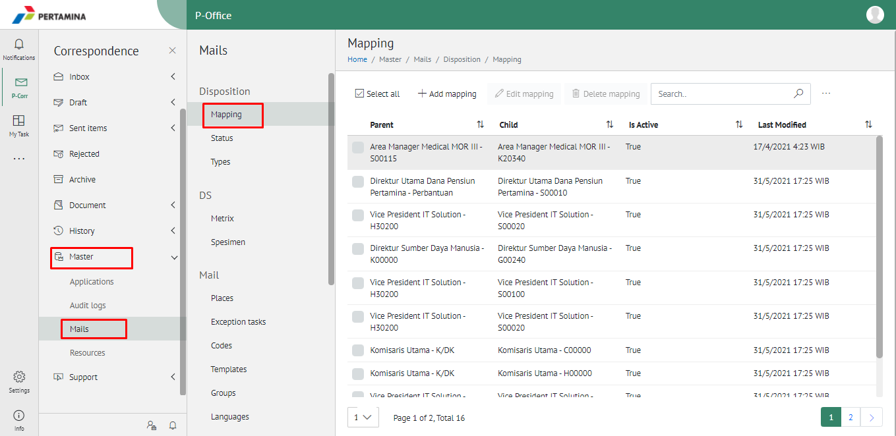

2. Klik checklist pada _secretary mapping_ yang akan dihapus kemudian klik icon **Delete Mapping**

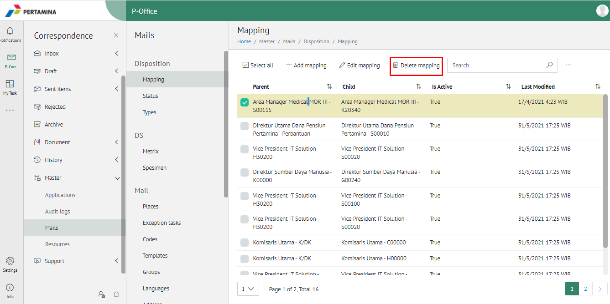

3. Klik tombol **No** untuk membatalkan proses

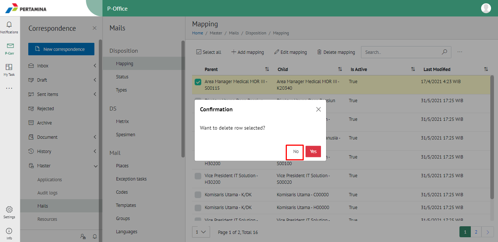

4. Klik tombol **Ya** untuk menghapus _secretary mapping_ **.** Sistem menyimpan perubahan dan data akan terhapus dari daftar _secretary mapping_

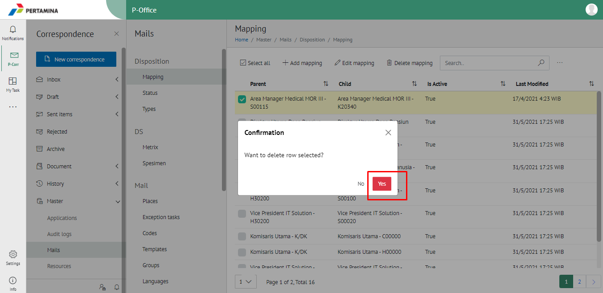
