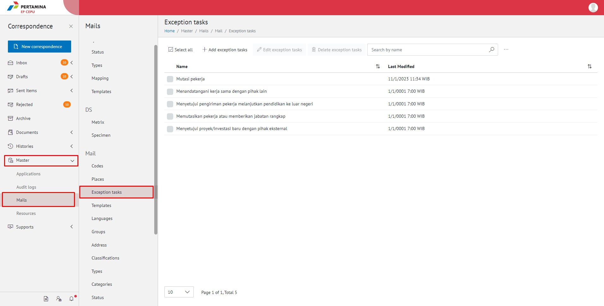
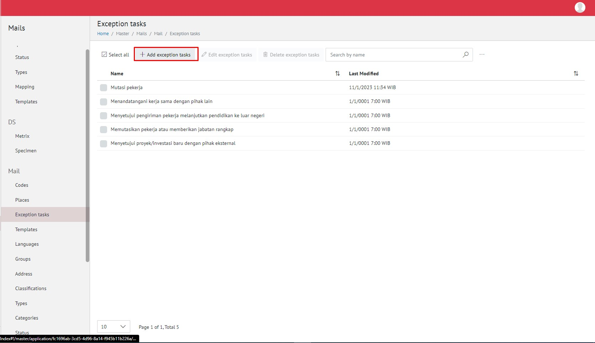
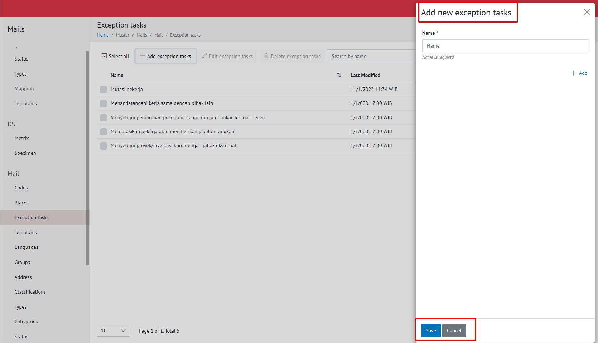
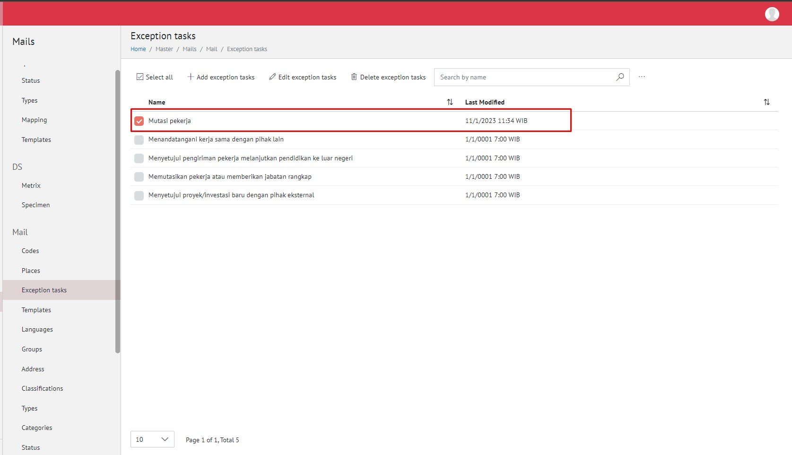
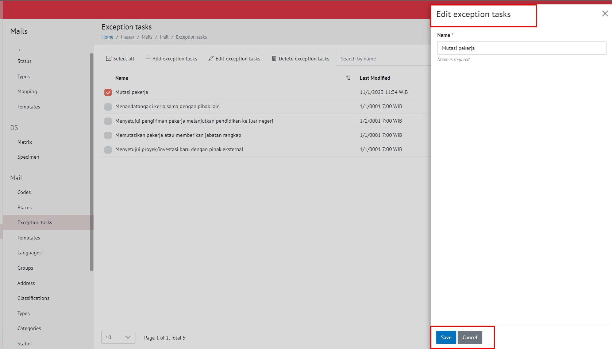
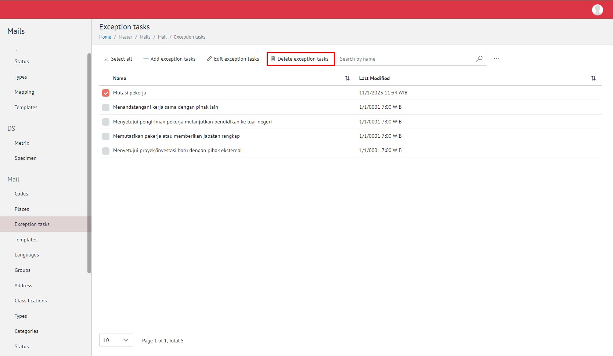
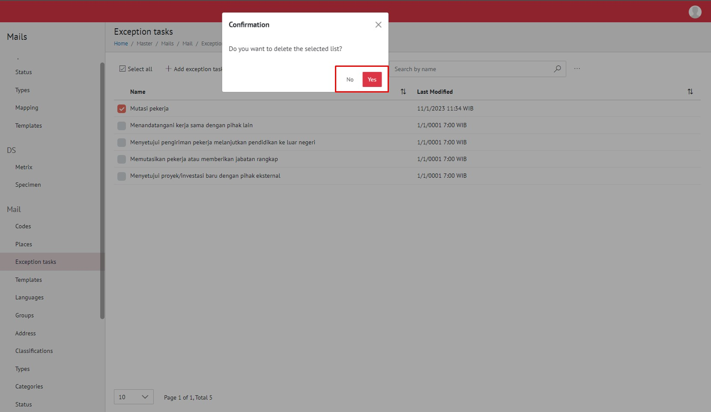
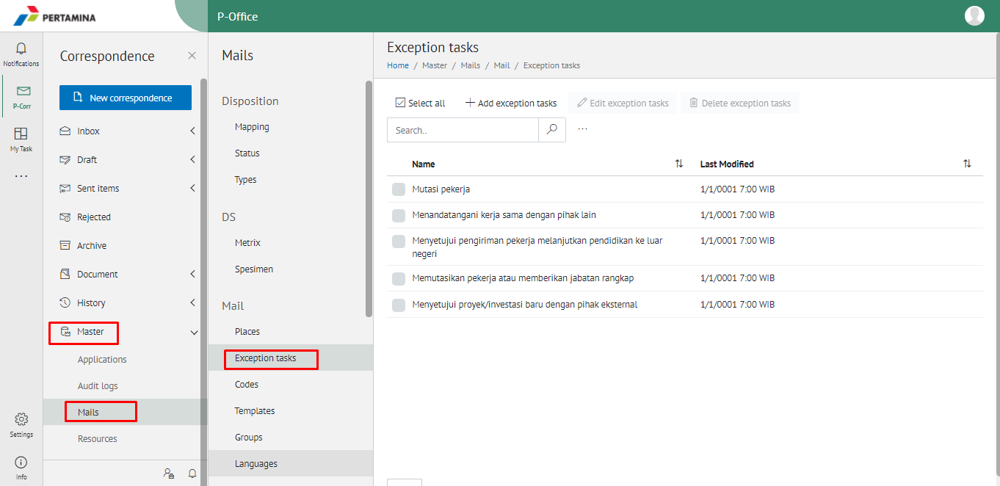
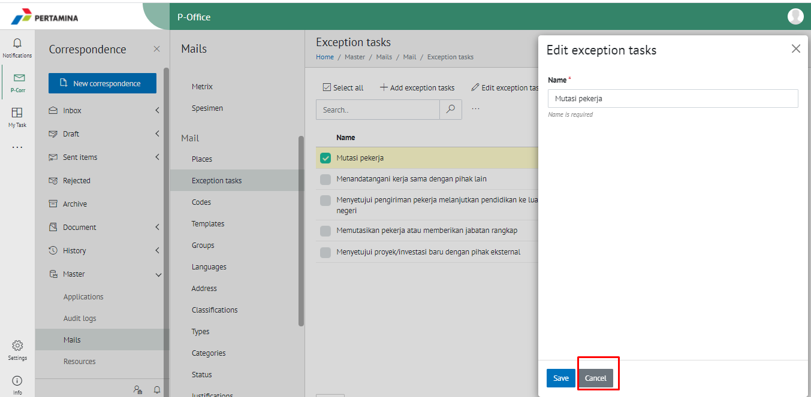
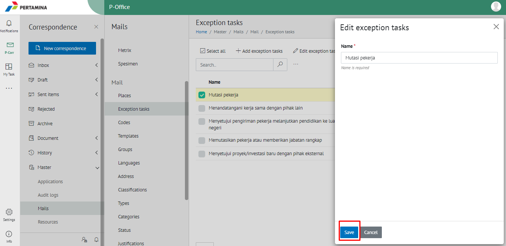

**Role yang sesuai**

- Admin E-Corr

 Admin E-Corr dapat mengelola _task list_ yang digunakan dalam penginputan form pengajuan SP3S. Pengelolaan _task list_ SP3S yang dilakukan admin E-Corr antara lain yaitu

- Mencari _task list_ SP3S
- Menambah _task list_ SP3S
- Mengubah _task list_ SP3S
- Menghapus _task list_ SP3S

## **E-Corr Versi Web**

Langkah - langkah untuk pengelolaan _task list_ SP3S via Web adalah sebagai berikut:

#### **Mencari Task List SP3S**

1.    Pilih menu **Master** kemudian **Mails** dan pilih submenu **_Task list_**

2.    Pilih tombol **Search** dan masukkan pencarian berdasarkan kata kunci, kemudian klik **Enter**

#### **Menambah Task List SP3S**

1.    Pilih menu **Master** kemudian **Mails** dan pilih submenu **_Task list_**

2.    Pilih tombol **+ Add Task** untuk menambah _task list_

3.    Isikan informasi _task list_ meliputi nama kemudian klik tombol **Submit.**

4.    Sistem menyimpan perubahan dan data akan muncul di halaman daftar _task list_

#### **Mengubah Task List SP3S**

1.    Pilih menu **Master** kemudian **Mails** dan pilih submenu **_Task list_**

2.    Klik checklist pada _task list_ yang akan diubah kemudian klik icon **Ubah**

3.    Lakukan perubahan pada _task list_, pilih **Cancel** untuk membatalkan proses

4.    Lakukan perubahan pada _task list_ kemudian klik tombol **Submit**

5.    Sistem menyimpan perubahan dan data akan muncul di halaman daftar _task list_

#### **Menghapus Task List SP3S**

1.    Pilih menu **Master** kemudian **Mails** dan pilih submenu **_Task list_**

2.    Klik checklist pada _task list_ yang akan dihapus kemudian klik tombol **Delete Task List**

3.    Klik tombol **Cancel** untuk membatalkan proses

4.    Klik tombol **Save** untuk menghapus _task list. _Sistem menyimpan perubahan dan data akan terhapus dari daftar _task list_

## **E-Corr Versi Mobile Android**

Langkah - langkah untuk pengelolaan _task list_ SP3S via Android adalah sebagai berikut:

#### **Menghapus Task List SP3S**

1.    Pilih menu **Master** dan pilih submenu **_Task list_**

2.    Klik checklist pada _task list_ yang akan dihapus kemudian klik tombol **Delete Task List**

3.    Klik tombol **Cancel** untuk membatalkan proses

4.    Klik tombol **Save** untuk menghapus _task list. _Sistem menyimpan perubahan dan data akan terhapus dari daftar _task list_

