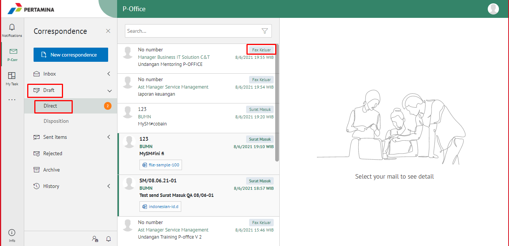
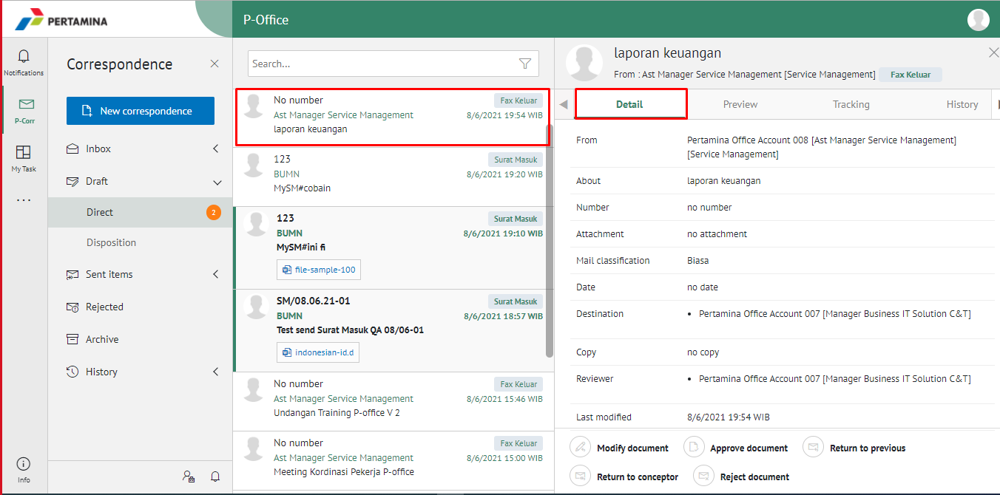
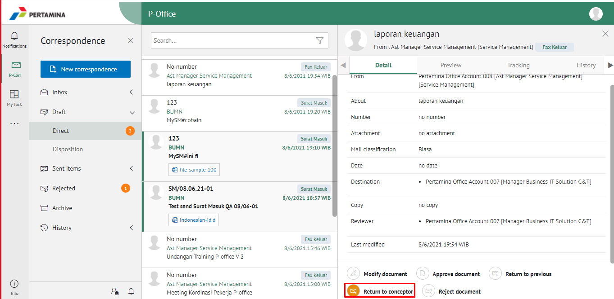
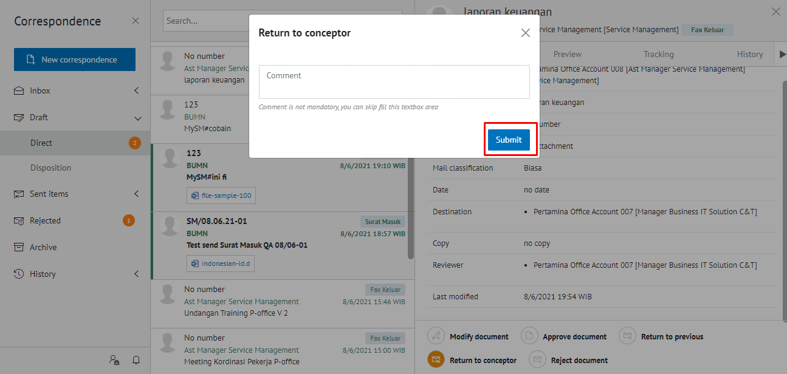
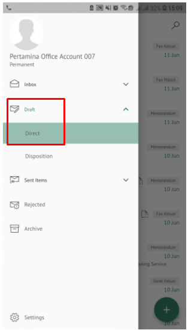
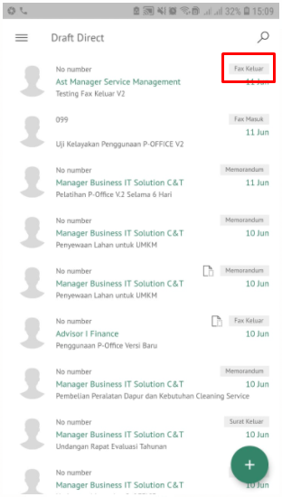
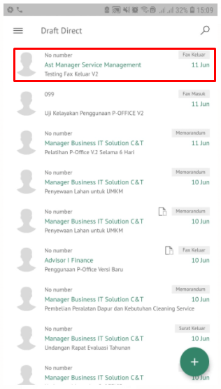
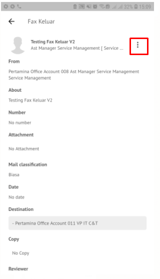
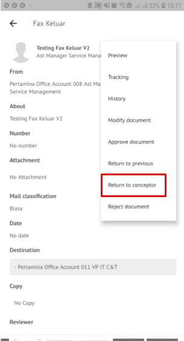

**Role yang sesuai**

- *Approver User*
- *Reviewer User*

*User* dapat mengembalikan fax keluar ke konseptor jika hasil review belum / tidak sesuai. Langkah-langkah untuk mengembalikan fax keluar ke konseptor adalah sebagai berikut

1. Klik menu **Draft** dan pilih menu **Direct** Lalu pilih surat berlabel **Fax Keluar**

2. Pilih fax keluar yang akan ditindak lanjuti kemudian pilih tab **Detail**

3. Klik tombol **Return Conceptor** dan Sistem menampilkan pop up konfirmasi lalu user harus mengisi komentar kemudian klik **Submit**

4. Sistem berhasil menyimpan perubahan. Fax keluar yang sudah dikirim akan tersimpan di menu **Sent Item- Fax Keluar** dan konseptor akan menerima fax keluar di menu **Draft - Fax Keluar**

## **E-Corr Versi Android dan iOS**

Langkah - langkah untuk kembalikan kekonseptor via Android dan iOS adalah sebagai berikut: 

1. Klik menu **Inbox** dan pilih Label **Fax Keluar**
   
 

2. Pilih fax keluar yang akan ditindak lanjuti kemudian pilih icon **Option**

 

3. Klik tombol **Revise to Conceptor** kemudian sistem menampilkan pop up dan user mengisi komentar lalu klik **Send**

 

4. Sistem berhasil menyimpan perubahan. Fax keluar yang sudah di kirim akan tersimpan di menu **Sent Item- Fax Keluar** dan konseptor akan menerima fax keluar di menu **Draft – Fax Keluar**

<<<<<<< HEAD
=======

>>>>>>> b33c148550d1869d36ed11b321218b84ea6aa07e

