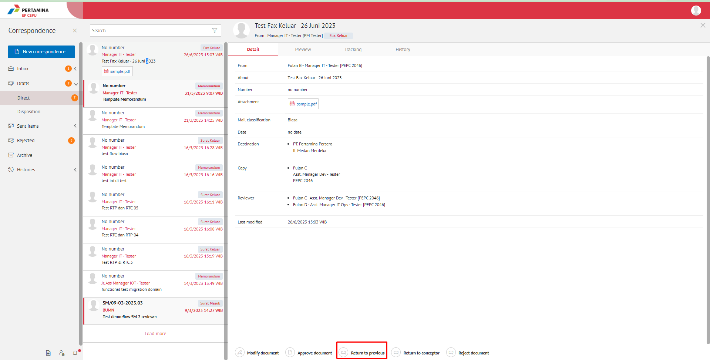
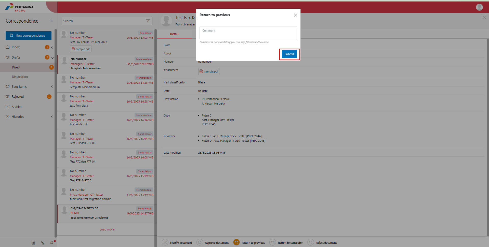

**Role yang sesuai**

- *Approver User*
- *Reviewer User*

*User* dapat mengembalikan fax keluar ke sebelumnya jika hasil review belum / tidak sesuai. Surat akan dikembalikan ke satu level *reviewer* sebelumnya atau ke konseptor (apabila hanya ada satu *reviewer*). Langkah - langkah untuk mengembalikan fax keluar ke sebelumnya adalah sebagai berikut

1. Klik menu **Draft** dan pilih menu **Direct** Lalu pilih surat berlabel **Fax Keluar**

2. Pilih fax keluar yang akan ditindak lanjuti kemudian pilih tab **Detail**

3. Klik tombol **Return to Previouss** dan Sistem menampilkan pop up konfirmasi lalu user harus mengisi komentar kemudian klik **Submit**

4. Sistem berhasil menyimpan perubahan. Fax keluar yang sudah di kirim akan tersimpan di menu **Sent Item - Fax Keluar** dan penerima pengembalian fax keluar akan menerima fax keluar di menu **Draft - Fax Keluar**

