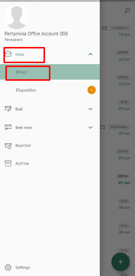
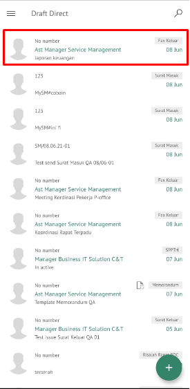

**Role yang sesuai**

- *Approver User*
- *Reviewer User*
- *Member User* (Pekerja)

*User* dapat melihat daftar fax keluar pada pada menu **Inbox, Draft atau Sent Item** pada masing-masing akun. 

## **E-Corr Versi Web**

Langkah - langkah untuk melihat daftar fax keluar via Web adalah sebagai berikut :

1. Klik menu **Inbox / Draft / Sent Item** dan pilih berlabel **Fax Keluar**

## **E-Corr Versi Android dan iOS**

Langkah - langkah untuk melihat daftar fax keluar via Android dan iOS adalah sebagai berikut :

1. Klik menu **Inbox / Draft / Sent Item** dan pilih berlabel **Fax Keluar**

 

