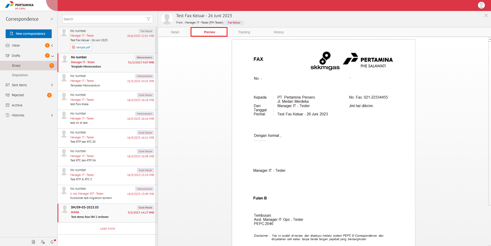
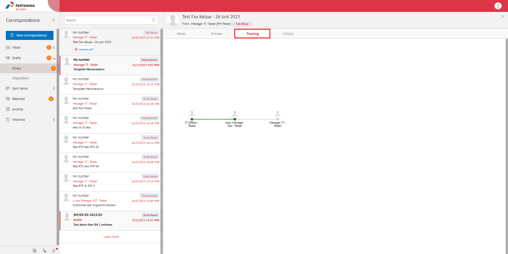
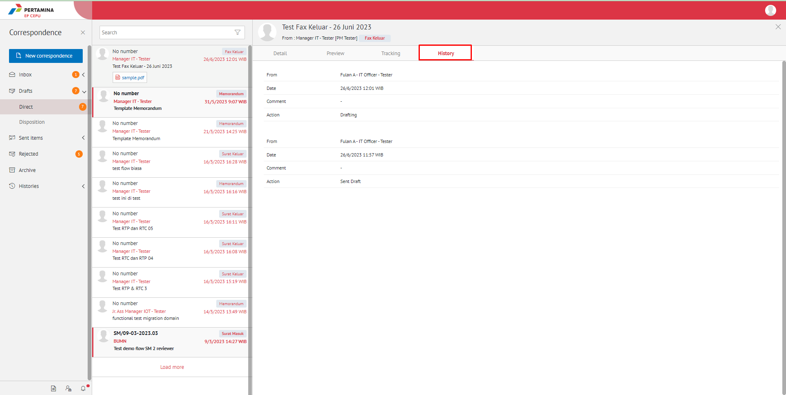

**Role yang sesuai**

- *Approver User*
- *Reviewer User*
- *Member User* (Pekerja)

*User* dapat melihat informasi lengkap fax keluar termasuk *preview* fax keluar, detail fax keluar, *tracking* fax keluar dan *history* fax keluar. Langkah - langkah untuk melihat informasi fax keluar adalah sebagai berikut :

1. Klik menu **Inbox/Draft/Sent Item** dan pilih berlabel **Fax Keluar**. Pilih salah satu fax keluar yang akan dilihat informasinya

#### **Preview Fax Keluar**

Pada tab **Preview**, ditampilkan *preview* fax keluar yang sudah dibuat. *Preview* fax keluar disesuaikan dengan template berdasarkan jenis surat.

#### **Detail Fax Keluar**

Pada tab **Detail**, terdapat informasi asal surat, perihal, file lampiran, nomor surat, klasifikasi surat, tanggal surat, tujuan surat dan *reviewer*

#### **Tracking Fax Keluar**

Pada tab **Tracking**, ditampilkan informasi *tracking* fax keluar dalam bentuk *chart*

#### **History Fax Keluar**

Pada tab **History**, ditampilkan riwayat fax keluar yang terdapat informasi jabatan, tanggal, tindakan dan komentar

