**Role yang sesuai**

- *Approver User*

*Approver User* dapat mengesahkan fax keluar yang sudah dikirim dan direview oleh reviewer. Keluaran untuk tindak lanjut ini adalah untuk men-*generate* nomor fax keluar kemudian fax keluar dapat dikirimkan ke pejabat tujuan. Langkah - langkah untuk menambah reviewer fax keluar adalah sebagai berikut

1. Klik menu **Draf** dan klik menu **Direct** pilih surat berlabel **Fax Keluar**

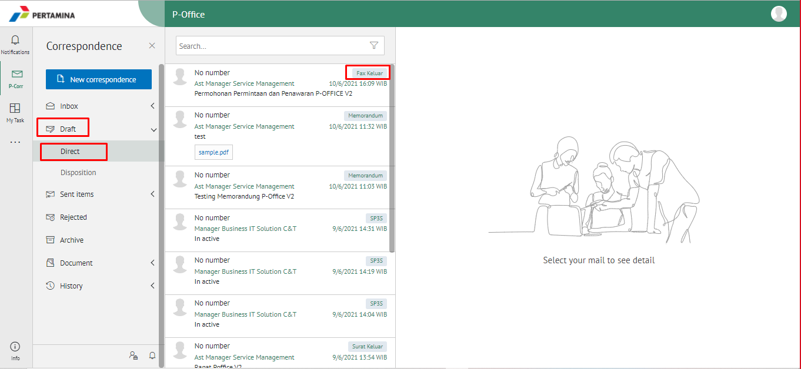

2. Pilih fax keluar yang akan ditindak lanjuti kemudian pilih tab **Detail.** Pada tab **Detail** terdapat informasi nomor surat yang masih bersifat sementara. Nomor inilah yang akan ter-*generate* jika *user* menyetujui fax keluar.

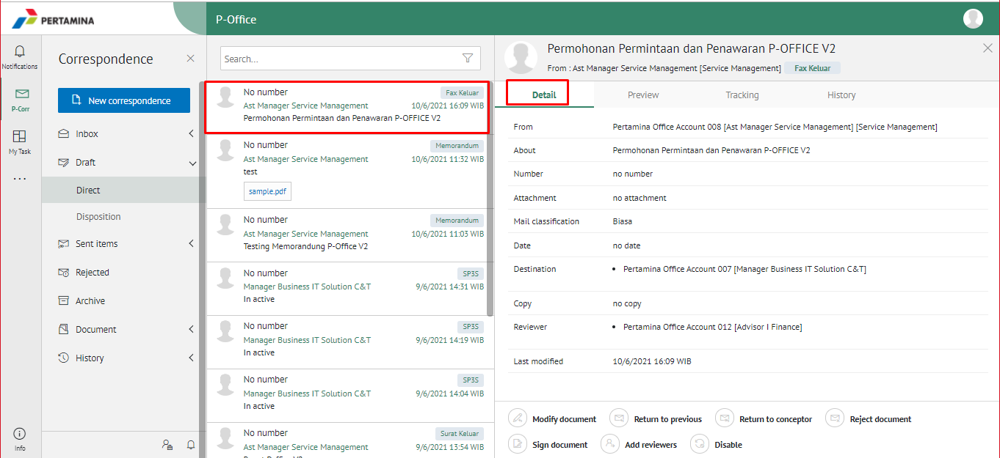

3. Klik **Approve** kemudian pilih **Send**

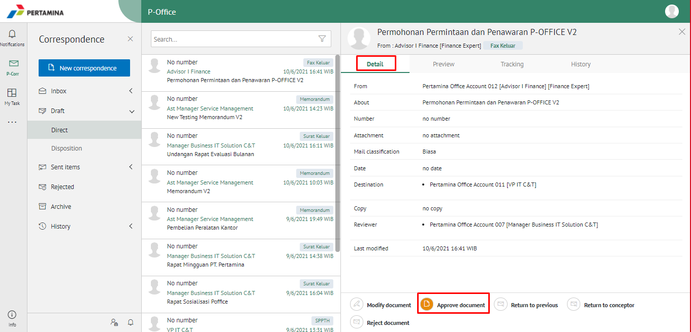

4. Sistem menampilkan *pop up* Validation of Digital Signature

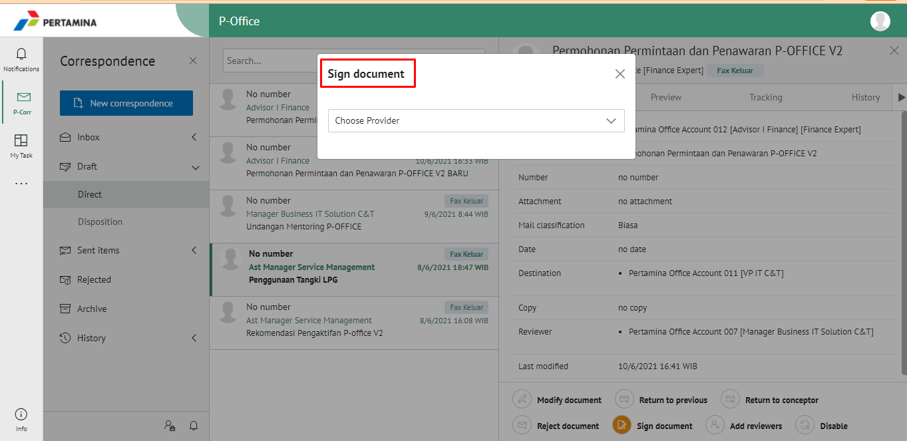

5. Pada *pop up* Sign Document akan terdapat pilih Sign, pilih salah satu Sign yang ingin digunakan, lalu Buka email dan salin kode OTP pada form E-Corr kemudian klik **Sign**

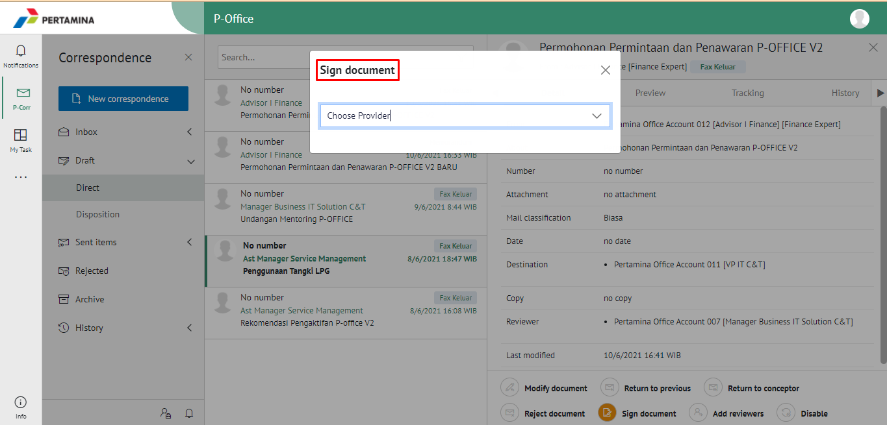

6. Surat keluar yang sudah disetujui akan tersimpan di menu **"Sent Item - Direct"** dan pilih label Fax Keluar pengirim sedangkan surat keluar akan tersimpan di menu **"Inbox - Direct"** berlabel Fax Keluar penerima.

## **E-Corr Versi Android dan iOS**

Langkah - langkah untuk mengesahkan fax keluar via Android dan iOS adalah sebagai berikut:

1. Klik menu **Draft - Direct** dan pilih tab **Fax Keluar**

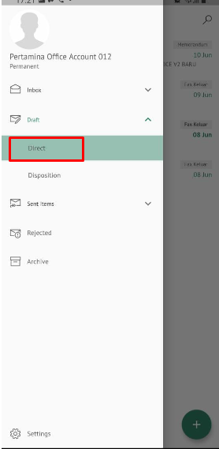 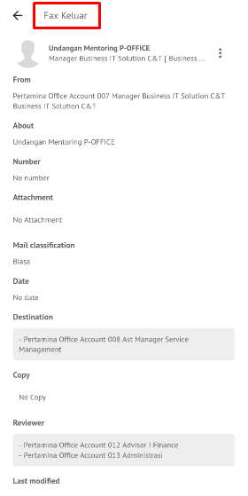 

2. Pilih fax keluar yang akan ditindak lanjuti kemudian pada **Detail** terdapat informasi nomor surat yang masih bersifat sementara. Nomor inilah yang akan ter-_generate_ jika _user_ menyetujui fax keluar. Pilih icon **Option** dan pilih **Sign Document**

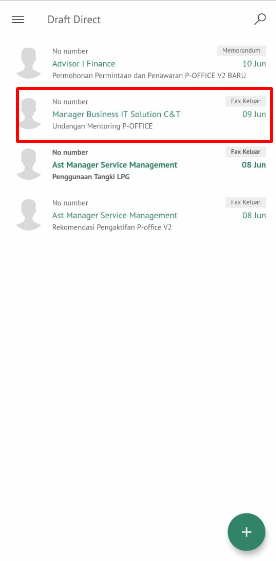 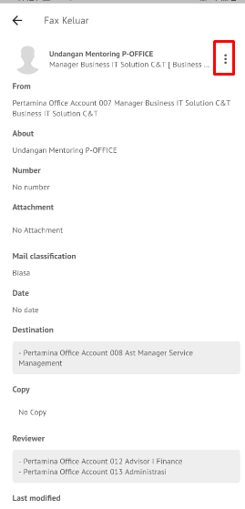  

3. Pilih tombol **button** kemudian **Sign Document**
   
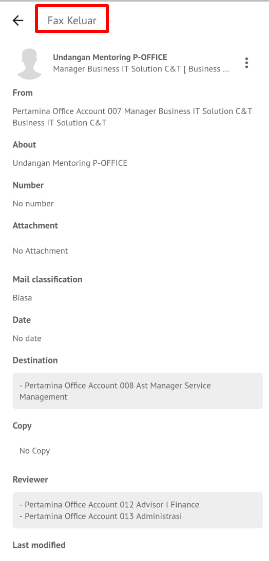 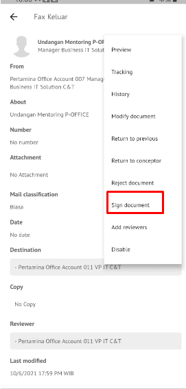 

4. Sistem akan menampilkan form Validation of Digital Signature
   
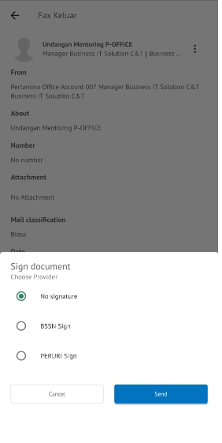

5. Kemudian isikan NIK dan PassPhrase pada form E-Corr kemudian klik **Send**
   
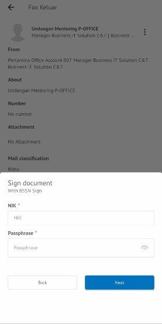

6. Fax keluar yang sudah disetujui akan tersimpan di menu **“Sent Item – Direct”** berlabel Fax Keluar pengiriman sedangkan Fax keluar akan tersimpan di menu **“Inbox – Direct”** berlabel Fax Keluar penerima

