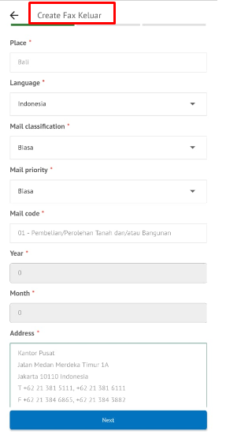
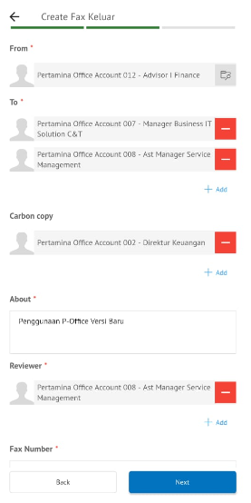
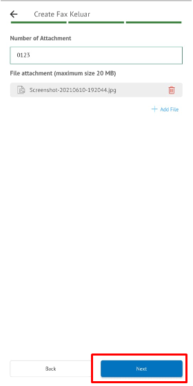
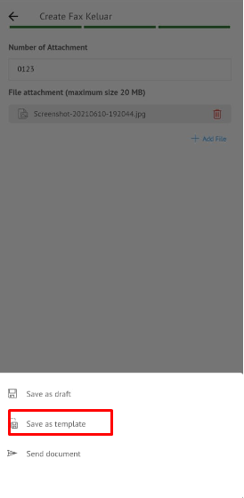
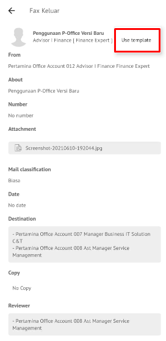
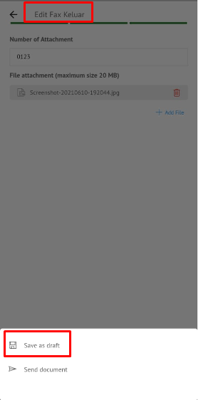

**Role yang sesuai**

- *Member User* (Pekerja)

*Member User* dapat menyimpan fax keluar sebagai *template*. *Template* ini digunakan jika sewaktu-waktu *user* akan melanjutkan fax keluar yang sudah dibuat dan diubah kembali kemudian dikirimkan kepejabat tujuan tanpa harus mengisi *form* fax keluar.

## **E-Corr Versi Web**

Langkah - langkah untuk Save as Template via Web adalah sebagai berikut :

1. Isi *form* fax keluar dan Klik **Save as Template**

2. Fax keluar yang disimpan menjadi *template* akan tersimpan di menu **"Draft - Direct - Fax Keluar"**. Untuk melanjutkan *template* yang sudah dibuat *user* dapat memilih menu **"Draft - Keluar"** kemudian pilih *template* yang akan digunakan

3. Pilih tombol ***User*** **Template** untuk melanjutkan edit fax keluar

4. Sistem akan menampilkan form **Edit Correspondence,** klik **Save as Draf** untuk menyimpan perubahan, kemudian check pada **Draf - Direct - Label Fax Keluar** pilih **Modify Document**

5. Lakukan perubahan pada fax, klik **Send** untuk menyimpan perubahan dan fax keluar akan tersimpan di menu **"Draft - Fax Keluar"**.

## **E-Corr Versi Android dan iOS**

Langkah - langkah untuk save as template fax keluar via Android dan iOS adalah sebagai berikut:

1. Isi _form_ **Creat Fax Keluar** dan isi semua tab yang terdapat di menu Creat Fax Keluar lalu klik **Next**

  

2. Fax keluar yang disimpan menjadi _template_ akan tersimpan di menu “**Draft – Direct”** surat berlabel Fax masuk Untuk melanjutkan _template_ yang sudah dibuat _user_ dapat memilih menu “**Draft – Direct**” label Fax Keluar, kemudian pilih _template_ yang akan digunakan

 

3. Pilih tombol **Use Template** untuk melanjutkan edit fax keluar

  
 

4. Sistem akan menampilkan form **Edit Fax Keluar,** klik **Save as Draf** untuk menyimpan perubahan

5. Lakukan perubahan pada fax, klik **Safe as Draf** untuk menyimpan perubahan dan fax keluar akan tersimpan di menu **“Draft – Direct”** berlabel Fax Keluar sebagai draft atau klik **Send Document** untuk mengirimkan ke pejabat tujuan dan tersimpan di menu **“Sent Item – Direct ”** berlabel Fax Keluar.

