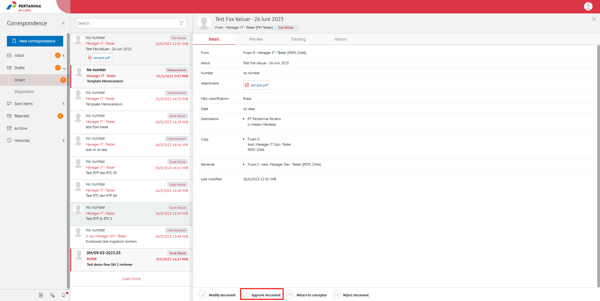
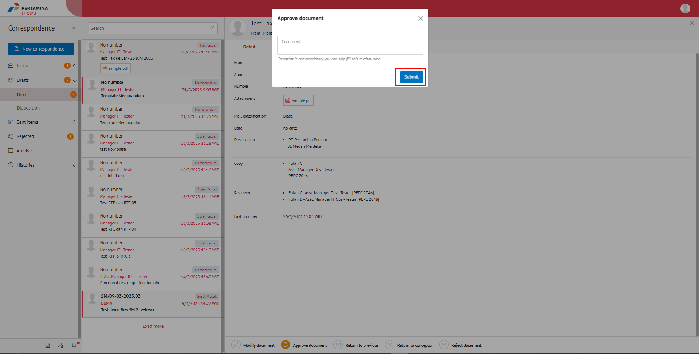

**Role yang sesuai**

- *Approver User*
- *Reviewer User*

*User* dapat menyetujui fax keluar yang sudah dilakukan review dan fax keluar akan dikirimkan ke *reviewer* selanjutnya atau *approver*. Langkah - langkah untuk menyetujui fax keluar adalah sebagai berikut

1. Klik menu **Draf - Direct** dan pilih label **Fax Keluar** 

2. Pilih fax keluar yang akan ditindak lanjuti kemudian pilih tab **Detail**

3. Klik tombol **Approve** dan akan muncul topup  **Approver Comment** Isikan komentar jika diperlukan, lalu **Submit**

4. Sistem berhasil menyimpan perubahan. Fax keluar yang sudah di kirim akan tersimpan di menu **Sent Item - Direct** pilih berlable Fax Keluar

