**Role yang sesuai**

- *Approver User*
- *Reviewer User*

*User* dapat menyetujui fax keluar yang sudah dilakukan review dan fax keluar akan dikirimkan ke *reviewer* selanjutnya atau *approver*. Langkah - langkah untuk menyetujui fax keluar adalah sebagai berikut

1. Klik menu **Draf - Direct** dan pilih label **Fax Keluar** 

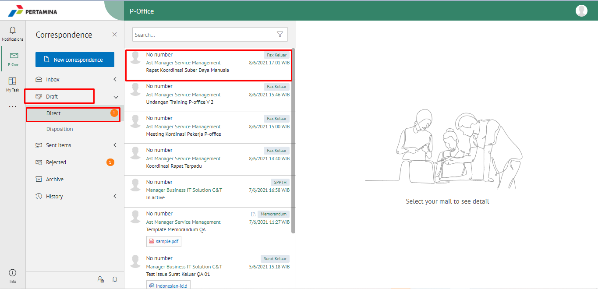

2. Pilih fax keluar yang akan ditindak lanjuti kemudian pilih tab **Detail**

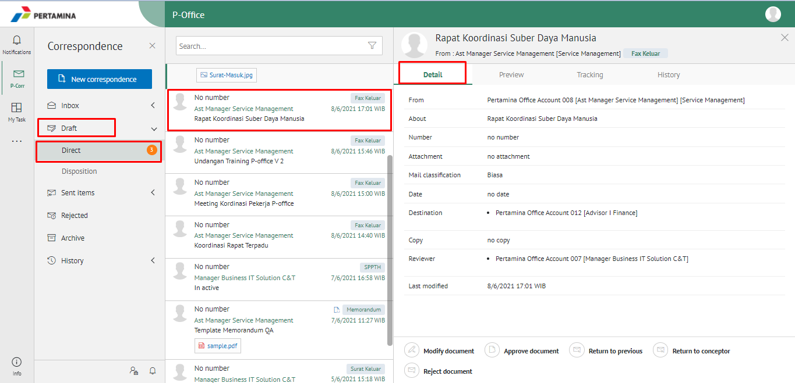

3. Klik tombol **Approve** dan akan muncul topup  **Approver Comment** Isikan komentar jika diperlukan, lalu **Submit**

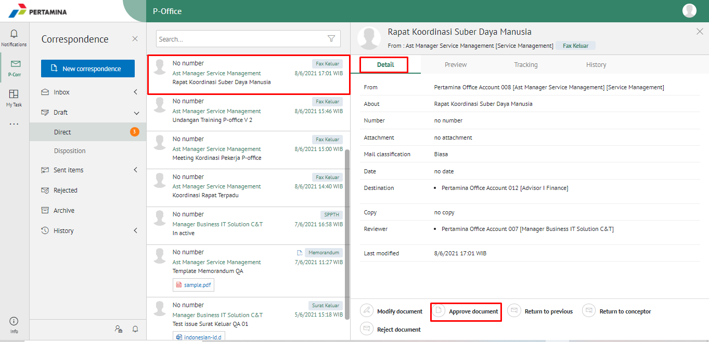

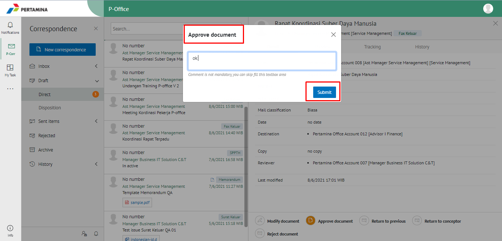

4. Sistem berhasil menyimpan perubahan. Fax keluar yang sudah di kirim akan tersimpan di menu **Sent Item - Direct** pilih berlable Fax Keluar

## **E-Corr Versi Teams**

Langkah - langkah untuk menyetujui fax keluar via Teams adalah sebagai berikut:

1. Klik menu **Inbox** dan pilih tab **Fax Keluar**

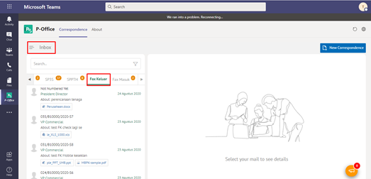

2. Pilih fax keluar yang akan ditindak lanjuti kemudian pilih tab **Detail**

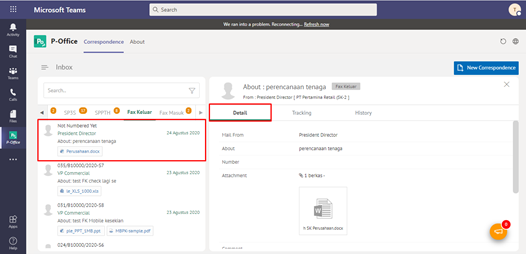

3. Klik tombol **Approve** dan pilih **Send.** Isikan komentar jika diperlukan

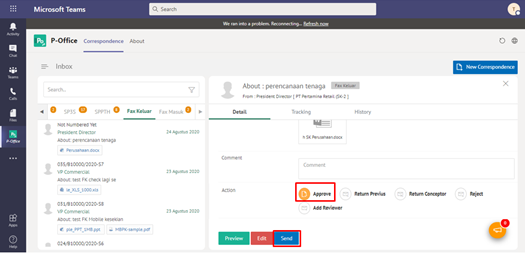

4. Sistem berhasil menyimpan perubahan. Fax keluar yang sudah di kirim akan tersimpan di menu **Sent Item - Fax Keluar**

## **E-Corr Versi Android dan iOS**

Langkah - langkah untuk menyetujui fax keluar via Android dan iOS adalah sebagai berikut:

1. Klik menu **Draf - Direct** dan pilih berlabel **Fax Keluar**

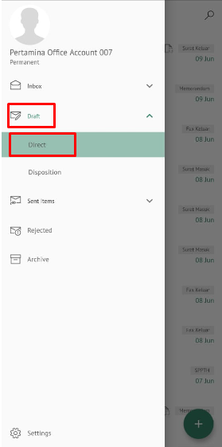 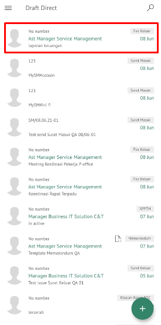

2. Pilih fax keluar yang akan ditindak lanjuti kemudian pilih icon **Option**
   
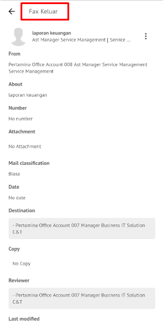 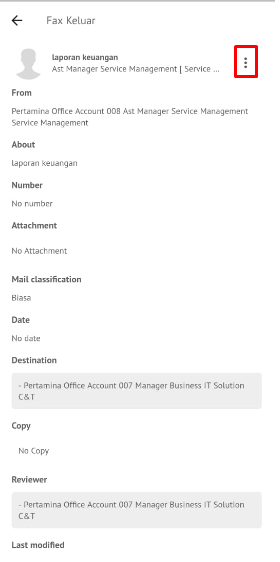

3. Klik tombol **Approve Document** kemudian Sistem akan menampilkan pop up konfirmasi dan _user_ harus mengisi komentar lalu pilih **Send**
   
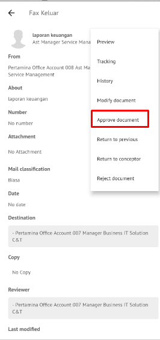 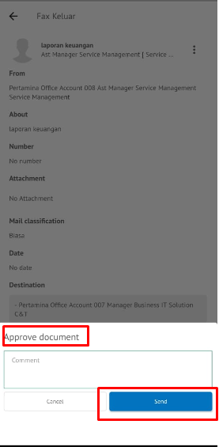

4. Sistem berhasil menyimpan perubahan. Fax keluar yang sudah di kirim akan tersimpan di menu **Sent Item - Direct** berlabel Fax Keluar.

