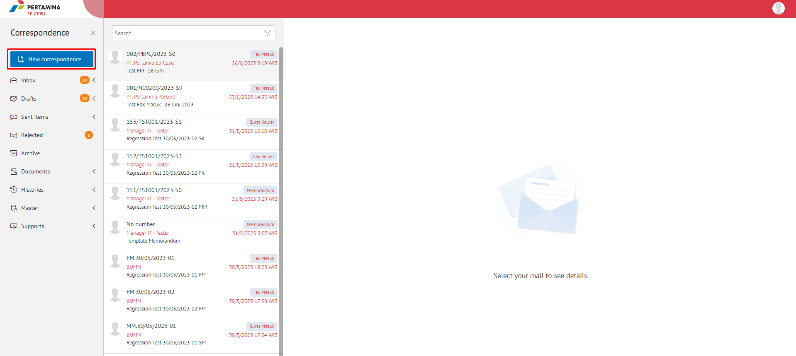
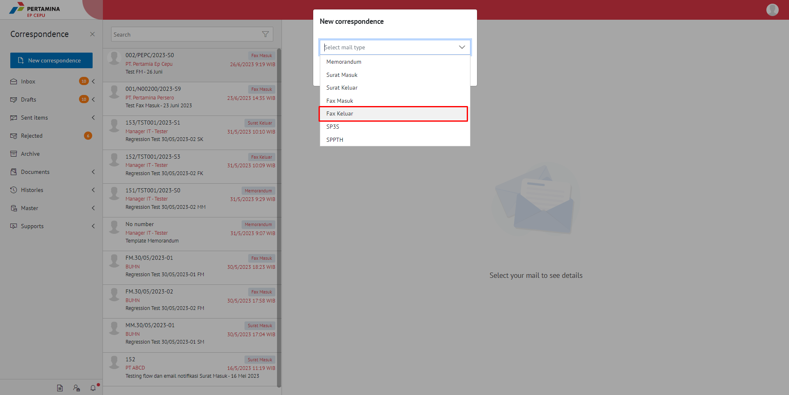
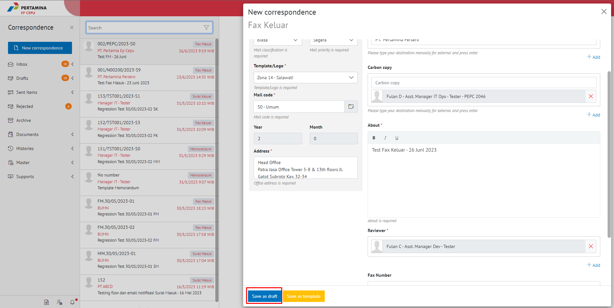

**Role yang sesuai**

- *Member User* (Pekerja)

*Member User* dapat menambah fax keluar pada aplikasi E-Corr.

## **E-Corr Versi Web**

Langkah - langkah untuk menambah fax keluar via Web adalah sebagai berikut :

1. Klik menu **New Correspondence**

2. Pilih jenis surat **"Fax Keluar"** lalu **Next**

3. Isi *form* tambah fax keluar. Terdapat bebarapa aksi untuk menindaklanjuti fax keluar yang sudah diisi *form*nya yaitu **Save as Draft**, **Save as Tamplate** dan **Send Document.**

#### **Simpan Fax Keluar**

Langkah - langkah untuk menyimpan fax keluar adalah sebagai berikut

1. Isi *form* fax keluar kemudian klik **Save as Draft**

2. Sistem akan menampilkan tampilan *Edit Correspondence* fax keluar dalam bentuk Word yang dapat di edit. Untuk melakukan *editing* terhadap isi surat klik **Edit** kemudian sistem akan menampilkan *pop up* konfirmasi **Ubah Word Desktop** atau **Ubah Online**

#### **[Edit] Word Desktop**

Langkah - langkah untuk mengubah isi fax keluar melalui Word Desktop adalah sebagai berikut

1. Klik **Ubah di Word** untuk mengubah melalui aplikasi Microsoft Word

2. Lakukan perubahan pada isi surat. Klik **Close** pada aplikasi dan isi surat akan otomatis tersimpan

#### **[Edit] Ubah Online**
  
Langkah - langkah untuk mengubah isi fax keluar secara *online* adalah sebagai berikut

1. Klik **Ubah Online** untuk mengubah isi surat secara *online*

2. Lakukan perubahan pada isi surat. Klik **Close** pada aplikasi

3. Isi surat akan otomatis tersimpan. Jika surat akan disimpan sebagai draft, maka klik **Close.** 

4. Surat yang sudah selesai diubah maka akan tersimpan di menu **"Draft - Direct"** pilih surat berlable **Fax Keluar**

#### **Kirim Fax Keluar**

Langkah - langkah untuk mengirim fax keluar adalah sebagai berikut

1. Pada tampilan **Detail** fax keluar, klik **Modifty Document** lalu klik **Send Document** untuk mengirim surat ke pejabat tujuan

2. Sistem menyimpan perubahan dan fax keluar akan tersimpan di menu **"Sent Item - Fax keluar"**

