**Role yang sesuai**

- *Member User* (Pekerja)

*Member User* dapat menambah fax keluar pada aplikasi E-Corr.

## **E-Corr Versi Web**

Langkah - langkah untuk menambah fax keluar via Web adalah sebagai berikut :

1. Klik menu **New Correspondence**

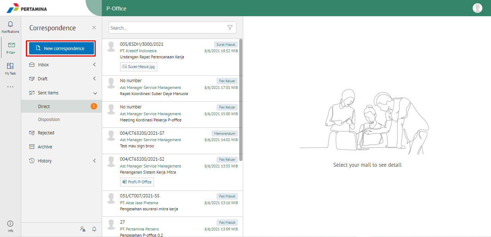

2. Pilih jenis surat **"Fax Keluar"** lalu **Next**

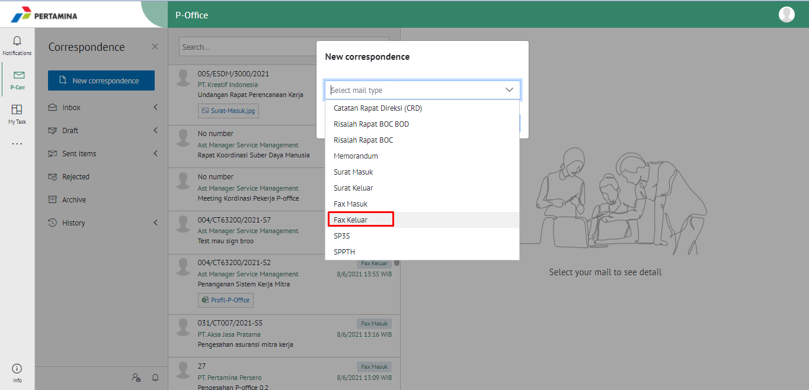

3. Isi *form* tambah fax keluar. Terdapat bebarapa aksi untuk menindaklanjuti fax keluar yang sudah diisi *form*nya yaitu **Save as Draft**, **Save as Tamplate** dan **Send Document.**

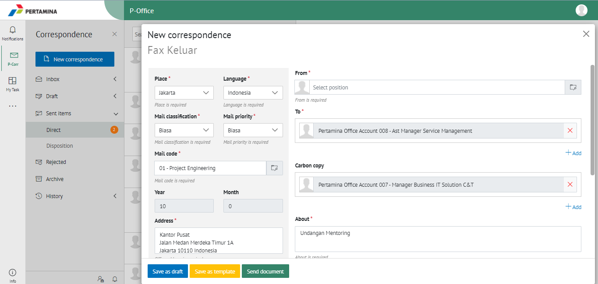

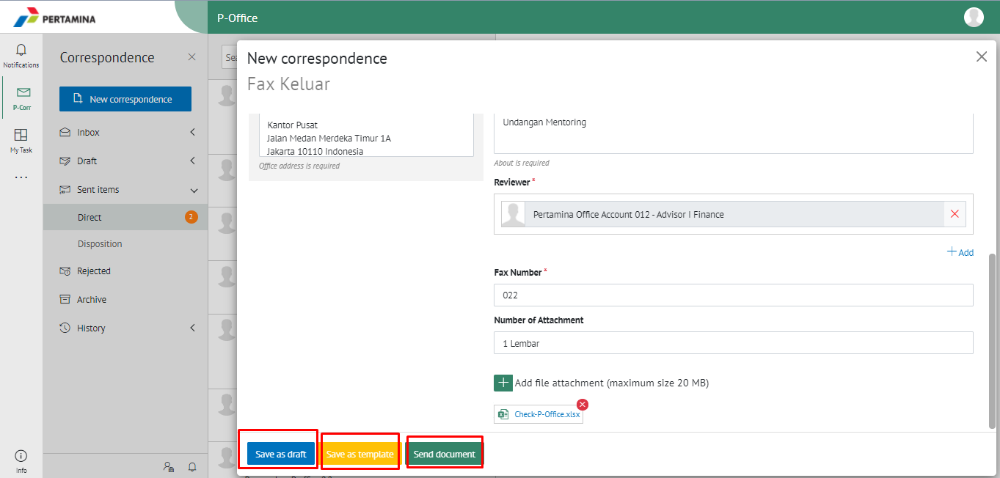

#### **Simpan Fax Keluar**

Langkah - langkah untuk menyimpan fax keluar adalah sebagai berikut

1. Isi *form* fax keluar kemudian klik **Save as Draft**

2. Sistem akan menampilkan tampilan *Edit Correspondence* fax keluar dalam bentuk Word yang dapat di edit. Untuk melakukan *editing* terhadap isi surat klik **Edit** kemudian sistem akan menampilkan *pop up* konfirmasi **Ubah Word Desktop** atau **Ubah Online**

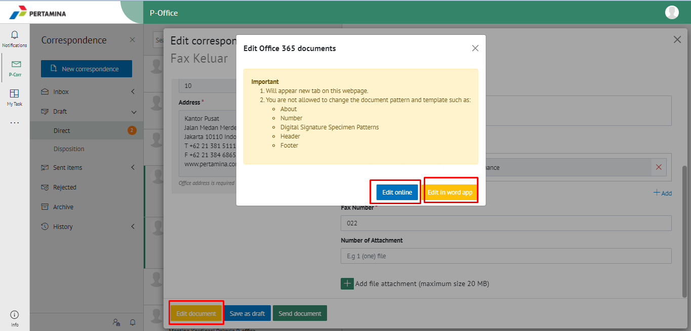

#### **[Edit] Word Desktop**

Langkah - langkah untuk mengubah isi fax keluar melalui Word Desktop adalah sebagai berikut

1. Klik **Ubah di Word** untuk mengubah melalui aplikasi Microsoft Word

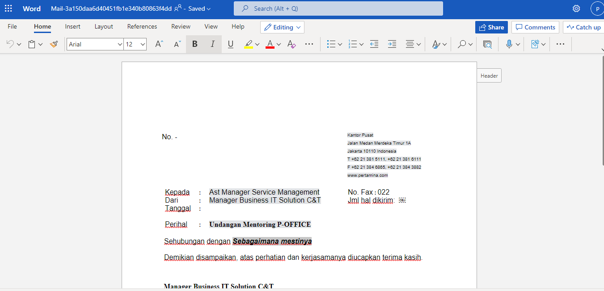

2. Lakukan perubahan pada isi surat. Klik **Close** pada aplikasi dan isi surat akan otomatis tersimpan

#### **[Edit] Ubah Online**
  
Langkah - langkah untuk mengubah isi fax keluar secara *online* adalah sebagai berikut

1. Klik **Ubah Online** untuk mengubah isi surat secara *online*

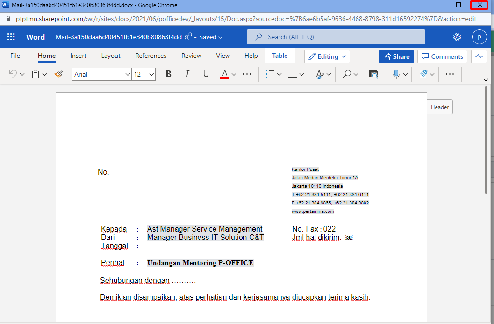

2. Lakukan perubahan pada isi surat. Klik **Close** pada aplikasi

3. Isi surat akan otomatis tersimpan. Jika surat akan disimpan sebagai draft, maka klik **Close.** 

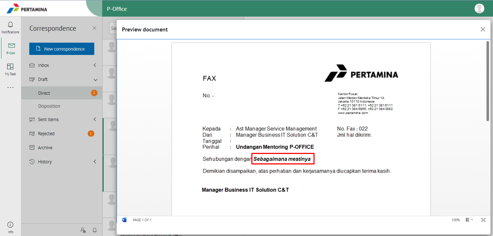

4. Surat yang sudah selesai diubah maka akan tersimpan di menu **"Draft - Direct"** pilih surat berlable **Fax Keluar**

#### **Kirim Fax Keluar**

Langkah - langkah untuk mengirim fax keluar adalah sebagai berikut

1. Pada tampilan **Detail** fax keluar, klik **Modifty Document** lalu klik **Send Document** untuk mengirim surat ke pejabat tujuan

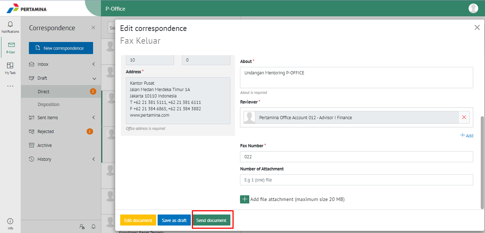

2. Sistem menyimpan perubahan dan fax keluar akan tersimpan di menu **"Sent Item - Fax keluar"**

## **E-Corr Versi Teams**

Langkah - langkah untuk tambah fax keluar via Teams adalah sebagai berikut:

1. Klik menu **New Correspondence**

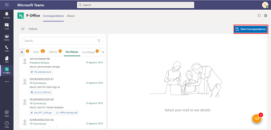

2. Pilih jenis surat **"Fax Keluar"**

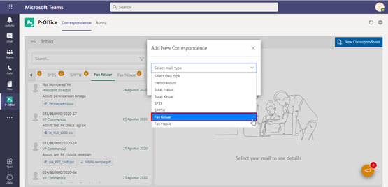

3. Isi *form* tambah fax keluar. Terdapat bebarapa aksi untuk menindaklanjuti fax keluar yang sudah diisi formnya yaitu **Simpan Fax Keluar**, **Kirim Fax Keluar** dan **Save as Template Fax Keluar.**

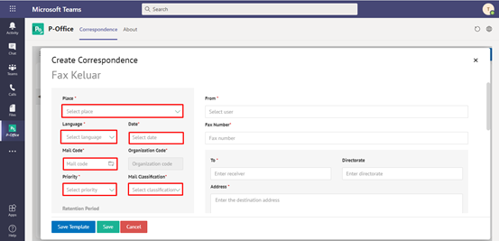

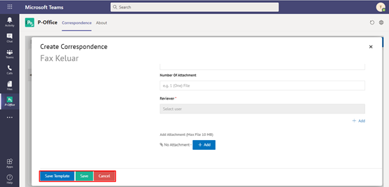

#### **Simpan Fax Keluar**

Langkah - langkah untuk menyimpan fax keluar adalah sebagai berikut

1. Isi *form* fax keluar kemudian klik **Save**

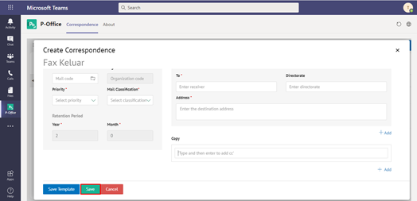

2. Sistem akan menampilkan tampilan *preview* fax keluar dalam bentuk Word yang dapat di edit. Untuk melakukan *editing* terhadap isi surat klik **Ubah Isi** kemudian sistem akan menampilkan *pop up* konfirmasi **Ubah Word Desktop** atau **Ubah Online**

#### **[Edit] Word Desktop**

Langkah - langkah untuk mengubah isi fax keluar melalui Word Desktop adalah sebagai berikut

1. Klik **Open in Desktop App** untuk mengubah melalui aplikasi Microsoft Word

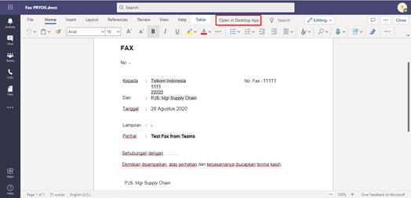

2. Lakukan perubahan pada isi surat. Klik **Close** pada aplikasi dan isi surat akan otomatis tersimpan

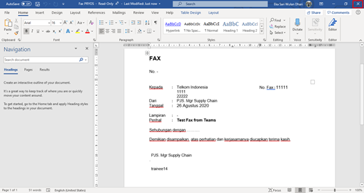

#### **[Edit] Ubah Online**
  
Langkah - langkah untuk mengubah isi fax keluar secara *online* adalah sebagai berikut

1.	Ketika Klik *button* **Edit Content** maka secara otomatis akan membuka dokumen dan bisa mengubah isi surat secara *online*

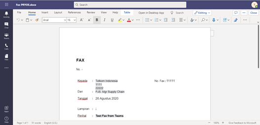

2. Lakukan perubahan pada isi surat. Klik **Close** pada aplikasi

3. Isi surat akan otomatis tersimpan. Jika surat akan disimpan sebagai draft, maka klik **Close.** 

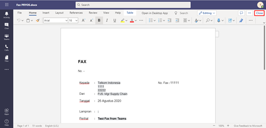

4. Surat yang sudah selesai diubah maka akan tersimpan di menu **"Draft - Fax Keluar"**

#### **Kirim Fax Keluar**

Langkah - langkah untuk mengirim fax keluar adalah sebagai berikut

1. Pada tampilan *preview* fax keluar, klik **Send** untuk mengirim surat ke pejabat tujuan

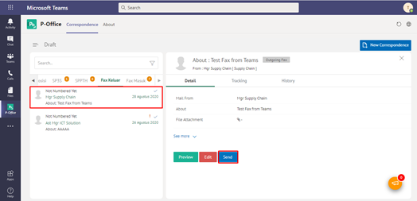

2. Sistem menyimpan perubahan dan fax keluar akan tersimpan di menu **"Sent Item - Fax keluar"**

## **E-Corr Versi Android dan iOS**

Langkah - langkah untuk tambah fax keluar via Android dan iOS adalah sebagai berikut:

1. Klik icon **(+)** pada fax keluar

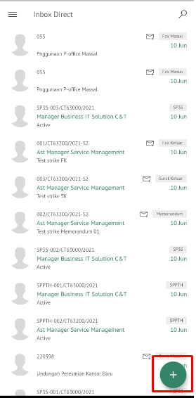

2. Pilih jenis surat “**Fax Keluar**” lalu pilih **Next**

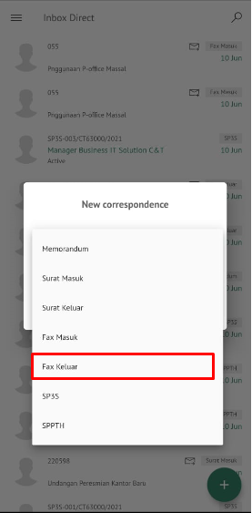

3. Isi _form_ tambah fax keluar. Terdapat bebarapa aksi untuk menindaklanjuti fax keluar yang sudah diisi _form_ nya yaitu **Save as template** dan **Save as Draft**

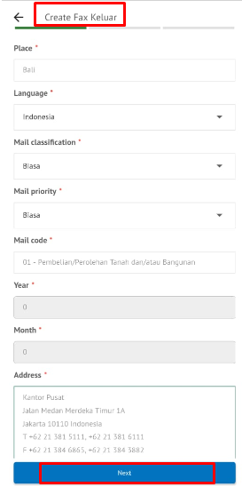  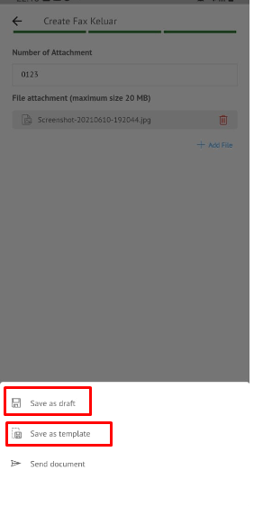

#### **Simpan Fax Keluar**

Langkah – langkah untuk menyimpan fax keluar adalah sebagai berikut.

1. Isi _form_ fax keluar kemudian klik **Save as Tamplate / Save as Draft** maka fax keluar tesimpan di menu **Draft – Direct** berlable fax keluar

  

##### **Kirim Fax Keluar**

Langkah – langkah untuk mengirim fax keluar adalah sebagai berikut.

1. Setelah dilakukan perubahan pada konten isi surat, klik **Send Document** untuk mengirim fax ke pejabat tujuan.

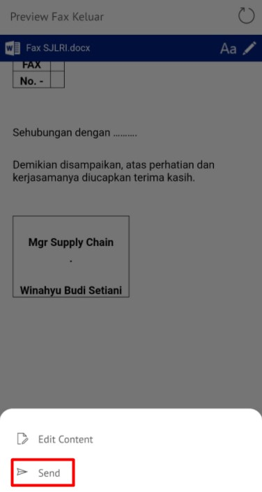

2. Sistem menyimpan perubahan dan surat keluar akan tersimpan di menu “**Sent Item - Direct**” berlabel Fax Keluar

