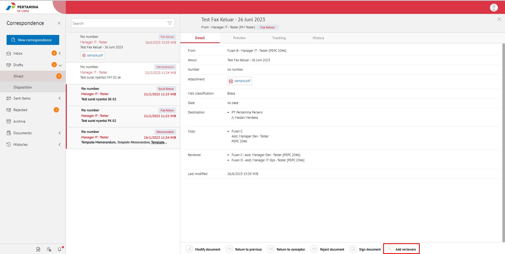
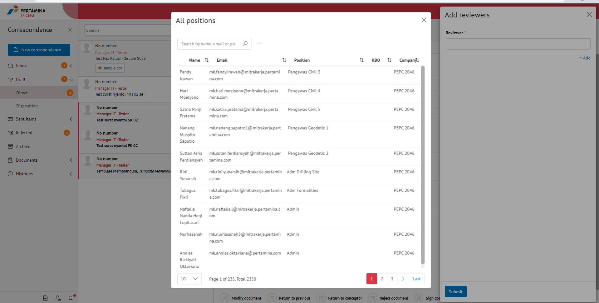
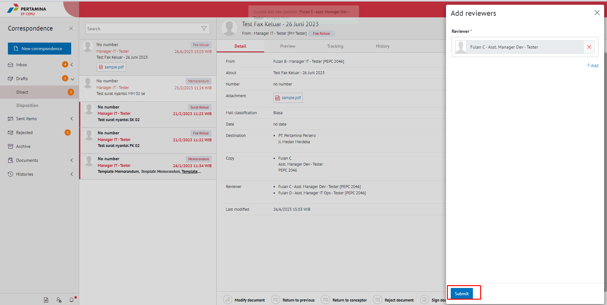

**Role yang sesuai**

- *Approver User*

*Approver User* dapat menambahkan reviewer kemudian fax keluar akan diteruskan ke reviewer baru. Langkah - langkah untuk menambah reviewer fax keluar adalah sebagai berikut

1. Klik menu **Draft - Direct** dan pilih berlabel **Fax Keluar**

2. Pilih fax keluar yang akan ditindak lanjuti kemudian pilih tab **Detail ** kemudian klik "**Add Reviewer**"

3. Klik tombol **Add Reviewer** dan pilih pejabat yang akan melakukan review dengan meng-klik tombol "+" pada field **Add Reviewer**

4. Sistem akan menampilkan pejabat untuk dijadikan reviewer baru

5. Pilih **Send Document** untuk mengirimkan kepada pejabat/reviewer yang dituju dan fax keluar akan tersimpan di menu **"Sent Item - Direct - Fax Keluar"**. Untuk pejabat/reviewer baru akan menerima fax keluar di menu **"Draf - Direct - Fax Keluar"**. Untuk penomoran fax keluar prosesnya akan tetap berada di role approver/pemilik KBO, sehingga setelah flow penambahan reviewer baru selesai, fax keluar akan kembali ke approver/pemilik KBO

!

