**Role yang sesuai**

- *Approver User*

*Approver User* dapat menambahkan reviewer kemudian fax keluar akan diteruskan ke reviewer baru. Langkah - langkah untuk menambah reviewer fax keluar adalah sebagai berikut

1. Klik menu **Draft - Direct** dan pilih berlabel **Fax Keluar**

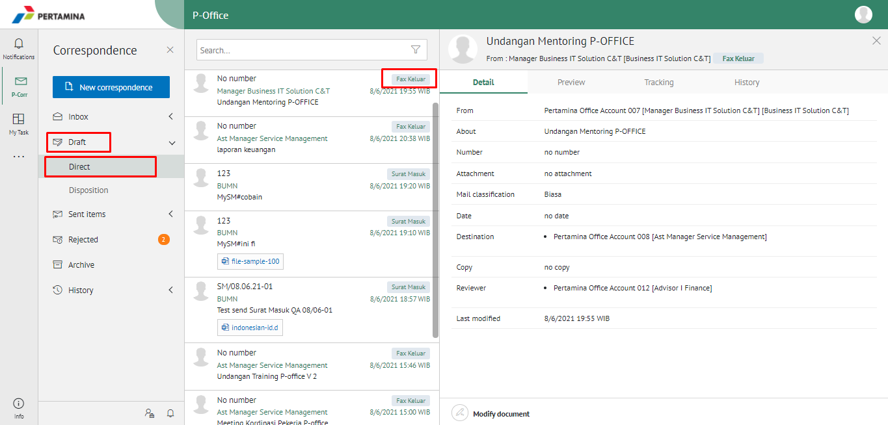

2. Pilih fax keluar yang akan ditindak lanjuti kemudian pilih tab **Detail - Modify Document**

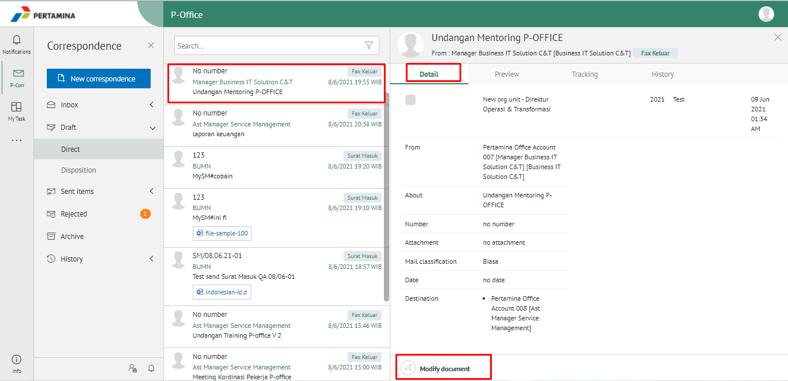

3. Klik tombol **Add Reviewer** dan pilih pejabat yang akan melakukan review dengan meng-klik tombol "+" pada field **Add Reviewer**

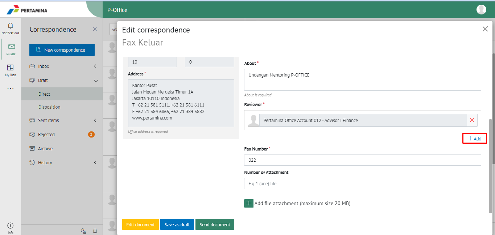

4. Sistem akan menampilkan pejabat untuk dijadikan reviewer baru

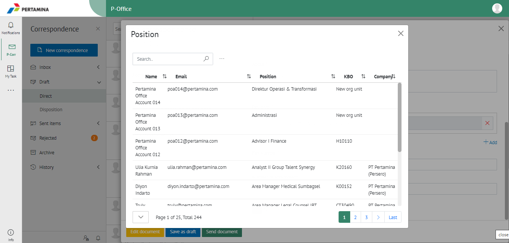

5. Pilih **Send Document** untuk mengirimkan kepada pejabat/reviewer yang dituju dan fax keluar akan tersimpan di menu **"Sent Item - Direct - Fax Keluar"**. Untuk pejabat/reviewer baru akan menerima fax keluar di menu **"Draf - Direct - Fax Keluar"**. Untuk penomoran fax keluar prosesnya akan tetap berada di role approver/pemilik KBO, sehingga setelah flow penambahan reviewer baru selesai, fax keluar akan kembali ke approver/pemilik KBO

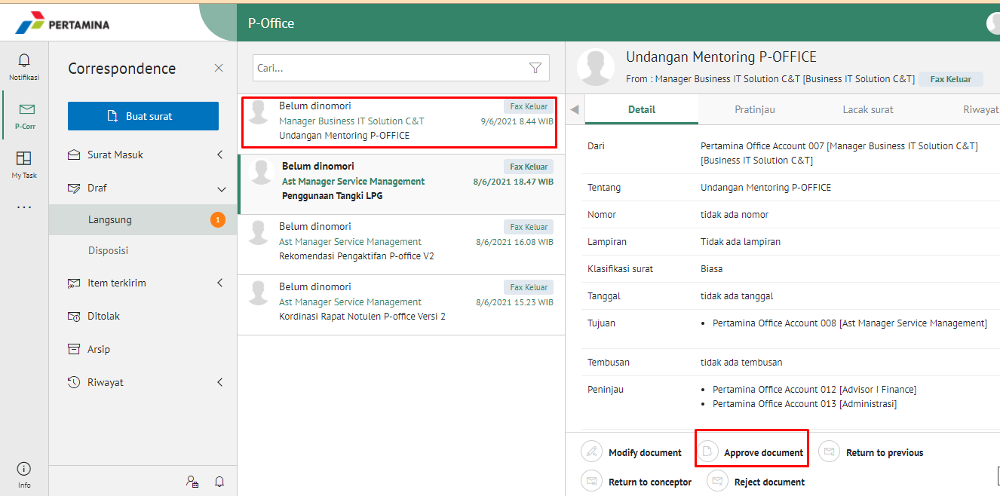

## **E-Corr Versi Android dan iOS**

Langkah - langkah untuk tambah reviewer via Android dan iOS adalah sebagai berikut:

1. Klik menu **Draft-Direct** dan pilih surat berlabel **Fax Keluar**

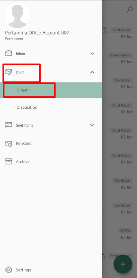 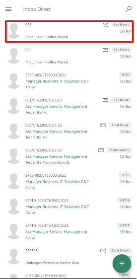

2. Pilih fax keluar yang akan ditindak lanjuti kemudian pada **Detail** klik icon **Option** kemudian pilih **Add Reviewer**

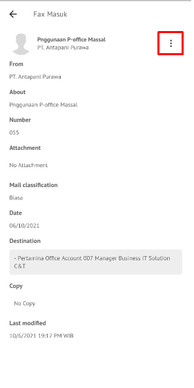 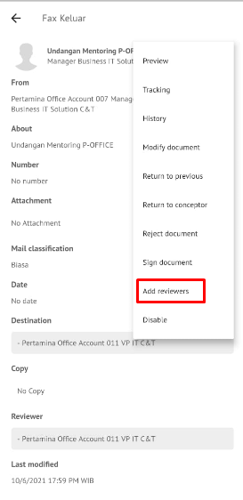

3. Klik tombol **Add Reviewer** dan pilih pejabat yang akan melakukan review dengan meng-klik pada field **Add Reviewer**
   
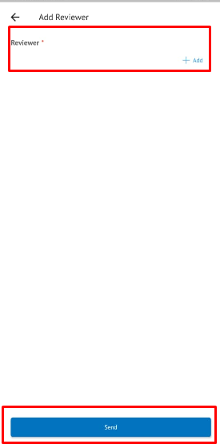

4. Sistem akan menampilkan pejabat untuk dijadikan reviewer baru

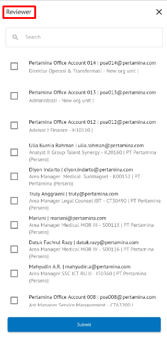

5. Pilih **Send** untuk mengirimkan kepada pejabat/reviewer yang dituju dan fax keluar akan tersimpan di menu “**Sent Item - Direct**” berlable Fax Keluar. Untuk pejabat/reviewer baru akan menerima fax keluar di menu “**Inbox – Direct**” berlabel Fax Keluar. Untuk penomoran fax keluar proesenya akan tetap berada di role approver/pemilik KBO, sehingga setelah flow penambahan reviewer baru selesai, fax keluar akan kembali ke approver/pemilik KBO

