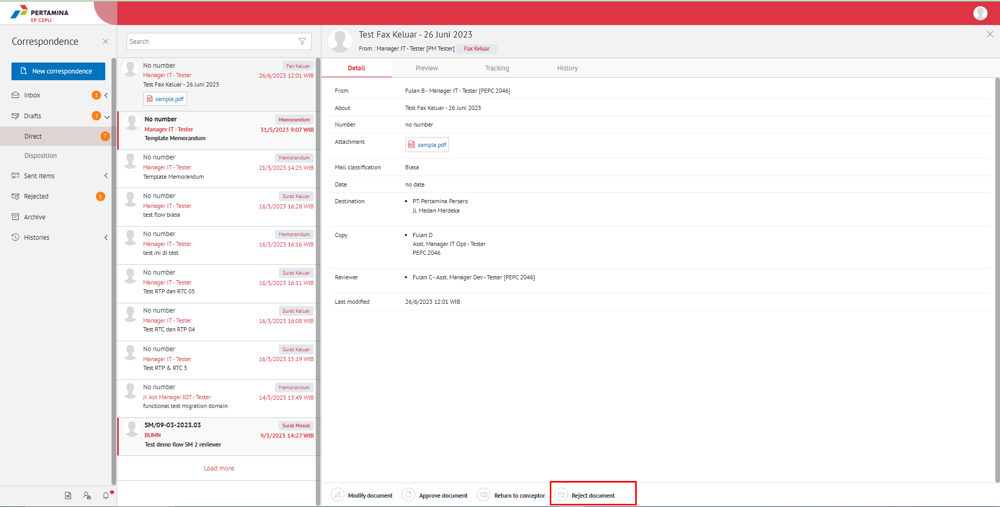
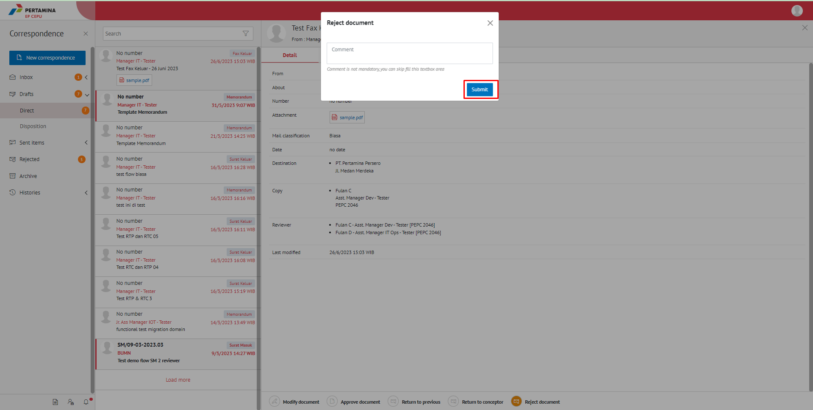

**Role yang sesuai**

- *Approver User*
- *Reviewer User*

*User* dapat menolak fax keluar yang akan dikemnbalikan ke konseptor jika hasil review fax keluar belum / tidak sesuai. Langkah-langkah untuk menolak fax keluar adalah sebagai berikut

1. Klik menu **Draft - Direct** dan pilih berlabel **Fax Keluar**

2. Pilih fax keluar yang akan ditindak lanjuti kemudian pilih tab **Detail**

3. Klik tombol **Reject** dan akan muncul top up *Reject Comment*. Isikan komentar jika diperlukan

4.	Sistem berhasil menyimpan perubahan. Fax keluar yang sudah di tolak akan terhapus dari **Draf - Direct** dan akan tersimpan di menu **“Rejected”** berlabel Fax Keluar.

