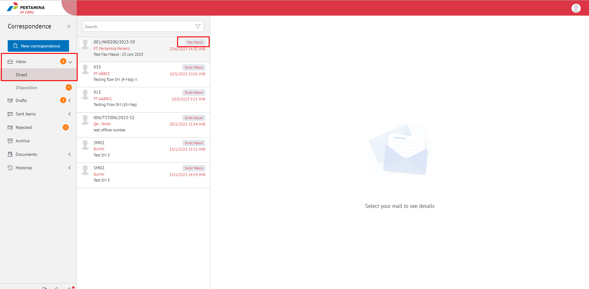
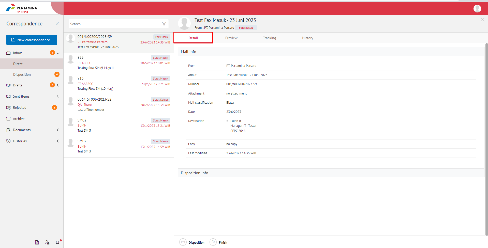
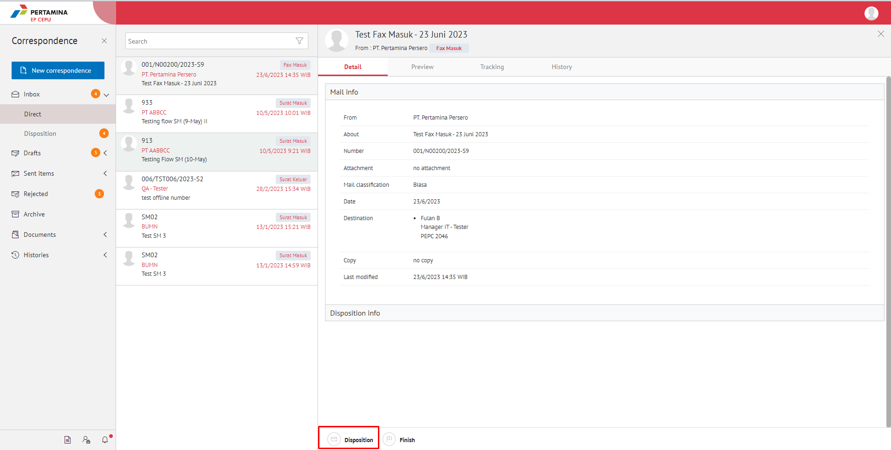
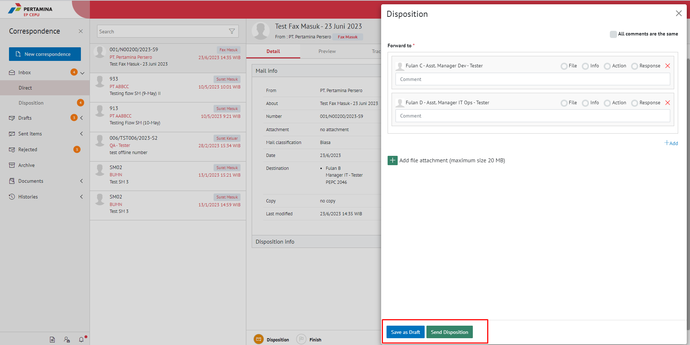

**Role yang sesuai**

- *Approver User*
- *Reviewer User*

*User* dapat melakukan *custom* penerima disposisi terhadap pejabat penerima yang akan menerima perintah disposisi. Secara *default* pejabat yang akan menerima disposisi adalah pejabat yang ada dibawahnya. Tetapi terdapat *case* jika *user* membutuhkan *custom* penerima disposisi sehingga disediakan fitur untuk memilih pejabat selain pejabat yang ada dibawahnya. 

## **E-Corr Versi Web**

Langkah-langkah untuk melakukan custom disposisi fax masuk Web adalah sebagai berikut :

1. Klik menu **Inbox** dan pilih tab **Direct** pilih surat berlable **Fax Masuk**

 

2. Pilih fax masuk yang akan didisposisikan kemudian pilih tab **Detail**

3. Klik tombol **Disposisi**

 

4. Sistem menampilkan form disposisi. Klik icon **"+add"** pada field **Forward To.** Isikan informasi disposisi dan perintah untuk masing - masing penerima disposisi.

 

5. Sistem menampilkan daftar pejabat yang dapat dipilih untuk didisposikan

6. Isikan perintah dan keterangan pada masing - masing penerima disposisi. Tambahkan lampiran disposisi jika diperlukan. Fitur **Same All Comment** dapat digunakan *user* untuk memberikan komentar yang sama untuk masing - masing pejabat penerima disposisi. Klik **Save** untuk menyimpan perubahan dan klik **Send** untuk mengirim disposisi.

 

