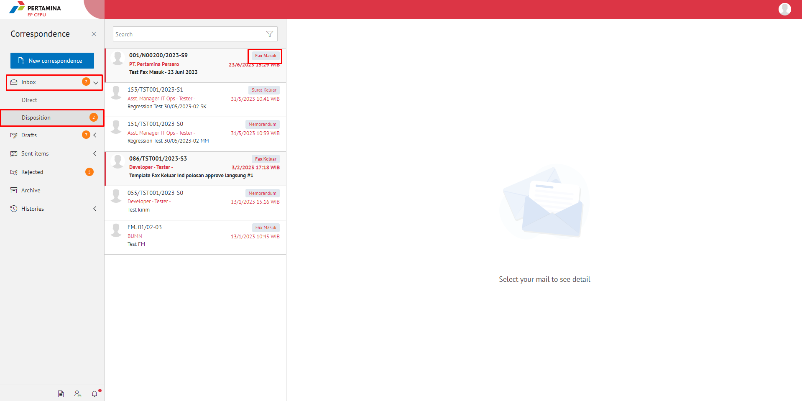

**Role yang sesuai**

- *Approver User*
- *Reviewer User*

*User* menerima fax masuk baru di menu **"Inbox - Fax Masuk"**. Fax masuk dapat didisposisikan kepada pejabat yang dipilih atau pejabat yang ada dibawahnya. Disposisi fax masuk dapat dilakukan dengan dua cara yaitu melalui menu **Inbox** jika fax masuk yang diterima merupakan surat masuk yang ditujukan langsung dari sekretaris ke pejabat pemilik KBOnya atau melalui menu **Disposisi** jika fax masuk sudah dilakukan tindak lanjut oleh pejabat pemilik KBO dan pemilik KBO akan mendisposisikan ke pejabat selanjutnya atau pejabat yang ada dibawahnya. 

## **E-Corr Versi Web**

Langkah - langkah untuk mendisposisikan fax masuk via Web adalah sebagai berikut:

#### **Disposisi melalui Menu Inbox**

1. Klik menu **Inbox - Direct** dan pilih berlabel **Fax Masuk**

 

2. Pilih fax masuk yang akan didisposisikan kemudian pilih tab **Detail**

 

3. Klik tombol **Disposition**
    
 

4. Sistem menampilkan form disposisi. Isikan informasi disposisi dan perintah untuk masing - masing penerima disposisi.

 

5. Klik **Save as Draft** untuk menyimpan draft disposisi surat masuk dan surat masuk akan tersimpan di menu **"Draft - Direct"** dab berlabel **Fax Masuk**. Klik **Send Disposisi** untuk mengirim disposisi ketujuan dan disposisi surat masuk akan tersimpan di menu **"Sent Item - Disposisi"**.

 

#### **Disposisi melalui Menu Disposisi**

1. Klik menu **Inbox - Disposisi** dan pilih berlabel **Fax Masuk**

 

2. Pilih fax masuk yang akan didisposisikan kemudian pilih tab **Detail**

 

3. Klik tombol **Disposisi**

 

4. Sistem menampilkan form disposisi. Isikan informasi disposisi dan perintah untuk masing - masing penerima disposisi.

 

5. Klik **Save as Draf** untuk menyimpan draft disposisi fax masuk dan fax masuk akan tersimpan di menu **"Draft - Disposisi"** dan berlabel Fax Masuk. Klik Send untuk mengirim disposisi ketujuan dan disposisi surat masuk akan tersimpan di menu **"Sent Item - Disposisi"** dan berlabel Fax Masuk.

 

