**Role yang sesuai**

- Sekretaris

Sekretaris dapat melakukan _drafting_ fax masuk pada aplikasi E-Corr. _Drafting_ fax masuk dilakukan jika sekretaris akan meneruskan dan melakukan perubahan pada fax masuk yang sudah disimpan pada menu **Draft.** 

## **E-Corr Versi Web**

Langkah-langkah untuk melakukan drafting fax masuk via Web adalah sebagai berikut :

1.    Klik menu **Draft - Direct** dan pilih berlabel **Fax Masuk**

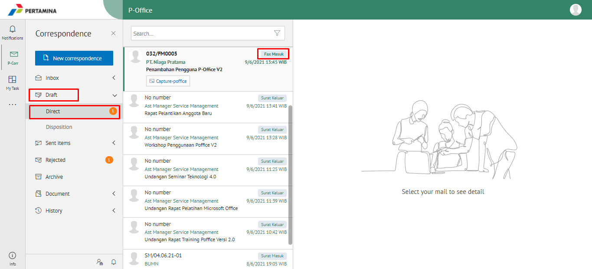 

1. Pilih fax masuk yang akan diubah. Pilih tab **Detail** kemudian klik **Modify Document**

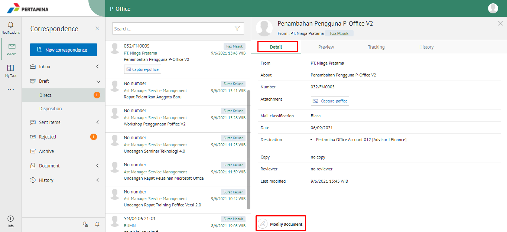 

2. Sistem akan menampilkan _form_ **Edit Correspondence**

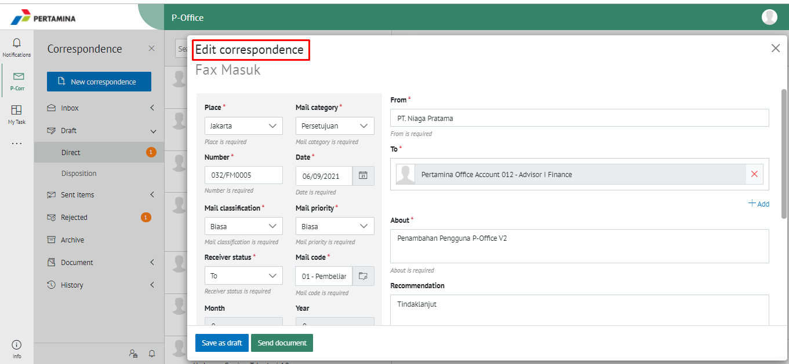 

1. Lakukan perubahan pada _form_. Klik **Send Document** untuk mengirim fax masuk ke pejabat tujuan. Surat yang terkirim akan tersimpan di menu "**Sent Item - Direct"** dan berlabel *Fax Masuk*

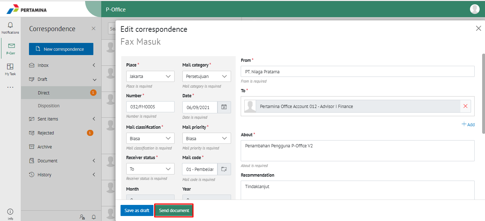 

## **E-Corr Versi Teams**

Langkah - langkah untuk drafting fax masuk via Teams adalah sebagai berikut:

1. Klik menu **Draft** dan pilih tab **Fax Masuk**

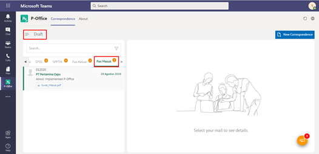

1. Pilih fax masuk yang akan diubah. Pilih tab **Detail** kemudian klik **Edit**

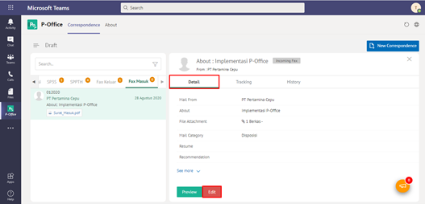

1. Sistem akan menampilkan _form_ **Edit Correspondence**

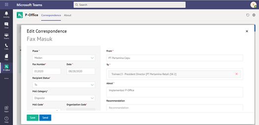

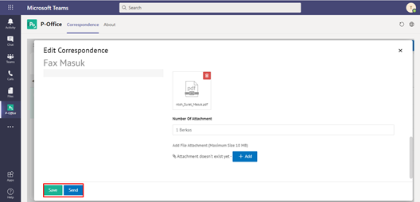

4.Lakukan perubahan pada _form_. Klik **Send** untuk mengirim fax masuk ke pejabat tujuan. Surat yang tersimpan akan ada di **“Draf – Fax Masuk”** dan surat yang terkirim akan tersimpan di menu **“Sent Item – Fax masuk”** 

## **E-Corr Versi Android dan iOS**

Langkah-langkah untuk drafting fax masuk adalah sebagai berikut :

1. Klik menu **Draft- Direct** dan pilih berlabel **Fax Masuk**

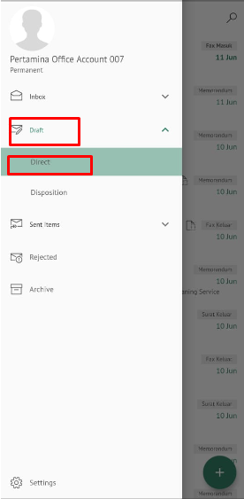 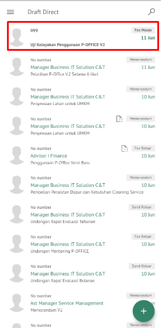 

2. Pilih fax masuk yang akan diubah. Pilih icon **Option** kemudian klik **Modify Document**

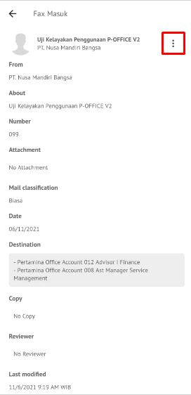 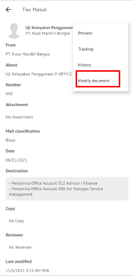

3. Sistem akan menampilkan _form_ **Edit Fax Masuk** lakukan edit yang ingin dilakukan perubahan.

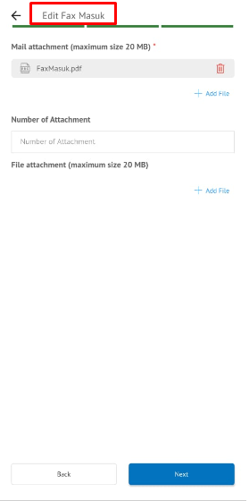

4. Lakukan perubahan pada _form_. Klik **Send Documet** untuk mengirim fax masuk ke pejabat tujuan. Surat yang terkirim akan tersimpan di menu “**Sent Item – Direct”** berlabel Fax Masuk.
   

