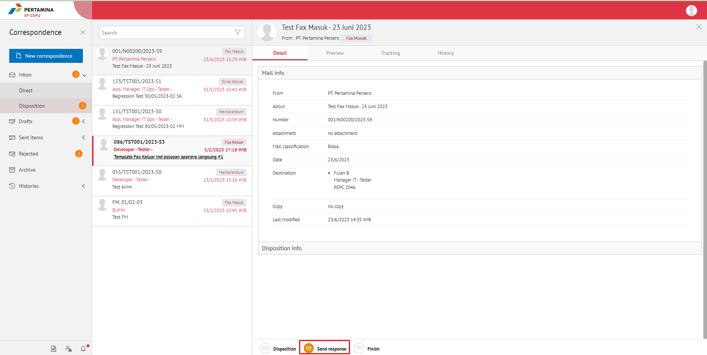

**Role yang sesuai**

- *Approver User*
- *Reviewer User*
- *Member User* (Pekerja)
- Sekretaris

*User* dapat mengirim tanggapan disposisi fax masuk yang ditujukan untuk pejabat pengirim disposisi.

## **E-Corr Versi Web**

Langkah - langkah untuk kirim tanggapan disposisi fax masuk via Web adalah sebagai berikut :

1. Klik menu **Inbox - Disposisi** dan pilih berlabel **Fax Masuk**

  

2. Pilih disposisi yang akan dikirim tanggapan kemudian pilih tab **Detail**
   
  

3. Pilih tombol **Send Response**.

  

4. Sistem menampilkan pop up konfirmasi dan *user* harus mengisi keterangan kirim tanggapan disposisi dan *user* dapat menambahkan lampiran jika diinginkan, kemudian klik **Save Respon**.
   
 

5. Sistem menyimpan perubahan dan informasi tanggapan disposisi akan tersimpan di **History** disposisi.

